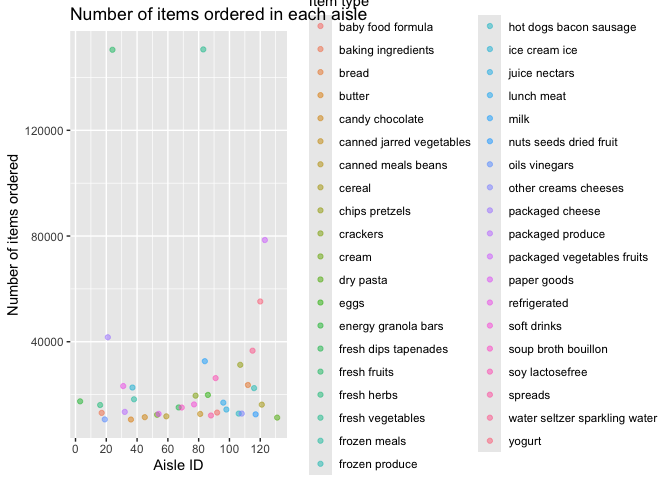

p8105_hw3_tp2806
================
Tejashree Prakash
2025-10-12

## Problem 1

``` r
#exploratory analysis 
total_row <- nrow(instacart)
summary <- dim(instacart)  

#examples of orders 
example_orders <- instacart %>%
  select(order_id, user_id, aisle, product_name, order_dow, order_hour_of_day) %>%
  sample_n(3)
```

The instacart data contains 1384617 rows. The 1384617 variables, or
columns. Key variables include: order_id, which is the order ID for each
order; product_name, defining the specific item that was ordered; and
aisle, defining aisle number matching to a specific order

For example, user 104741 placed order 1355077 that included “Mandarin
Oranges” from the “fresh fruits” aisle on day 1 at hour 9.

``` r
#distinct aisle 
aisle_num <- instacart %>%
  distinct(aisle_id, aisle) %>%
  nrow()

#highlight the most items ordered
aisle_counts <- instacart %>%
  group_by(aisle_id, aisle) %>%
  summarise(n_count = n(), .groups = "drop") %>% 
  slice_max(order_by = n_count, n = 5)
```

There are 134 aisles. The top 5 aisles overall are fresh vegetables,
fresh fruits, packaged vegetables fruits, yogurt, packaged cheese.

Making a plot that shows the number of items ordered in each aisle.

``` r
#make a plot
instacart_count <- instacart %>%
  group_by(aisle_id, aisle) %>%
  summarise(aisle_count = n(), .groups = "drop") %>%
  filter(aisle_count > 10000) #only aisle orders with aisle count above 10000 items ordered 

instacart_plot <- ggplot(instacart_count, aes(x = aisle_id, y = aisle_count)) + 
  geom_point(aes(color = aisle), alpha = 0.5) + 
  labs(
    title = "Number of items ordered in each aisle", 
    x = "Aisle ID", 
    y = "Number of items ordered", 
    color = "Item type"
  ) + 
  scale_x_continuous(
    breaks = c(0, 20, 40, 60, 80, 100, 120, 140),  
    labels = c(0, 20, 40, 60, 80, 100, 120, 140)
  )
instacart_plot
```

<!-- -->

Making a table that show popular items in three aisles.

``` r
#list frequency of three most tables in three aisles 
pop_items <- instacart %>%
  filter(aisle %in% c("baking ingredients", "dog food care", "packaged vegetables fruits")) %>%
  group_by(aisle, product_name) %>%
  summarise(order_count = n(), .groups = "drop") %>%
  group_by(aisle) %>%
  top_n(3, order_count) %>%
  arrange(aisle, desc(order_count))

knitr::kable(pop_items)
```

| aisle | product_name | order_count |
|:---|:---|---:|
| baking ingredients | Light Brown Sugar | 499 |
| baking ingredients | Pure Baking Soda | 387 |
| baking ingredients | Cane Sugar | 336 |
| dog food care | Snack Sticks Chicken & Rice Recipe Dog Treats | 30 |
| dog food care | Organix Chicken & Brown Rice Recipe | 28 |
| dog food care | Small Dog Biscuits | 26 |
| packaged vegetables fruits | Organic Baby Spinach | 9784 |
| packaged vegetables fruits | Organic Raspberries | 5546 |
| packaged vegetables fruits | Organic Blueberries | 4966 |

Making a readable table that shows the mean hour of the day at which
apples and ice cream are ordered on each day of the week.

``` r
apple_ice_cream_orders <- instacart %>%
  filter(product_name %in% c("Pink Lady Apples", "Coffee Ice Cream")) %>%
  group_by(product_name, order_dow) %>%
  summarise(mean_hour = mean(order_hour_of_day), .groups = "drop") %>%
  mutate(order_dow = recode(order_dow, 
                            `0` = "Sunday", 
                            `1` = "Monday",
                            `2` = "Tuesday",
                            `3` = "Wednesday",
                            `4` = "Thursday", 
                            `5` = "Friday", 
                            `6` = "Saturday")) %>%
  pivot_wider( #makes it readable 
    names_from = "order_dow",
    values_from = "mean_hour"
  ) 
knitr::kable(apple_ice_cream_orders)
```

| product_name | Sunday | Monday | Tuesday | Wednesday | Thursday | Friday | Saturday |
|:---|---:|---:|---:|---:|---:|---:|---:|
| Coffee Ice Cream | 13.77419 | 14.31579 | 15.38095 | 15.31818 | 15.21739 | 12.26316 | 13.83333 |
| Pink Lady Apples | 13.44118 | 11.36000 | 11.70213 | 14.25000 | 11.55172 | 12.78431 | 11.93750 |
