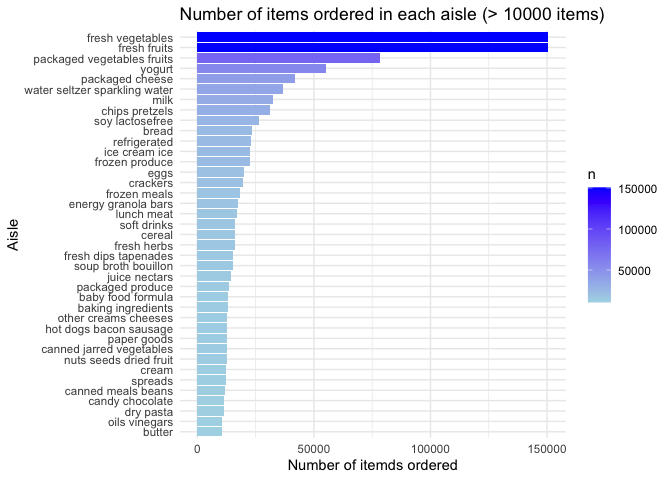
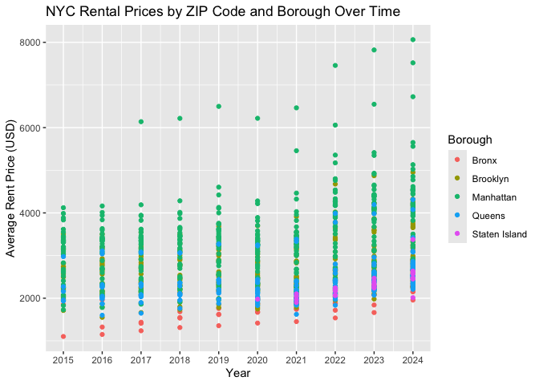
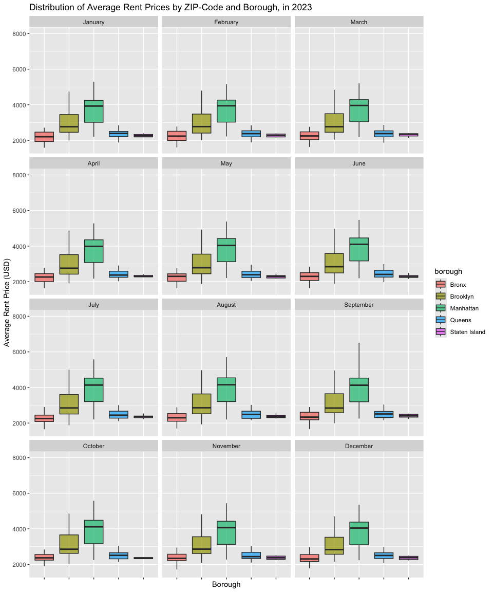
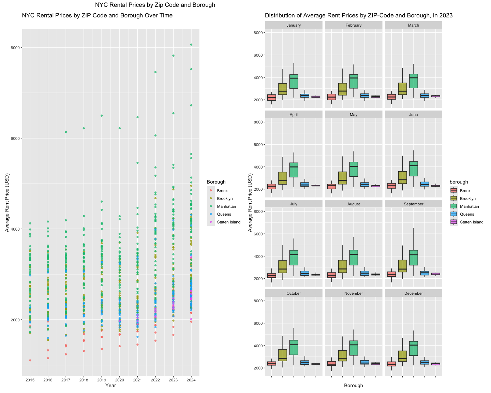
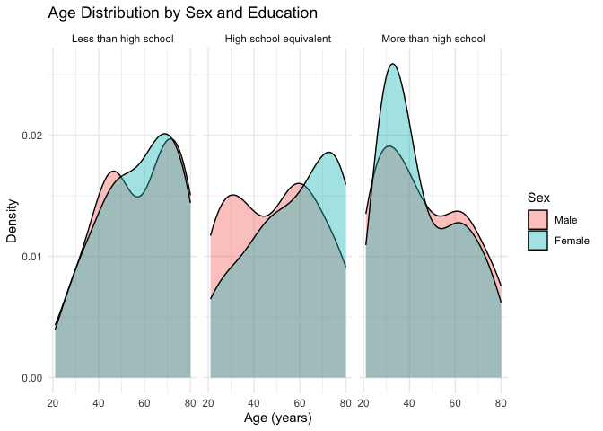
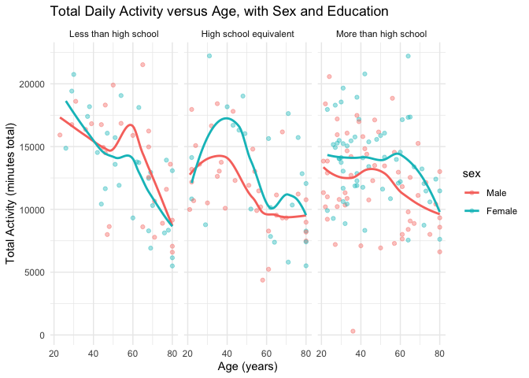
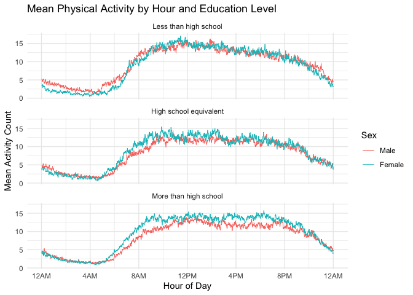

p8105_hw3_tp2806
================
Tejashree Prakash
2025-10-12

``` r
#Keep the output clean with code and outputs 
knitr::opts_chunk$set(
  message = FALSE,
  echo = TRUE 
)
```

## Problem 1

``` r
#exploratory analysis 
total_row <- nrow(instacart)
summary <- dim(instacart)  

#examples of orders 
example_orders <- instacart %>%
  select(order_id, user_id, aisle, product_name, order_dow, order_hour_of_day) %>%
  sample_n(3)
```

The instacart data contains 1384617 rows. The 1384617 variables, or
columns. Key variables include: order_id, which is the order ID for each
order; product_name, defining the specific item that was ordered; and
aisle, defining aisle number matching to a specific order

For example, user 168567 placed order 526795 that included “Raspberries”
from the “packaged produce” aisle on day 4 at hour 15.

``` r
#distinct aisle 
aisle_num <- instacart %>%
  distinct(aisle_id, aisle) %>%
  nrow()

#highlight the most items ordered
aisle_counts <- instacart %>%
  group_by(aisle_id, aisle) %>%
  summarise(n_count = n(), .groups = "drop") %>% 
  slice_max(order_by = n_count, n = 5)
```

There are 134 aisles. The top 5 aisles overall are fresh vegetables,
fresh fruits, packaged vegetables fruits, yogurt, packaged cheese.

## Making a plot that shows the number of items ordered in each aisle.

``` r
#make a plot
aisle_plot <- instacart %>%
  count(aisle) %>%
  filter(n > 10000) %>%
  arrange(desc(n)) %>%
  mutate(aisle = fct_reorder(aisle, n)) %>%
  ggplot(aes(x = aisle, y = n)) +
    geom_col(aes(fill = n)) +
  scale_fill_gradient(low = "lightblue", high = "blue") + 
  coord_flip() +
  labs(
    title = "Number of items ordered in each aisle (> 10000 items)", 
    x = "Aisle", 
    y = "Number of itemds ordered"
  ) + 
  theme_minimal()

aisle_plot
```

<!-- --> The
most ordered items in each aisle were fresh vegetables and fruits,
packaged vegetables and fruits, yogurt, cheese, water, and milk. These
orders make sense as that is the baseline of many people’s shopping
list.

## Making a table that show popular items in three aisles.

``` r
#list frequency of three most tables in three aisles 
pop_items <- instacart %>%
  filter(aisle %in% c("baking ingredients", "dog food care", "packaged vegetables fruits")) %>%
  group_by(aisle, product_name) %>%
  summarise(order_count = n(), .groups = "drop") %>%
  group_by(aisle) %>%
  top_n(3, order_count) %>%
  arrange(aisle, desc(order_count))

knitr::kable(pop_items)
```

| aisle | product_name | order_count |
|:---|:---|---:|
| baking ingredients | Light Brown Sugar | 499 |
| baking ingredients | Pure Baking Soda | 387 |
| baking ingredients | Cane Sugar | 336 |
| dog food care | Snack Sticks Chicken & Rice Recipe Dog Treats | 30 |
| dog food care | Organix Chicken & Brown Rice Recipe | 28 |
| dog food care | Small Dog Biscuits | 26 |
| packaged vegetables fruits | Organic Baby Spinach | 9784 |
| packaged vegetables fruits | Organic Raspberries | 5546 |
| packaged vegetables fruits | Organic Blueberries | 4966 |

For baking ingredients, the most popular items were light brown sugar,
pure baking soda, and cane sugar. For dog food/care, it was two
different brands of dog treats/food and small dog biscuits. For packaged
vegetables and fruits, organic baby spinach, raspberries, and
blueberries were the most bought items.

## Making a readable table that shows the mean hour of the day at which apples and ice cream are ordered on each day of the week.

``` r
apple_ice_cream_orders <- instacart %>%
  filter(product_name %in% c("Pink Lady Apples", "Coffee Ice Cream")) %>%
  group_by(product_name, order_dow) %>%
  summarise(mean_hour = mean(order_hour_of_day), .groups = "drop") %>%
  mutate(
    mean_time = format(
      as.POSIXct(mean_hour * 3600, origin = "1970-01-01", tz = "UTC"), 
      format = "%I:%M %p"
    ),
    order_dow = recode(order_dow, 
                            `0` = "Sunday", 
                            `1` = "Monday",
                            `2` = "Tuesday",
                            `3` = "Wednesday",
                            `4` = "Thursday", 
                            `5` = "Friday", 
                            `6` = "Saturday")
                  ) %>%
  select(product_name, order_dow, mean_time) %>% #to ensure the pivot occurs without mean_hour variable
  pivot_wider( #makes it readable 
    names_from = "order_dow",
    values_from = "mean_time"
  ) 
knitr::kable(apple_ice_cream_orders)
```

| product_name | Sunday | Monday | Tuesday | Wednesday | Thursday | Friday | Saturday |
|:---|:---|:---|:---|:---|:---|:---|:---|
| Coffee Ice Cream | 01:46 PM | 02:18 PM | 03:22 PM | 03:19 PM | 03:13 PM | 12:15 PM | 01:50 PM |
| Pink Lady Apples | 01:26 PM | 11:21 AM | 11:42 AM | 02:15 PM | 11:33 AM | 12:47 PM | 11:56 AM |

The average hour-of-day that coffee ice cream and pink lady apples were
bought varied each day, but they were mostly contained in the afternoon
hours.

## Problem 2

Downloading and cleaning the Zillow data (ZORI and zip code data), from
HW2.

``` r
#Zip metadata
zip_df <- 
  read_csv("data/zillow_data/Zip Codes.csv") %>%
  janitor::clean_names() %>%
  mutate(file_date = as.Date(file_date, format = "%m/%d/%y")) #consistent date format

#Zillow data
zori_df <- 
  read_csv("data/zillow_data/zori.csv") %>%
  janitor::clean_names() %>%
  rename(zip_code = region_name, county = county_name) %>%
  pivot_longer(
    cols = starts_with("x20"),
    names_to = "date",
    values_to = "rent_price"
  ) %>%
  mutate(
    county = str_remove(county, " County$"),
    date = str_remove(date, "^x"), #remove "x"
    date = ymd(date), #consistent date format
  ) %>%
  rename(borough = county) 

#Merging datasets
zillow_df <- left_join(zori_df, zip_df, by= c("zip_code"), relationship =
  "many-to-many")

zillow_df <- zillow_df %>%
  select(date, zip_code, neighborhood, borough, city, state, rent_price) %>%
  mutate(
    borough = case_match(
      borough,
      "Bronx" ~ "Bronx",
      "Kings" ~ "Brooklyn",
      "New York" ~ "Manhattan",
      "Queens" ~ "Queens",
      "Richmond" ~ "Staten Island"
    ))
knitr::kable(head(zillow_df, 5))
```

| date       | zip_code | neighborhood | borough | city     | state | rent_price |
|:-----------|---------:|:-------------|:--------|:---------|:------|-----------:|
| 2015-01-31 |    11368 | West Queens  | Queens  | New York | NY    |         NA |
| 2015-02-28 |    11368 | West Queens  | Queens  | New York | NY    |         NA |
| 2015-03-31 |    11368 | West Queens  | Queens  | New York | NY    |         NA |
| 2015-04-30 |    11368 | West Queens  | Queens  | New York | NY    |         NA |
| 2015-05-31 |    11368 | West Queens  | Queens  | New York | NY    |         NA |

``` r
#summarize frequency of zip codes
zip_obs <- zillow_df %>%
  group_by(zip_code) %>%
  summarise(month_count = n(), .groups = "drop")

#how many zip codes observed 116 times
zip_116 <- zip_obs %>%
  filter(month_count == 116) %>%
  nrow()

#how many zip codes observed fewer than 10 times
zip_10 <- zip_obs %>%
  filter(month_count < 10) %>%
  nrow()
```

There are 147 zip codes that are observed 116 times. There are 0 zip
codes that are observed fewer than 10 times. This suggests that there
are not many zip codes that contain a limited number of rentals. This
could be due to several reasons such as if there is greater property
ownership rather than renting in that zip code area or the zip code
doesn’t contain land to be developed or hasn’t been developed yet into
homes (rural areas). Rental prices can also fluctuate throughout the
year because of seasonal renting. For example, if one area is very cold
in the winter months, it likely will have less renters as some people
have other homes during the winter months.

## Creating a table that shows the average rental price in each borough and year.

``` r
rent_pricing <- zillow_df %>%
  mutate(year = year(date)) %>%
  group_by(borough, year) %>%
  summarise(
    avg_rent_price = mean(rent_price, na.rm = TRUE),
    .groups = "drop"
  ) %>%
  pivot_wider(
    names_from = year,
    values_from = avg_rent_price
  ) 

knitr::kable(head(rent_pricing))
```

| borough | 2015 | 2016 | 2017 | 2018 | 2019 | 2020 | 2021 | 2022 | 2023 | 2024 |
|:---|---:|---:|---:|---:|---:|---:|---:|---:|---:|---:|
| Bronx | 1803.408 | 1645.699 | 1652.601 | 1721.186 | 1783.641 | 1872.650 | 1910.707 | 2089.672 | 2304.983 | 2506.036 |
| Brooklyn | 2524.584 | 2551.005 | 2574.491 | 2576.714 | 2661.273 | 2582.442 | 2580.078 | 2901.288 | 3049.057 | 3159.528 |
| Manhattan | 3022.042 | 3038.818 | 3133.848 | 3183.703 | 3310.408 | 3106.517 | 3136.632 | 3778.375 | 3932.610 | 4078.440 |
| Queens | 2214.707 | 2271.955 | 2263.303 | 2291.918 | 2387.816 | 2315.632 | 2210.787 | 2406.038 | 2561.615 | 2694.022 |
| Staten Island | NaN | NaN | NaN | NaN | NaN | 1977.608 | 2045.430 | 2147.436 | 2332.934 | 2536.442 |

Across all boroughs/counties, there is an increase in average rent
pricing in later years (2024) compared to earlier years (2015). Out of
the boroughs, Manhattan has the largest increase in average rent price
between 2015 to 2024. “NaN” refers to missing values where we don’t have
rent price data.

## Making a plot that shows NYC rental prices within zip codes for all available years, comparing prices across boroughs.

``` r
rent_by_zip_df <- zillow_df %>%
  mutate(year = year(date)) %>% #get year from date
  group_by(borough, zip_code, year) %>%
  summarise(
    avg_rent_price = mean(rent_price, na.rm = TRUE), .groups = "drop"
  )
  
rent_by_zip_plot <- 
  ggplot(rent_by_zip_df, aes(x = year, y = avg_rent_price, group = zip_code, color = borough)) +
  geom_point() +
  labs(
    title = "NYC Rental Prices by ZIP Code and Borough Over Time",
    x = "Year", 
    y = "Average Rent Price (USD)", 
    color = "Borough"
  ) +
  scale_x_continuous(
    breaks = c(2015, 2016, 2017, 2018, 2019, 2020, 2021, 2022, 2023, 2024),  
    labels = c(2015, 2016, 2017, 2018, 2019, 2020, 2021, 2022, 2023, 2024)
  )
print(rent_by_zip_plot)
```

    ## Warning: Removed 531 rows containing missing values or values outside the scale range
    ## (`geom_point()`).

<!-- -->
This plot shows the average rent prices of each zip code within all
boroughs and all years between 2015 to 2024. Overall, we can see through
this plot that rent prices consistently ranged between 2000-4000 USD
between 2015 to 2021. The cost of Manhattan rent is consistently higher
than other boroughs throughout all years. Starting in 2022, we see a
shift to more rental prices above 4000 USD, especially in Manhattan.
This reflects inflation and other living costs raising after the
COVID-19 pandemic.

## Making visualization that shows average rental price over each month in 2023.

``` r
#Create table that shows average rental price over 2023
rent_2023 <- zillow_df %>%
  mutate(
    year = year(date), #converting year properly 
    month = month(date, label = TRUE, abbr = FALSE)
    ) %>%
  filter(year == 2023) %>% #filter to only 2023
  group_by(borough, zip_code, month) %>%
  summarise(
    avg_rent_price = mean(rent_price, na.rm = TRUE),
    .groups = "drop"
  ) 
knitr::kable(head(rent_2023))
```

| borough | zip_code | month    | avg_rent_price |
|:--------|---------:|:---------|---------------:|
| Bronx   |    10451 | January  |       2710.558 |
| Bronx   |    10451 | February |       2778.695 |
| Bronx   |    10451 | March    |       2762.731 |
| Bronx   |    10451 | April    |       2776.828 |
| Bronx   |    10451 | May      |       2764.892 |
| Bronx   |    10451 | June     |       2834.902 |

``` r
#Create plot showing the distribution 
rent_2023_plot <- ggplot(rent_2023, aes(x = borough, y = avg_rent_price, fill = borough)) +
  geom_boxplot() +
  facet_wrap(~ month, ncol = 3) +
  labs(
    title = "Distribution of Average Rent Prices by ZIP-Code and Borough, in 2023",
    x = "Borough",
    y = "Average Rent Price (USD)"
  ) +
  theme(axis.text.x = element_blank()) 

print(rent_2023_plot)
```

    ## Warning: Removed 333 rows containing non-finite outside the scale range
    ## (`stat_boxplot()`).

<!-- -->

These box plots show the distribution of average rent prices within each
zip code over each month in 2023, grouped by borough. Consistently
across each month in 2023, Manhattan had the highest average rent price.
Visually, Brooklyn seemed consistent in the average rent price across
all of the months. Staten Island had the smallest distribution, due to
the smaller amount of zip codes and land area compared to the other
boroughs in NYC.

## Both plots put together.

``` r
#Merge both plots into one graphic
rent_graphic <- rent_by_zip_plot + rent_2023_plot + 
  plot_layout(ncol = 2) + 
  plot_annotation(
    title = "NYC Rental Prices by Zip Code and Borough",
    theme = theme(plot.title = element_text(hjust = 0.25))
  )
print(rent_graphic)
```

    ## Warning: Removed 531 rows containing missing values or values outside the scale range
    ## (`geom_point()`).

    ## Warning: Removed 333 rows containing non-finite outside the scale range
    ## (`stat_boxplot()`).

<!-- -->

``` r
#Save graphic into results folder
ggsave("results/rent_graphic.png", rent_graphic, width = 15, height = 12, dpi = 300)
```

    ## Warning: Removed 531 rows containing missing values or values outside the scale range
    ## (`geom_point()`).
    ## Removed 333 rows containing non-finite outside the scale range
    ## (`stat_boxplot()`).

## Problem 3

``` r
#Load the two datasets
accel_df <- 
  read_csv("data/problem3_data/nhanes_accel.csv") %>%
  janitor::clean_names() 

covar_df <- 
  read_csv("data/problem3_data/nhanes_covar.csv", skip = 4) %>% #skip the first few rows that's data dictionary info 
  janitor::clean_names()

#Merge datasets - joining by seqn ID
nhanes_df <-
  left_join(covar_df, accel_df, by = join_by(seqn))

#Remove less than 21, if missing demographic data, recoding to not be numeric when appropriate
nhanes_df <- nhanes_df %>%
  drop_na() %>%
  filter(age >= 21) %>%
  mutate(
    sex = factor(sex, 
                 levels = c(1, 2),
                 labels = c("Male", "Female")), 
    education = factor(education, 
                       levels = c(1, 2, 3),
                       labels = c("Less than high school", "High school equivalent", "More than high school")))

knitr::kable(head(nhanes_df, 5))
```

| seqn | sex | age | bmi | education | min1 | min2 | min3 | min4 | min5 | min6 | min7 | min8 | min9 | min10 | min11 | min12 | min13 | min14 | min15 | min16 | min17 | min18 | min19 | min20 | min21 | min22 | min23 | min24 | min25 | min26 | min27 | min28 | min29 | min30 | min31 | min32 | min33 | min34 | min35 | min36 | min37 | min38 | min39 | min40 | min41 | min42 | min43 | min44 | min45 | min46 | min47 | min48 | min49 | min50 | min51 | min52 | min53 | min54 | min55 | min56 | min57 | min58 | min59 | min60 | min61 | min62 | min63 | min64 | min65 | min66 | min67 | min68 | min69 | min70 | min71 | min72 | min73 | min74 | min75 | min76 | min77 | min78 | min79 | min80 | min81 | min82 | min83 | min84 | min85 | min86 | min87 | min88 | min89 | min90 | min91 | min92 | min93 | min94 | min95 | min96 | min97 | min98 | min99 | min100 | min101 | min102 | min103 | min104 | min105 | min106 | min107 | min108 | min109 | min110 | min111 | min112 | min113 | min114 | min115 | min116 | min117 | min118 | min119 | min120 | min121 | min122 | min123 | min124 | min125 | min126 | min127 | min128 | min129 | min130 | min131 | min132 | min133 | min134 | min135 | min136 | min137 | min138 | min139 | min140 | min141 | min142 | min143 | min144 | min145 | min146 | min147 | min148 | min149 | min150 | min151 | min152 | min153 | min154 | min155 | min156 | min157 | min158 | min159 | min160 | min161 | min162 | min163 | min164 | min165 | min166 | min167 | min168 | min169 | min170 | min171 | min172 | min173 | min174 | min175 | min176 | min177 | min178 | min179 | min180 | min181 | min182 | min183 | min184 | min185 | min186 | min187 | min188 | min189 | min190 | min191 | min192 | min193 | min194 | min195 | min196 | min197 | min198 | min199 | min200 | min201 | min202 | min203 | min204 | min205 | min206 | min207 | min208 | min209 | min210 | min211 | min212 | min213 | min214 | min215 | min216 | min217 | min218 | min219 | min220 | min221 | min222 | min223 | min224 | min225 | min226 | min227 | min228 | min229 | min230 | min231 | min232 | min233 | min234 | min235 | min236 | min237 | min238 | min239 | min240 | min241 | min242 | min243 | min244 | min245 | min246 | min247 | min248 | min249 | min250 | min251 | min252 | min253 | min254 | min255 | min256 | min257 | min258 | min259 | min260 | min261 | min262 | min263 | min264 | min265 | min266 | min267 | min268 | min269 | min270 | min271 | min272 | min273 | min274 | min275 | min276 | min277 | min278 | min279 | min280 | min281 | min282 | min283 | min284 | min285 | min286 | min287 | min288 | min289 | min290 | min291 | min292 | min293 | min294 | min295 | min296 | min297 | min298 | min299 | min300 | min301 | min302 | min303 | min304 | min305 | min306 | min307 | min308 | min309 | min310 | min311 | min312 | min313 | min314 | min315 | min316 | min317 | min318 | min319 | min320 | min321 | min322 | min323 | min324 | min325 | min326 | min327 | min328 | min329 | min330 | min331 | min332 | min333 | min334 | min335 | min336 | min337 | min338 | min339 | min340 | min341 | min342 | min343 | min344 | min345 | min346 | min347 | min348 | min349 | min350 | min351 | min352 | min353 | min354 | min355 | min356 | min357 | min358 | min359 | min360 | min361 | min362 | min363 | min364 | min365 | min366 | min367 | min368 | min369 | min370 | min371 | min372 | min373 | min374 | min375 | min376 | min377 | min378 | min379 | min380 | min381 | min382 | min383 | min384 | min385 | min386 | min387 | min388 | min389 | min390 | min391 | min392 | min393 | min394 | min395 | min396 | min397 | min398 | min399 | min400 | min401 | min402 | min403 | min404 | min405 | min406 | min407 | min408 | min409 | min410 | min411 | min412 | min413 | min414 | min415 | min416 | min417 | min418 | min419 | min420 | min421 | min422 | min423 | min424 | min425 | min426 | min427 | min428 | min429 | min430 | min431 | min432 | min433 | min434 | min435 | min436 | min437 | min438 | min439 | min440 | min441 | min442 | min443 | min444 | min445 | min446 | min447 | min448 | min449 | min450 | min451 | min452 | min453 | min454 | min455 | min456 | min457 | min458 | min459 | min460 | min461 | min462 | min463 | min464 | min465 | min466 | min467 | min468 | min469 | min470 | min471 | min472 | min473 | min474 | min475 | min476 | min477 | min478 | min479 | min480 | min481 | min482 | min483 | min484 | min485 | min486 | min487 | min488 | min489 | min490 | min491 | min492 | min493 | min494 | min495 | min496 | min497 | min498 | min499 | min500 | min501 | min502 | min503 | min504 | min505 | min506 | min507 | min508 | min509 | min510 | min511 | min512 | min513 | min514 | min515 | min516 | min517 | min518 | min519 | min520 | min521 | min522 | min523 | min524 | min525 | min526 | min527 | min528 | min529 | min530 | min531 | min532 | min533 | min534 | min535 | min536 | min537 | min538 | min539 | min540 | min541 | min542 | min543 | min544 | min545 | min546 | min547 | min548 | min549 | min550 | min551 | min552 | min553 | min554 | min555 | min556 | min557 | min558 | min559 | min560 | min561 | min562 | min563 | min564 | min565 | min566 | min567 | min568 | min569 | min570 | min571 | min572 | min573 | min574 | min575 | min576 | min577 | min578 | min579 | min580 | min581 | min582 | min583 | min584 | min585 | min586 | min587 | min588 | min589 | min590 | min591 | min592 | min593 | min594 | min595 | min596 | min597 | min598 | min599 | min600 | min601 | min602 | min603 | min604 | min605 | min606 | min607 | min608 | min609 | min610 | min611 | min612 | min613 | min614 | min615 | min616 | min617 | min618 | min619 | min620 | min621 | min622 | min623 | min624 | min625 | min626 | min627 | min628 | min629 | min630 | min631 | min632 | min633 | min634 | min635 | min636 | min637 | min638 | min639 | min640 | min641 | min642 | min643 | min644 | min645 | min646 | min647 | min648 | min649 | min650 | min651 | min652 | min653 | min654 | min655 | min656 | min657 | min658 | min659 | min660 | min661 | min662 | min663 | min664 | min665 | min666 | min667 | min668 | min669 | min670 | min671 | min672 | min673 | min674 | min675 | min676 | min677 | min678 | min679 | min680 | min681 | min682 | min683 | min684 | min685 | min686 | min687 | min688 | min689 | min690 | min691 | min692 | min693 | min694 | min695 | min696 | min697 | min698 | min699 | min700 | min701 | min702 | min703 | min704 | min705 | min706 | min707 | min708 | min709 | min710 | min711 | min712 | min713 | min714 | min715 | min716 | min717 | min718 | min719 | min720 | min721 | min722 | min723 | min724 | min725 | min726 | min727 | min728 | min729 | min730 | min731 | min732 | min733 | min734 | min735 | min736 | min737 | min738 | min739 | min740 | min741 | min742 | min743 | min744 | min745 | min746 | min747 | min748 | min749 | min750 | min751 | min752 | min753 | min754 | min755 | min756 | min757 | min758 | min759 | min760 | min761 | min762 | min763 | min764 | min765 | min766 | min767 | min768 | min769 | min770 | min771 | min772 | min773 | min774 | min775 | min776 | min777 | min778 | min779 | min780 | min781 | min782 | min783 | min784 | min785 | min786 | min787 | min788 | min789 | min790 | min791 | min792 | min793 | min794 | min795 | min796 | min797 | min798 | min799 | min800 | min801 | min802 | min803 | min804 | min805 | min806 | min807 | min808 | min809 | min810 | min811 | min812 | min813 | min814 | min815 | min816 | min817 | min818 | min819 | min820 | min821 | min822 | min823 | min824 | min825 | min826 | min827 | min828 | min829 | min830 | min831 | min832 | min833 | min834 | min835 | min836 | min837 | min838 | min839 | min840 | min841 | min842 | min843 | min844 | min845 | min846 | min847 | min848 | min849 | min850 | min851 | min852 | min853 | min854 | min855 | min856 | min857 | min858 | min859 | min860 | min861 | min862 | min863 | min864 | min865 | min866 | min867 | min868 | min869 | min870 | min871 | min872 | min873 | min874 | min875 | min876 | min877 | min878 | min879 | min880 | min881 | min882 | min883 | min884 | min885 | min886 | min887 | min888 | min889 | min890 | min891 | min892 | min893 | min894 | min895 | min896 | min897 | min898 | min899 | min900 | min901 | min902 | min903 | min904 | min905 | min906 | min907 | min908 | min909 | min910 | min911 | min912 | min913 | min914 | min915 | min916 | min917 | min918 | min919 | min920 | min921 | min922 | min923 | min924 | min925 | min926 | min927 | min928 | min929 | min930 | min931 | min932 | min933 | min934 | min935 | min936 | min937 | min938 | min939 | min940 | min941 | min942 | min943 | min944 | min945 | min946 | min947 | min948 | min949 | min950 | min951 | min952 | min953 | min954 | min955 | min956 | min957 | min958 | min959 | min960 | min961 | min962 | min963 | min964 | min965 | min966 | min967 | min968 | min969 | min970 | min971 | min972 | min973 | min974 | min975 | min976 | min977 | min978 | min979 | min980 | min981 | min982 | min983 | min984 | min985 | min986 | min987 | min988 | min989 | min990 | min991 | min992 | min993 | min994 | min995 | min996 | min997 | min998 | min999 | min1000 | min1001 | min1002 | min1003 | min1004 | min1005 | min1006 | min1007 | min1008 | min1009 | min1010 | min1011 | min1012 | min1013 | min1014 | min1015 | min1016 | min1017 | min1018 | min1019 | min1020 | min1021 | min1022 | min1023 | min1024 | min1025 | min1026 | min1027 | min1028 | min1029 | min1030 | min1031 | min1032 | min1033 | min1034 | min1035 | min1036 | min1037 | min1038 | min1039 | min1040 | min1041 | min1042 | min1043 | min1044 | min1045 | min1046 | min1047 | min1048 | min1049 | min1050 | min1051 | min1052 | min1053 | min1054 | min1055 | min1056 | min1057 | min1058 | min1059 | min1060 | min1061 | min1062 | min1063 | min1064 | min1065 | min1066 | min1067 | min1068 | min1069 | min1070 | min1071 | min1072 | min1073 | min1074 | min1075 | min1076 | min1077 | min1078 | min1079 | min1080 | min1081 | min1082 | min1083 | min1084 | min1085 | min1086 | min1087 | min1088 | min1089 | min1090 | min1091 | min1092 | min1093 | min1094 | min1095 | min1096 | min1097 | min1098 | min1099 | min1100 | min1101 | min1102 | min1103 | min1104 | min1105 | min1106 | min1107 | min1108 | min1109 | min1110 | min1111 | min1112 | min1113 | min1114 | min1115 | min1116 | min1117 | min1118 | min1119 | min1120 | min1121 | min1122 | min1123 | min1124 | min1125 | min1126 | min1127 | min1128 | min1129 | min1130 | min1131 | min1132 | min1133 | min1134 | min1135 | min1136 | min1137 | min1138 | min1139 | min1140 | min1141 | min1142 | min1143 | min1144 | min1145 | min1146 | min1147 | min1148 | min1149 | min1150 | min1151 | min1152 | min1153 | min1154 | min1155 | min1156 | min1157 | min1158 | min1159 | min1160 | min1161 | min1162 | min1163 | min1164 | min1165 | min1166 | min1167 | min1168 | min1169 | min1170 | min1171 | min1172 | min1173 | min1174 | min1175 | min1176 | min1177 | min1178 | min1179 | min1180 | min1181 | min1182 | min1183 | min1184 | min1185 | min1186 | min1187 | min1188 | min1189 | min1190 | min1191 | min1192 | min1193 | min1194 | min1195 | min1196 | min1197 | min1198 | min1199 | min1200 | min1201 | min1202 | min1203 | min1204 | min1205 | min1206 | min1207 | min1208 | min1209 | min1210 | min1211 | min1212 | min1213 | min1214 | min1215 | min1216 | min1217 | min1218 | min1219 | min1220 | min1221 | min1222 | min1223 | min1224 | min1225 | min1226 | min1227 | min1228 | min1229 | min1230 | min1231 | min1232 | min1233 | min1234 | min1235 | min1236 | min1237 | min1238 | min1239 | min1240 | min1241 | min1242 | min1243 | min1244 | min1245 | min1246 | min1247 | min1248 | min1249 | min1250 | min1251 | min1252 | min1253 | min1254 | min1255 | min1256 | min1257 | min1258 | min1259 | min1260 | min1261 | min1262 | min1263 | min1264 | min1265 | min1266 | min1267 | min1268 | min1269 | min1270 | min1271 | min1272 | min1273 | min1274 | min1275 | min1276 | min1277 | min1278 | min1279 | min1280 | min1281 | min1282 | min1283 | min1284 | min1285 | min1286 | min1287 | min1288 | min1289 | min1290 | min1291 | min1292 | min1293 | min1294 | min1295 | min1296 | min1297 | min1298 | min1299 | min1300 | min1301 | min1302 | min1303 | min1304 | min1305 | min1306 | min1307 | min1308 | min1309 | min1310 | min1311 | min1312 | min1313 | min1314 | min1315 | min1316 | min1317 | min1318 | min1319 | min1320 | min1321 | min1322 | min1323 | min1324 | min1325 | min1326 | min1327 | min1328 | min1329 | min1330 | min1331 | min1332 | min1333 | min1334 | min1335 | min1336 | min1337 | min1338 | min1339 | min1340 | min1341 | min1342 | min1343 | min1344 | min1345 | min1346 | min1347 | min1348 | min1349 | min1350 | min1351 | min1352 | min1353 | min1354 | min1355 | min1356 | min1357 | min1358 | min1359 | min1360 | min1361 | min1362 | min1363 | min1364 | min1365 | min1366 | min1367 | min1368 | min1369 | min1370 | min1371 | min1372 | min1373 | min1374 | min1375 | min1376 | min1377 | min1378 | min1379 | min1380 | min1381 | min1382 | min1383 | min1384 | min1385 | min1386 | min1387 | min1388 | min1389 | min1390 | min1391 | min1392 | min1393 | min1394 | min1395 | min1396 | min1397 | min1398 | min1399 | min1400 | min1401 | min1402 | min1403 | min1404 | min1405 | min1406 | min1407 | min1408 | min1409 | min1410 | min1411 | min1412 | min1413 | min1414 | min1415 | min1416 | min1417 | min1418 | min1419 | min1420 | min1421 | min1422 | min1423 | min1424 | min1425 | min1426 | min1427 | min1428 | min1429 | min1430 | min1431 | min1432 | min1433 | min1434 | min1435 | min1436 | min1437 | min1438 | min1439 | min1440 |
|---:|:---|---:|---:|:---|---:|---:|---:|---:|---:|---:|---:|---:|---:|---:|---:|---:|---:|---:|---:|---:|---:|---:|---:|---:|---:|---:|---:|---:|---:|---:|---:|---:|---:|---:|---:|---:|---:|---:|---:|---:|---:|---:|---:|---:|---:|---:|---:|---:|---:|---:|---:|---:|---:|---:|---:|---:|---:|---:|---:|---:|---:|---:|---:|---:|---:|---:|---:|---:|---:|---:|---:|---:|---:|---:|---:|---:|---:|---:|---:|---:|---:|---:|---:|---:|---:|---:|---:|---:|---:|---:|---:|---:|---:|---:|---:|---:|---:|---:|---:|---:|---:|---:|---:|---:|---:|---:|---:|---:|---:|---:|---:|---:|---:|---:|---:|---:|---:|---:|---:|---:|---:|---:|---:|---:|---:|---:|---:|---:|---:|---:|---:|---:|---:|---:|---:|---:|---:|---:|---:|---:|---:|---:|---:|---:|---:|---:|---:|---:|---:|---:|---:|---:|---:|---:|---:|---:|---:|---:|---:|---:|---:|---:|---:|---:|---:|---:|---:|---:|---:|---:|---:|---:|---:|---:|---:|---:|---:|---:|---:|---:|---:|---:|---:|---:|---:|---:|---:|---:|---:|---:|---:|---:|---:|---:|---:|---:|---:|---:|---:|---:|---:|---:|---:|---:|---:|---:|---:|---:|---:|---:|---:|---:|---:|---:|---:|---:|---:|---:|---:|---:|---:|---:|---:|---:|---:|---:|---:|---:|---:|---:|---:|---:|---:|---:|---:|---:|---:|---:|---:|---:|---:|---:|---:|---:|---:|---:|---:|---:|---:|---:|---:|---:|---:|---:|---:|---:|---:|---:|---:|---:|---:|---:|---:|---:|---:|---:|---:|---:|---:|---:|---:|---:|---:|---:|---:|---:|---:|---:|---:|---:|---:|---:|---:|---:|---:|---:|---:|---:|---:|---:|---:|---:|---:|---:|---:|---:|---:|---:|---:|---:|---:|---:|---:|---:|---:|---:|---:|---:|---:|---:|---:|---:|---:|---:|---:|---:|---:|---:|---:|---:|---:|---:|---:|---:|---:|---:|---:|---:|---:|---:|---:|---:|---:|---:|---:|---:|---:|---:|---:|---:|---:|---:|---:|---:|---:|---:|---:|---:|---:|---:|---:|---:|---:|---:|---:|---:|---:|---:|---:|---:|---:|---:|---:|---:|---:|---:|---:|---:|---:|---:|---:|---:|---:|---:|---:|---:|---:|---:|---:|---:|---:|---:|---:|---:|---:|---:|---:|---:|---:|---:|---:|---:|---:|---:|---:|---:|---:|---:|---:|---:|---:|---:|---:|---:|---:|---:|---:|---:|---:|---:|---:|---:|---:|---:|---:|---:|---:|---:|---:|---:|---:|---:|---:|---:|---:|---:|---:|---:|---:|---:|---:|---:|---:|---:|---:|---:|---:|---:|---:|---:|---:|---:|---:|---:|---:|---:|---:|---:|---:|---:|---:|---:|---:|---:|---:|---:|---:|---:|---:|---:|---:|---:|---:|---:|---:|---:|---:|---:|---:|---:|---:|---:|---:|---:|---:|---:|---:|---:|---:|---:|---:|---:|---:|---:|---:|---:|---:|---:|---:|---:|---:|---:|---:|---:|---:|---:|---:|---:|---:|---:|---:|---:|---:|---:|---:|---:|---:|---:|---:|---:|---:|---:|---:|---:|---:|---:|---:|---:|---:|---:|---:|---:|---:|---:|---:|---:|---:|---:|---:|---:|---:|---:|---:|---:|---:|---:|---:|---:|---:|---:|---:|---:|---:|---:|---:|---:|---:|---:|---:|---:|---:|---:|---:|---:|---:|---:|---:|---:|---:|---:|---:|---:|---:|---:|---:|---:|---:|---:|---:|---:|---:|---:|---:|---:|---:|---:|---:|---:|---:|---:|---:|---:|---:|---:|---:|---:|---:|---:|---:|---:|---:|---:|---:|---:|---:|---:|---:|---:|---:|---:|---:|---:|---:|---:|---:|---:|---:|---:|---:|---:|---:|---:|---:|---:|---:|---:|---:|---:|---:|---:|---:|---:|---:|---:|---:|---:|---:|---:|---:|---:|---:|---:|---:|---:|---:|---:|---:|---:|---:|---:|---:|---:|---:|---:|---:|---:|---:|---:|---:|---:|---:|---:|---:|---:|---:|---:|---:|---:|---:|---:|---:|---:|---:|---:|---:|---:|---:|---:|---:|---:|---:|---:|---:|---:|---:|---:|---:|---:|---:|---:|---:|---:|---:|---:|---:|---:|---:|---:|---:|---:|---:|---:|---:|---:|---:|---:|---:|---:|---:|---:|---:|---:|---:|---:|---:|---:|---:|---:|---:|---:|---:|---:|---:|---:|---:|---:|---:|---:|---:|---:|---:|---:|---:|---:|---:|---:|---:|---:|---:|---:|---:|---:|---:|---:|---:|---:|---:|---:|---:|---:|---:|---:|---:|---:|---:|---:|---:|---:|---:|---:|---:|---:|---:|---:|---:|---:|---:|---:|---:|---:|---:|---:|---:|---:|---:|---:|---:|---:|---:|---:|---:|---:|---:|---:|---:|---:|---:|---:|---:|---:|---:|---:|---:|---:|---:|---:|---:|---:|---:|---:|---:|---:|---:|---:|---:|---:|---:|---:|---:|---:|---:|---:|---:|---:|---:|---:|---:|---:|---:|---:|---:|---:|---:|---:|---:|---:|---:|---:|---:|---:|---:|---:|---:|---:|---:|---:|---:|---:|---:|---:|---:|---:|---:|---:|---:|---:|---:|---:|---:|---:|---:|---:|---:|---:|---:|---:|---:|---:|---:|---:|---:|---:|---:|---:|---:|---:|---:|---:|---:|---:|---:|---:|---:|---:|---:|---:|---:|---:|---:|---:|---:|---:|---:|---:|---:|---:|---:|---:|---:|---:|---:|---:|---:|---:|---:|---:|---:|---:|---:|---:|---:|---:|---:|---:|---:|---:|---:|---:|---:|---:|---:|---:|---:|---:|---:|---:|---:|---:|---:|---:|---:|---:|---:|---:|---:|---:|---:|---:|---:|---:|---:|---:|---:|---:|---:|---:|---:|---:|---:|---:|---:|---:|---:|---:|---:|---:|---:|---:|---:|---:|---:|---:|---:|---:|---:|---:|---:|---:|---:|---:|---:|---:|---:|---:|---:|---:|---:|---:|---:|---:|---:|---:|---:|---:|---:|---:|---:|---:|---:|---:|---:|---:|---:|---:|---:|---:|---:|---:|---:|---:|---:|---:|---:|---:|---:|---:|---:|---:|---:|---:|---:|---:|---:|---:|---:|---:|---:|---:|---:|---:|---:|---:|---:|---:|---:|---:|---:|---:|---:|---:|---:|---:|---:|---:|---:|---:|---:|---:|---:|---:|---:|---:|---:|---:|---:|---:|---:|---:|---:|---:|---:|---:|---:|---:|---:|---:|---:|---:|---:|---:|---:|---:|---:|---:|---:|---:|---:|---:|---:|---:|---:|---:|---:|---:|---:|---:|---:|---:|---:|---:|---:|---:|---:|---:|---:|---:|---:|---:|---:|---:|---:|---:|---:|---:|---:|---:|---:|---:|---:|---:|---:|---:|---:|---:|---:|---:|---:|---:|---:|---:|---:|---:|---:|---:|---:|---:|---:|---:|---:|---:|---:|---:|---:|---:|---:|---:|---:|---:|---:|---:|---:|---:|---:|---:|---:|---:|---:|---:|---:|---:|---:|---:|---:|---:|---:|---:|---:|---:|---:|---:|---:|---:|---:|---:|---:|---:|---:|---:|---:|---:|---:|---:|---:|---:|---:|---:|---:|---:|---:|---:|---:|---:|---:|---:|---:|---:|---:|---:|---:|---:|---:|---:|---:|---:|---:|---:|---:|---:|---:|---:|---:|---:|---:|---:|---:|---:|---:|---:|---:|---:|---:|---:|---:|---:|---:|---:|---:|---:|---:|---:|---:|---:|---:|---:|---:|---:|---:|---:|---:|---:|---:|---:|---:|---:|---:|---:|---:|---:|---:|---:|---:|---:|---:|---:|---:|---:|---:|---:|---:|---:|---:|---:|---:|---:|---:|---:|---:|---:|---:|---:|---:|---:|---:|---:|---:|---:|---:|---:|---:|---:|---:|---:|---:|---:|---:|---:|---:|---:|---:|---:|---:|---:|---:|---:|---:|---:|---:|---:|---:|---:|---:|---:|---:|---:|---:|---:|---:|---:|---:|---:|---:|---:|---:|---:|---:|---:|---:|---:|---:|---:|---:|---:|---:|---:|---:|---:|---:|---:|---:|---:|---:|---:|---:|---:|---:|---:|---:|---:|---:|---:|---:|---:|---:|---:|---:|---:|---:|---:|---:|---:|---:|---:|---:|---:|---:|---:|---:|---:|---:|---:|---:|---:|---:|---:|---:|---:|---:|---:|---:|---:|---:|---:|---:|---:|---:|---:|---:|---:|---:|---:|---:|---:|---:|---:|---:|---:|---:|---:|---:|---:|---:|---:|---:|---:|---:|---:|---:|---:|---:|---:|---:|---:|---:|---:|---:|---:|---:|---:|---:|---:|---:|---:|---:|---:|---:|---:|---:|---:|---:|---:|---:|---:|---:|---:|---:|---:|---:|---:|---:|---:|---:|---:|---:|---:|---:|---:|---:|---:|---:|---:|---:|---:|---:|---:|---:|---:|---:|---:|---:|---:|---:|---:|---:|---:|---:|---:|---:|---:|---:|---:|---:|---:|---:|---:|---:|---:|---:|---:|---:|---:|---:|---:|---:|---:|---:|---:|---:|---:|---:|---:|---:|---:|---:|---:|
| 62161 | Male | 22 | 23.3 | High school equivalent | 1.106000 | 3.115167 | 1.467500 | 0.9376667 | 1.598667 | 0.1453333 | 2.1005000 | 0.509500 | 1.6321667 | 1.196333 | 0.9471667 | 0.0263333 | 0.0551667 | 0.0370000 | 2.098333 | 0.543500 | 0.0915000 | 0.970500 | 0.8141667 | 0.9651667 | 0.0478333 | 1.863833 | 1.078000 | 1.025167 | 1.234667 | 2.287000 | 0.0606667 | 0.0533333 | 0.102500 | 0.0906667 | 0.3088333 | 0.4005000 | 1.2341667 | 0.0330000 | 3.0613333 | 1.7228333 | 0.0605000 | 4.220500 | 0.8051667 | 0.898000 | 1.7445000 | 1.5058333 | 0.857500 | 1.026500 | 0.0495000 | 0.1366667 | 0.911000 | 0.299500 | 0.3636667 | 0.045500 | 0.0306667 | 2.215667 | 0.0576667 | 1.2155000 | 0.0765000 | 0.0638333 | 0.5320000 | 0.0448333 | 0.094000 | 0.0273333 | 0.922500 | 0.0378333 | 0.1496667 | 0.0921667 | 0.3783333 | 0.0376667 | 1.1283333 | 0.1235000 | 1.212833 | 0.0503333 | 0.0243333 | 0.0543333 | 0.0273333 | 0.6796667 | 0.0511667 | 0.7471667 | 0.7428333 | 1.256500 | 0.8536667 | 1.1658333 | 0.2063333 | 0.823500 | 0.1146667 | 1.055833 | 3.764833 | 6.864333 | 5.949167 | 1.5935000 | 0.3526667 | 0.768000 | 0.2753333 | 0.0291667 | 1.9920000 | 0.0521667 | 0.8761667 | 0.4255000 | 1.259500 | 1.964000 | 0.9631667 | 6.161167 | 5.0600000 | 3.8905000 | 1.7341667 | 0.6885000 | 3.8646667 | 0.9385000 | 3.0663333 | 0.165000 | 0.1193333 | 0.3096667 | 0.0440000 | 1.8651667 | 0.0655000 | 0.0453333 | 0.0383333 | 0.0406667 | 0.0471667 | 0.046500 | 0.1553333 | 0.0731667 | 0.0561667 | 0.0461667 | 0.0513333 | 0.054500 | 0.070000 | 3.9165000 | 0.0588333 | 0.7985000 | 0.5428333 | 0.0428333 | 0.0358333 | 0.0863333 | 0.0326667 | 0.0391667 | 0.081500 | 0.0436667 | 0.0683333 | 0.0525000 | 0.0575000 | 0.0366667 | 0.0515000 | 0.2845000 | 0.0481667 | 0.1023333 | 0.0488333 | 1.628833 | 0.0891667 | 0.7366667 | 0.0615000 | 1.0231667 | 0.7321667 | 1.6490000 | 1.1923333 | 0.0343333 | 1.5848333 | 3.1320000 | 0.0478333 | 0.0588333 | 0.9556667 | 0.2906667 | 0.0943333 | 0.0758333 | 0.1493333 | 2.2958333 | 1.8775000 | 0.8935000 | 1.8583333 | 3.6053333 | 0.1311667 | 0.0300000 | 0.0316667 | 0.2051667 | 1.679667 | 0.3803333 | 0.7505000 | 0.6278333 | 0.7303333 | 0.0458333 | 0.4181667 | 0.3353333 | 1.467833 | 0.3461667 | 1.580500 | 1.2910000 | 0.0936667 | 0.1618333 | 0.6945000 | 1.0053333 | 0.0276667 | 1.184833 | 3.0540000 | 0.2735000 | 1.781667 | 0.5673333 | 0.3146667 | 0.1165000 | 1.0408333 | 0.0500000 | 0.0611667 | 0.5675000 | 0.0513333 | 0.095000 | 0.030500 | 0.0313333 | 0.0550000 | 0.477500 | 0.0348333 | 0.4011667 | 0.0666667 | 0.3670000 | 0.2178333 | 0.0455000 | 0.8151667 | 0.0880000 | 0.0550000 | 0.0696667 | 0.224500 | 3.0433333 | 0.0798333 | 0.4663333 | 0.0803333 | 0.0485000 | 0.3030000 | 0.0841667 | 0.1448333 | 0.0563333 | 0.7108333 | 1.2725000 | 1.007000 | 3.6046667 | 0.0790000 | 0.0466667 | 0.045500 | 0.2623333 | 0.043000 | 0.0476667 | 0.0561667 | 0.0595000 | 6.8028333 | 1.2225000 | 2.4338333 | 0.1648333 | 0.0276667 | 0.0653333 | 0.0293333 | 0.0345000 | 0.0353333 | 0.0278333 | 0.0320000 | 0.0358333 | 0.0381667 | 1.6071667 | 0.5623333 | 0.3175000 | 0.0445000 | 2.3428333 | 0.2651667 | 1.1103333 | 0.0258333 | 1.7613333 | 3.171167 | 0.0270000 | 0.2798333 | 1.1913333 | 0.6311667 | 0.8250000 | 0.0365000 | 0.0288333 | 0.0363333 | 0.6130000 | 0.1290000 | 0.0258333 | 0.9126667 | 1.3225000 | 0.0421667 | 0.6400000 | 0.0435000 | 0.2820000 | 0.2263333 | 0.0370000 | 0.0681667 | 0.2598333 | 0.1063333 | 0.3295000 | 0.3660000 | 0.5715000 | 0.0438333 | 0.1806667 | 0.1163333 | 0.8321667 | 0.3708333 | 0.7670000 | 0.0418333 | 1.4221667 | 0.0376667 | 0.3808333 | 0.338500 | 0.2713333 | 0.1660000 | 0.2413333 | 0.3313333 | 0.1193333 | 0.2305000 | 1.2520000 | 0.6176667 | 0.0793333 | 1.6578333 | 0.3240000 | 2.9035000 | 2.6698333 | 0.0543333 | 0.3583333 | 0.2480000 | 0.2730000 | 0.9148333 | 0.0245000 | 0.2545000 | 0.2895000 | 0.8365000 | 0.1330000 | 0.403000 | 0.7708333 | 0.1175000 | 1.2963333 | 0.1636667 | 0.2396667 | 0.0311667 | 0.052000 | 0.3813333 | 0.1345000 | 0.1026667 | 0.4305000 | 0.4850000 | 1.1475000 | 0.0436667 | 0.0316667 | 0.1178333 | 0.4543333 | 4.3536667 | 0.1770000 | 0.0336667 | 0.1371667 | 0.9126667 | 0.1338333 | 0.0428333 | 0.0693333 | 2.7178333 | 0.8476667 | 0.0755000 | 0.1478333 | 0.0420000 | 0.4205000 | 0.1023333 | 0.0761667 | 0.1556667 | 1.1526667 | 0.1621667 | 0.1141667 | 0.1635000 | 0.0710000 | 0.6428333 | 16.2520000 | 9.1285000 | 13.8950000 | 17.9935000 | 7.4945000 | 7.1731667 | 3.5996667 | 5.8920000 | 6.8733333 | 6.3200000 | 7.8543333 | 2.4986667 | 6.0141667 | 4.2745000 | 9.5653333 | 9.633333 | 8.2158333 | 12.7388333 | 13.2523333 | 14.9848333 | 17.109000 | 8.6350000 | 11.3481667 | 12.4356667 | 11.4043333 | 12.3965000 | 14.0216667 | 9.983000 | 10.5390000 | 14.9321667 | 7.8591667 | 8.9740000 | 6.2468333 | 4.104333 | 5.5246667 | 5.0888333 | 5.7498333 | 7.8380000 | 6.9140000 | 9.2763333 | 4.7425000 | 3.5780000 | 5.011667 | 1.9840000 | 3.278500 | 4.760833 | 2.4570000 | 5.6876667 | 5.9610000 | 7.1188333 | 8.1335000 | 7.3885000 | 10.2000000 | 4.2233333 | 1.2310000 | 4.858000 | 5.0926667 | 6.639167 | 6.6710000 | 4.230167 | 1.808500 | 3.2546667 | 0.9730000 | 3.535000 | 4.463000 | 5.3221667 | 4.871500 | 6.342333 | 5.411167 | 9.000500 | 7.4266667 | 11.01067 | 4.2160000 | 2.795167 | 4.7125000 | 5.866167 | 11.319167 | 8.975500 | 3.167000 | 4.187167 | 3.881167 | 5.097333 | 8.186167 | 6.228000 | 10.503000 | 10.6073333 | 13.695167 | 15.0595000 | 21.1296667 | 29.006667 | 19.559833 | 18.966500 | 16.616833 | 16.544167 | 21.712667 | 17.001500 | 19.013333 | 20.359500 | 17.940167 | 12.9875000 | 15.1795000 | 11.983833 | 9.574333 | 12.030833 | 12.017833 | 20.2148333 | 16.951000 | 20.665333 | 15.6478333 | 17.0136667 | 20.633667 | 20.3296667 | 15.153333 | 19.9306667 | 17.867333 | 18.006500 | 18.6845000 | 17.4160000 | 13.924333 | 11.9186667 | 9.725667 | 8.155000 | 8.947167 | 5.204667 | 7.629333 | 9.306333 | 9.165000 | 16.148333 | 23.532167 | 28.879333 | 19.4678333 | 21.08600 | 19.2880000 | 14.1006667 | 12.486333 | 14.7860000 | 18.332500 | 14.344500 | 20.942500 | 18.355167 | 12.151833 | 11.457833 | 11.789667 | 21.786333 | 14.529667 | 13.058833 | 15.801833 | 19.910500 | 19.885333 | 14.163167 | 15.556000 | 22.237500 | 16.601667 | 15.131833 | 11.402333 | 12.750167 | 15.715500 | 14.923667 | 17.280667 | 18.953500 | 17.363667 | 15.937167 | 17.353500 | 19.354000 | 7.228000 | 9.617333 | 10.261000 | 10.173167 | 7.354000 | 7.630500 | 4.232333 | 10.569167 | 14.778333 | 9.598333 | 10.783833 | 9.454000 | 10.308167 | 8.580000 | 13.721000 | 12.672167 | 25.229167 | 16.723167 | 15.331667 | 18.691500 | 17.046833 | 19.60983 | 16.346667 | 17.062833 | 20.387500 | 19.380167 | 17.404333 | 14.628000 | 17.961167 | 15.927167 | 11.242333 | 13.908167 | 16.561833 | 14.909833 | 13.695333 | 12.777667 | 9.516833 | 12.187500 | 9.049167 | 13.628167 | 15.020500 | 13.129333 | 16.271833 | 19.192167 | 24.284833 | 20.538167 | 23.021833 | 24.276833 | 23.844167 | 22.464000 | 20.310000 | 18.672167 | 22.177667 | 22.413000 | 19.188833 | 25.762500 | 24.220833 | 20.468167 | 22.139500 | 22.431333 | 21.274833 | 19.898167 | 24.078667 | 22.358167 | 19.780500 | 24.422333 | 22.928833 | 19.708500 | 24.082500 | 22.762667 | 19.236667 | 18.094833 | 15.048833 | 17.660500 | 18.059333 | 15.282667 | 16.464500 | 15.991333 | 14.605833 | 14.330000 | 19.825667 | 16.359833 | 17.256500 | 15.359000 | 20.464833 | 14.610167 | 19.357500 | 18.652333 | 14.162500 | 14.648000 | 16.067667 | 14.487667 | 11.390667 | 20.959667 | 13.99600 | 13.107167 | 14.840833 | 12.566000 | 17.551333 | 21.230500 | 12.150333 | 14.393500 | 13.72750 | 14.799333 | 14.860167 | 17.904167 | 18.838333 | 17.041167 | 19.871500 | 19.42800 | 19.933833 | 19.036500 | 14.935167 | 16.501333 | 14.530667 | 12.219000 | 15.187833 | 15.945500 | 23.691500 | 16.721333 | 19.429167 | 23.185167 | 17.61350 | 17.755333 | 14.591167 | 23.671000 | 20.714000 | 19.981833 | 18.663500 | 20.857667 | 27.599667 | 25.460167 | 16.525167 | 23.784500 | 22.288167 | 22.504000 | 22.462833 | 18.444833 | 23.664833 | 22.808833 | 24.609167 | 21.457333 | 26.565000 | 26.697667 | 16.701833 | 22.176000 | 20.717833 | 17.353833 | 20.698667 | 17.018167 | 18.578833 | 18.03083 | 13.602833 | 21.550333 | 22.171667 | 22.023000 | 24.17350 | 16.777167 | 24.451333 | 24.754833 | 15.530833 | 15.814000 | 18.073500 | 18.906500 | 13.811667 | 15.37783 | 16.401500 | 11.608500 | 24.93167 | 23.06750 | 22.87367 | 22.03200 | 19.87017 | 14.999500 | 20.473833 | 17.007500 | 11.055333 | 14.140000 | 14.642833 | 11.138667 | 14.241833 | 11.018833 | 13.049000 | 13.742167 | 25.392833 | 16.244333 | 11.034000 | 11.716500 | 17.450667 | 14.439667 | 17.827500 | 16.08367 | 10.653000 | 11.03817 | 13.213000 | 13.17067 | 10.47067 | 5.704667 | 7.086333 | 8.383333 | 11.812667 | 13.424833 | 14.861167 | 6.401000 | 8.218167 | 11.711833 | 12.540333 | 17.001500 | 12.76250 | 11.531500 | 16.942333 | 11.887167 | 12.24950 | 14.140500 | 15.060833 | 16.776333 | 14.271167 | 13.978500 | 17.603167 | 15.078333 | 12.804000 | 12.014333 | 12.202167 | 11.774000 | 11.824833 | 18.646333 | 22.416000 | 27.029833 | 22.48383 | 19.212667 | 26.877333 | 22.637000 | 17.34817 | 19.678167 | 19.747500 | 16.821500 | 18.559167 | 20.714333 | 17.368833 | 23.856833 | 23.425000 | 24.613000 | 17.429500 | 15.294333 | 23.851167 | 17.273333 | 15.481167 | 13.599500 | 13.152167 | 18.08083 | 16.665333 | 22.649000 | 20.096333 | 14.969833 | 19.523500 | 21.416333 | 17.107833 | 27.24933 | 24.028667 | 18.358500 | 26.88867 | 18.460167 | 13.83600 | 16.95067 | 15.096667 | 19.169000 | 16.669333 | 18.22050 | 13.20050 | 20.14350 | 14.79467 | 12.91117 | 13.633167 | 17.63050 | 18.942833 | 23.91567 | 17.455167 | 18.294667 | 29.384667 | 21.708167 | 27.475667 | 26.303500 | 33.833667 | 24.354333 | 17.29650 | 15.50783 | 20.592167 | 21.704833 | 18.070333 | 22.921000 | 18.746500 | 16.667833 | 19.299333 | 12.52133 | 16.376000 | 12.892667 | 18.861833 | 17.344833 | 16.183500 | 19.26900 | 16.449833 | 16.456667 | 17.424500 | 16.692667 | 16.541333 | 11.360833 | 8.814333 | 22.83250 | 13.107667 | 18.56067 | 20.453333 | 21.065167 | 14.292333 | 14.924833 | 12.813333 | 8.648667 | 12.024667 | 10.340667 | 8.242000 | 11.260000 | 9.210000 | 13.635500 | 9.381000 | 17.226833 | 14.996667 | 9.624833 | 6.022500 | 12.540333 | 9.991167 | 13.523333 | 12.130833 | 17.132000 | 8.915000 | 5.581833 | 6.986500 | 13.083000 | 15.360500 | 17.309833 | 12.670000 | 15.383000 | 12.449500 | 9.670667 | 16.649167 | 16.524667 | 14.652833 | 9.342500 | 14.291500 | 15.175000 | 11.848667 | 18.980833 | 21.816000 | 18.161667 | 20.505500 | 16.592500 | 16.403833 | 19.869333 | 14.802167 | 17.314000 | 18.749000 | 14.818833 | 11.328333 | 11.638667 | 14.332167 | 17.600500 | 23.068333 | 20.457500 | 16.634833 | 9.247167 | 14.60083 | 11.648667 | 14.023333 | 19.322167 | 15.224500 | 11.986500 | 18.217667 | 21.604333 | 19.886667 | 26.030333 | 23.773333 | 21.278167 | 20.436500 | 17.374667 | 18.289667 | 14.510833 | 11.52500 | 17.099500 | 15.800333 | 16.661667 | 19.362833 | 25.906333 | 23.553333 | 14.169333 | 16.132833 | 15.437333 | 11.576167 | 12.840833 | 17.336667 | 15.842000 | 15.222167 | 23.725167 | 20.144000 | 17.846000 | 10.357667 | 13.821833 | 18.40633 | 20.43083 | 19.265833 | 15.484667 | 16.556167 | 12.599500 | 12.844000 | 10.203667 | 8.019833 | 11.528167 | 11.311667 | 17.090000 | 15.95683 | 15.04133 | 28.363167 | 18.711000 | 19.872500 | 21.41533 | 17.678833 | 16.184833 | 10.865333 | 9.001000 | 15.678833 | 17.022000 | 15.58133 | 17.07433 | 25.361167 | 19.911500 | 21.27367 | 22.889667 | 16.813167 | 17.604500 | 17.076500 | 11.799333 | 13.794500 | 11.787667 | 4.222833 | 10.36200 | 8.025000 | 5.487833 | 6.434667 | 5.466000 | 8.288333 | 17.169833 | 15.839500 | 11.485000 | 12.823500 | 13.084167 | 10.592833 | 12.474833 | 11.575333 | 10.604833 | 15.028333 | 12.486667 | 12.136167 | 9.828500 | 8.854500 | 10.267167 | 15.925667 | 12.739000 | 12.422833 | 9.828333 | 12.168500 | 17.648833 | 6.002333 | 14.798667 | 18.394167 | 8.558167 | 9.729000 | 12.079667 | 20.023667 | 15.498833 | 13.33533 | 19.68400 | 14.513333 | 18.258667 | 10.413167 | 12.227000 | 14.96833 | 10.691167 | 15.848000 | 15.438500 | 20.293833 | 15.751667 | 19.773500 | 15.646333 | 7.583167 | 15.924833 | 10.353667 | 6.804667 | 11.42250 | 12.040000 | 15.970167 | 20.365667 | 24.60983 | 18.412167 | 17.807167 | 21.44967 | 16.177000 | 18.029167 | 16.34000 | 17.56617 | 11.59733 | 6.895667 | 11.394333 | 17.30767 | 8.373500 | 10.24200 | 7.296333 | 9.520333 | 12.02333 | 13.27000 | 11.22767 | 7.455833 | 10.52350 | 9.59850 | 12.998167 | 12.632167 | 11.29733 | 10.12667 | 14.64450 | 16.466333 | 10.03000 | 8.151500 | 6.656500 | 6.182333 | 8.963000 | 5.867833 | 6.945833 | 5.573500 | 4.850000 | 10.378000 | 5.741667 | 6.597333 | 10.934833 | 8.320167 | 13.915167 | 18.778167 | 17.996000 | 13.713167 | 9.867667 | 12.262333 | 10.001000 | 10.18650 | 16.69100 | 18.701667 | 12.507333 | 12.160000 | 11.797833 | 9.071667 | 8.728000 | 11.77017 | 6.92850 | 11.044833 | 8.478500 | 7.208833 | 7.654000 | 9.802000 | 6.275500 | 9.917833 | 10.657833 | 4.740500 | 5.581167 | 11.424667 | 12.338333 | 13.17133 | 9.45900 | 9.952667 | 13.219000 | 16.633000 | 17.285000 | 14.832833 | 17.953333 | 14.242333 | 10.203500 | 11.905833 | 5.875500 | 5.568500 | 1.797667 | 2.295167 | 7.388000 | 7.456667 | 4.681500 | 4.717333 | 5.146333 | 7.501000 | 8.286500 | 5.392000 | 4.630833 | 5.236167 | 12.780333 | 9.481000 | 17.350667 | 10.018000 | 14.714500 | 6.892500 | 5.402333 | 5.642000 | 4.813833 | 7.285667 | 7.417000 | 8.529500 | 17.280667 | 19.828000 | 17.860000 | 19.701333 | 15.901833 | 13.440000 | 21.774833 | 19.214333 | 18.895667 | 15.550500 | 16.957667 | 13.255667 | 16.275833 | 10.383833 | 13.051833 | 15.353167 | 11.965667 | 13.84483 | 11.948333 | 10.505167 | 13.211833 | 11.851000 | 18.269500 | 15.020500 | 15.769667 | 14.420333 | 20.078167 | 19.901167 | 21.618833 | 18.346000 | 23.830667 | 7.591500 | 7.812500 | 4.802667 | 5.580500 | 9.854000 | 11.529667 | 12.266000 | 11.088167 | 13.616333 | 8.908000 | 5.014000 | 4.042833 | 8.315333 | 7.565667 | 4.820833 | 10.395167 | 2.737833 | 5.861333 | 5.494833 | 15.037000 | 19.834833 | 10.003833 | 13.15567 | 8.713000 | 4.825833 | 5.202333 | 6.960667 | 3.785833 | 7.994333 | 18.348833 | 13.769500 | 16.510333 | 15.942833 | 7.021167 | 9.981833 | 11.463833 | 7.828000 | 11.46383 | 16.790333 | 12.91067 | 3.436167 | 1.616000 | 3.706500 | 4.784500 | 7.726667 | 4.460000 | 5.199000 | 2.813167 | 3.622833 | 4.423000 | 13.761167 | 11.452500 | 7.891333 | 5.317833 | 3.751833 | 5.047333 | 3.972000 | 6.080333 | 8.531833 | 8.796333 | 7.235500 | 7.234333 | 5.876667 | 12.148833 | 11.733000 | 16.469333 | 8.098167 | 14.222833 | 9.072000 | 5.744167 | 7.463000 | 11.905833 | 10.434500 | 10.799667 | 7.039667 | 5.854167 | 5.749167 | 5.719500 | 8.272667 | 8.005000 | 7.049667 | 3.402500 | 5.639500 | 4.992667 | 0.4118333 | 4.039000 | 5.021000 | 3.618500 | 8.120333 | 8.660167 | 11.703333 | 9.319167 | 5.010667 | 7.529500 | 7.540667 | 5.193333 | 7.625667 | 10.082167 | 14.238333 | 16.275333 | 10.767500 | 18.367000 | 14.374667 | 6.542333 | 13.587667 | 5.562500 | 4.85900 | 4.611667 | 6.460833 | 2.767333 | 4.577167 | 2.798833 | 1.373833 | 3.894333 | 4.142333 | 3.300500 | 5.935500 | 1.976667 | 1.065500 | 3.726333 | 3.498667 | 3.504500 | 6.620167 | 6.250167 | 4.990333 | 2.678667 | 5.991000 | 8.216833 | 5.410833 | 7.001833 | 4.758500 | 1.17450 | 0.5098333 | 1.377667 | 5.508167 | 12.022667 | 4.537500 | 7.121333 | 4.516667 | 4.205667 | 6.645333 | 2.052333 | 1.815667 | 3.020667 | 0.5733333 | 2.739167 | 2.931500 | 1.363167 | 1.741333 | 1.262500 | 0.5566667 | 6.320167 | 3.043833 | 1.813833 | 1.312833 | 0.386000 | 1.102000 | 4.482000 | 7.754167 | 10.023500 | 10.316000 | 5.704667 | 3.094167 | 1.934000 | 1.164000 | 0.965000 | 0.7961667 | 0.1336667 | 0.9081667 | 1.958000 | 1.414000 | 0.416000 | 2.170833 | 4.954000 | 0.2736667 | 0.9676667 | 0.1108333 | 0.7066667 | 0.509000 | 0.074000 | 2.162167 | 0.2963333 | 0.208500 | 0.044000 | 0.5881667 | 0.0571667 | 0.0656667 | 0.8173333 | 0.0386667 | 0.0593333 | 0.0308333 | 0.0163333 | 0.177000 | 0.9941667 | 0.655500 | 0.101500 | 0.018500 | 1.121000 | 0.5966667 | 1.378167 | 0.2468333 | 0.7686667 | 1.054833 | 0.631000 | 0.031500 | 0.030500 | 0.0351667 | 4.258500 | 0.3176667 | 1.316667 | 1.932500 | 0.0523333 | 0.073000 | 0.0316667 | 0.034500 | 0.782000 | 0.585000 | 0.9643333 | 0.5353333 | 0.8086667 | 1.962000 | 2.499833 | 0.0683333 | 0.8833333 | 0.4796667 | 0.0393333 | 0.085500 | 1.793000 | 0.067000 | 1.224667 | 1.089333 | 1.227167 | 0.2881667 | 0.1016667 | 0.0523333 | 1.236500 | 5.526667 | 1.036000 | 1.211667 | 3.970000 | 0.1048333 | 0.735500 | 0.0526667 | 1.708167 | 0.125500 | 0.4338333 | 1.860333 | 3.688333 | 4.354167 | 0.3921667 | 1.592500 | 0.9838333 | 1.227833 | 0.6906667 | 0.0371667 | 0.367500 | 0.685500 | 0.4578333 | 0.1741667 | 0.480000 | 0.3986667 | 0.1558333 | 2.226667 | 1.120167 | 0.0666667 | 1.673500 | 0.1293333 | 1.052500 | 2.048167 | 2.548167 | 1.433500 | 2.276667 | 0.9723333 | 0.9026667 | 0.100500 | 1.395333 | 1.382833 | 1.527500 |
| 62164 | Female | 44 | 23.2 | More than high school | 1.924571 | 1.669429 | 2.376000 | 0.9345714 | 2.593143 | 5.2212857 | 2.3931429 | 4.901714 | 1.9682857 | 3.134000 | 2.7708571 | 2.4538571 | 2.1964286 | 3.0788571 | 7.724143 | 9.464286 | 6.8507143 | 5.502714 | 6.1104286 | 3.4432857 | 3.5678571 | 1.473571 | 3.101000 | 1.772429 | 3.276000 | 4.532286 | 2.5034286 | 1.3331429 | 0.765000 | 5.9848571 | 3.2498571 | 0.7451429 | 0.9901429 | 1.3421429 | 3.5911429 | 5.0632857 | 4.6420000 | 5.018714 | 2.6640000 | 1.362571 | 2.4272857 | 5.1648571 | 6.526714 | 3.217000 | 6.4894286 | 6.6021429 | 2.535429 | 3.532286 | 2.3647143 | 1.039571 | 0.8050000 | 0.722000 | 1.1585714 | 1.2434286 | 1.2767143 | 1.2551429 | 0.6137143 | 0.7018571 | 4.954000 | 4.0598571 | 9.251143 | 2.8972857 | 1.8705714 | 1.1697143 | 2.6250000 | 2.4760000 | 2.3358571 | 4.9830000 | 3.257714 | 4.6211429 | 3.8281429 | 2.0437143 | 1.0824286 | 6.0227143 | 5.1124286 | 7.6460000 | 6.1807143 | 4.771000 | 4.3732857 | 4.5602857 | 1.9208571 | 2.648286 | 2.1677143 | 1.318286 | 2.754571 | 1.847571 | 1.476714 | 0.7151429 | 1.5521429 | 1.582571 | 1.3995714 | 3.4962857 | 0.9755714 | 3.4008571 | 3.4975714 | 3.5905714 | 1.110714 | 0.654000 | 1.3022857 | 1.692000 | 2.4138571 | 2.0637143 | 4.8098571 | 2.3562857 | 4.3492857 | 2.2215714 | 2.3371429 | 1.856286 | 1.3778571 | 1.9111429 | 1.5015714 | 2.7841429 | 4.8211429 | 1.1428571 | 0.8367143 | 2.1637143 | 2.4727143 | 1.688714 | 3.4271429 | 2.8748571 | 3.4864286 | 2.6811429 | 1.3245714 | 1.655571 | 1.410286 | 3.3875714 | 4.0192857 | 3.7651429 | 1.8248571 | 5.3918571 | 6.4500000 | 5.7391429 | 3.6540000 | 6.0304286 | 6.488571 | 5.5001429 | 2.7625714 | 0.5677143 | 2.6561429 | 4.8492857 | 5.3930000 | 1.6230000 | 1.8184286 | 3.0982857 | 2.8395714 | 4.730714 | 2.0384286 | 1.0944286 | 1.2775714 | 2.6351429 | 2.0685714 | 3.8125714 | 5.0037143 | 3.5061429 | 2.3912857 | 1.1584286 | 1.0587143 | 2.1214286 | 3.3335714 | 5.5154286 | 3.9460000 | 2.9705714 | 3.0474286 | 1.6950000 | 4.1510000 | 1.9961429 | 1.4155714 | 2.6032857 | 1.0987143 | 0.8400000 | 0.5990000 | 4.0747143 | 2.160000 | 1.0025714 | 0.6420000 | 2.0584286 | 2.2654286 | 1.5341429 | 2.1940000 | 1.7498571 | 2.359429 | 3.1501429 | 3.925857 | 5.9308571 | 4.9085714 | 5.8381429 | 5.4568571 | 4.8241429 | 4.4364286 | 2.228857 | 3.0592857 | 2.3634286 | 0.476000 | 0.9322857 | 2.5454286 | 0.8550000 | 1.0155714 | 1.4194286 | 1.9757143 | 1.6405714 | 1.9452857 | 2.180143 | 2.484143 | 0.9082857 | 2.0891429 | 1.148714 | 3.8791429 | 1.9214286 | 2.5515714 | 1.6717143 | 1.7065714 | 1.8668571 | 0.9504286 | 1.8201429 | 2.5152857 | 2.7227143 | 4.492571 | 1.9471429 | 3.4125714 | 0.6215714 | 1.1155714 | 0.7874286 | 0.9331429 | 2.0747143 | 2.7767143 | 2.7361429 | 3.5194286 | 2.3202857 | 2.747571 | 4.4557143 | 1.8772857 | 1.3490000 | 1.894286 | 0.7374286 | 1.344286 | 0.9238571 | 0.6520000 | 0.8388571 | 2.8035714 | 1.1455714 | 4.0262857 | 1.6555714 | 1.4672857 | 1.9060000 | 1.0100000 | 2.7658571 | 3.3217143 | 3.1837143 | 5.3550000 | 4.2632857 | 1.5364286 | 3.8401429 | 1.5652857 | 2.2222857 | 2.7912857 | 2.6787143 | 2.1261429 | 2.2040000 | 2.3694286 | 2.0522857 | 2.362000 | 1.3780000 | 1.0734286 | 0.3060000 | 1.6782857 | 0.3674286 | 0.4500000 | 0.5937143 | 0.3800000 | 1.5371429 | 0.4958571 | 1.6277143 | 1.1874286 | 0.4431429 | 0.2368571 | 1.0797143 | 4.8250000 | 5.2890000 | 2.9044286 | 0.0737143 | 0.1862857 | 0.6340000 | 1.8898571 | 0.0131429 | 1.8438571 | 0.1724286 | 1.1854286 | 0.0431429 | 0.6145714 | 0.8622857 | 1.6494286 | 1.3358571 | 0.4701429 | 1.6425714 | 2.3128571 | 0.8862857 | 1.044571 | 1.4362857 | 0.7520000 | 0.0081429 | 0.9607143 | 0.0112857 | 0.0000000 | 0.5940000 | 1.7065714 | 0.8632857 | 0.2074286 | 1.4725714 | 0.3505714 | 0.0000000 | 1.9382857 | 0.0055714 | 0.6567143 | 0.0954286 | 4.3325714 | 0.0325714 | 0.4061429 | 1.2801429 | 0.1474286 | 1.0762857 | 0.292000 | 0.1710000 | 0.4922857 | 4.0364286 | 2.4487143 | 2.1321429 | 4.4111429 | 5.386143 | 2.3101429 | 10.5001429 | 3.6914286 | 3.5694286 | 6.4104286 | 5.0302857 | 3.0822857 | 3.4490000 | 2.8631429 | 4.3065714 | 1.4975714 | 0.9007143 | 2.6120000 | 0.3422857 | 2.9944286 | 1.2090000 | 0.6612857 | 1.2488571 | 2.1652857 | 3.0265714 | 1.2190000 | 2.6532857 | 1.4207143 | 0.9160000 | 1.5170000 | 1.3227143 | 0.7395714 | 1.7761429 | 2.2287143 | 2.2610000 | 1.6987143 | 6.0624286 | 7.1981429 | 2.3814286 | 5.7244286 | 4.0627143 | 4.3290000 | 2.3404286 | 1.4227143 | 1.0624286 | 0.9272857 | 1.2470000 | 1.0982857 | 5.2830000 | 6.4074286 | 5.7201429 | 9.0688571 | 17.4774286 | 13.160429 | 14.2808571 | 19.5001429 | 22.7344286 | 23.0444286 | 24.480571 | 22.2907143 | 28.2072857 | 24.2238571 | 19.8057143 | 20.7371429 | 16.1698571 | 25.756286 | 19.9910000 | 22.7732857 | 20.3144286 | 15.6508571 | 16.3654286 | 17.126571 | 17.4061429 | 30.0004286 | 24.5061429 | 21.0594286 | 17.3778571 | 18.5588571 | 11.8272857 | 12.3385714 | 8.856857 | 7.9972857 | 14.580571 | 14.292714 | 13.9812857 | 14.0042857 | 13.4615714 | 12.0768571 | 17.8894286 | 12.8821429 | 13.6618571 | 9.7677143 | 5.4880000 | 10.598286 | 5.3867143 | 4.167857 | 8.8160000 | 8.106286 | 5.515571 | 5.6167143 | 7.7311429 | 10.158571 | 10.320571 | 9.1767143 | 12.962000 | 8.193000 | 5.371571 | 14.631000 | 13.1047143 | 10.08700 | 8.7191429 | 12.413429 | 11.6082857 | 14.015857 | 16.142286 | 13.161571 | 9.791286 | 7.281857 | 5.838000 | 6.242286 | 8.451286 | 5.355857 | 10.605429 | 9.3672857 | 17.737000 | 11.2305714 | 11.9348571 | 13.919000 | 14.186857 | 11.661571 | 13.529000 | 13.801429 | 16.703571 | 11.510143 | 10.975857 | 8.798429 | 7.213000 | 8.1700000 | 12.3434286 | 11.670571 | 10.134286 | 8.042857 | 9.257857 | 13.6114286 | 4.804714 | 9.560571 | 11.2502857 | 11.5727143 | 10.010143 | 7.7880000 | 9.419571 | 18.1138571 | 11.959857 | 10.734286 | 10.2834286 | 13.0261429 | 8.127857 | 12.4311429 | 6.735857 | 8.409857 | 11.031714 | 9.272857 | 10.081429 | 3.621571 | 12.270571 | 9.927714 | 14.494143 | 14.837571 | 9.5395714 | 10.36443 | 6.0015714 | 10.5758571 | 8.627286 | 8.1784286 | 14.520571 | 12.288000 | 11.952286 | 8.235143 | 8.754143 | 8.866429 | 13.996714 | 11.518429 | 13.093143 | 13.819714 | 8.835571 | 9.581714 | 15.977714 | 14.095857 | 16.359571 | 10.423714 | 8.931429 | 7.012000 | 6.601429 | 11.313286 | 10.451857 | 7.124143 | 17.358000 | 9.005286 | 12.095000 | 8.043143 | 12.495714 | 11.894286 | 10.012857 | 10.223000 | 11.363000 | 6.518571 | 7.341429 | 6.421286 | 9.300571 | 11.696571 | 9.517143 | 9.976857 | 8.331857 | 9.560000 | 5.367429 | 7.411429 | 9.786571 | 8.598571 | 10.435143 | 13.567000 | 10.674286 | 11.696000 | 11.979286 | 10.10871 | 11.298571 | 8.851286 | 10.814000 | 11.126429 | 8.594000 | 7.207143 | 10.624857 | 8.498000 | 7.921571 | 8.851000 | 9.510286 | 8.210000 | 5.505571 | 5.151857 | 6.012143 | 10.316429 | 7.990143 | 9.040714 | 12.422429 | 19.903429 | 13.878000 | 10.431000 | 14.475429 | 11.637429 | 12.154143 | 14.488143 | 7.472143 | 14.933143 | 11.509714 | 15.390714 | 21.404571 | 14.304429 | 11.866857 | 12.727000 | 9.324571 | 18.660714 | 16.856857 | 13.953857 | 9.512571 | 11.249286 | 14.316000 | 11.061429 | 9.241857 | 9.846571 | 8.360286 | 13.208857 | 8.285714 | 9.334714 | 14.802571 | 13.064143 | 15.687286 | 15.362714 | 12.977714 | 12.559857 | 15.433286 | 16.358000 | 9.841000 | 21.739857 | 22.310714 | 21.540429 | 16.792714 | 12.272000 | 13.399286 | 18.571286 | 16.029857 | 14.423000 | 13.352429 | 13.065857 | 17.056714 | 11.374714 | 15.264714 | 16.251000 | 18.62629 | 14.359857 | 19.938286 | 13.704857 | 16.864571 | 22.436429 | 19.512000 | 22.757429 | 19.91914 | 19.468571 | 23.494000 | 22.664714 | 16.789286 | 18.253714 | 18.053857 | 16.85543 | 12.499571 | 13.547429 | 16.160714 | 18.413286 | 18.415429 | 15.552000 | 8.317000 | 13.575857 | 14.045143 | 14.193286 | 11.577286 | 10.294571 | 10.64129 | 9.949714 | 6.848714 | 8.858571 | 12.417286 | 17.037000 | 13.622000 | 4.831143 | 9.315000 | 8.002714 | 12.967857 | 15.602000 | 10.091429 | 8.741714 | 7.394429 | 5.520000 | 13.096000 | 4.378714 | 7.586714 | 8.152000 | 10.827286 | 9.465429 | 11.485714 | 14.706714 | 11.767143 | 8.543429 | 10.911857 | 12.486857 | 14.090286 | 11.62357 | 11.859571 | 9.243571 | 11.501000 | 11.565429 | 13.76771 | 15.494714 | 15.793571 | 14.649429 | 9.649857 | 11.315429 | 9.652857 | 15.151429 | 13.806286 | 14.94543 | 12.968143 | 12.598571 | 17.01729 | 16.03786 | 21.00157 | 24.14943 | 19.74571 | 18.139143 | 15.719571 | 16.944429 | 19.050714 | 15.587571 | 14.606429 | 14.049714 | 13.951286 | 12.791857 | 19.062714 | 17.036143 | 16.478571 | 11.223000 | 13.238143 | 16.326429 | 15.056000 | 8.607714 | 10.729714 | 14.73257 | 11.404286 | 12.63471 | 17.043714 | 20.41871 | 18.12143 | 17.182857 | 18.707857 | 18.604857 | 23.113286 | 22.854714 | 16.783429 | 20.748143 | 10.167429 | 18.212286 | 21.070000 | 18.898714 | 12.10886 | 10.676143 | 16.344286 | 14.783000 | 15.28557 | 12.254714 | 9.278714 | 10.038429 | 9.682286 | 12.346429 | 8.839429 | 5.256714 | 10.970857 | 10.188286 | 9.714429 | 13.636857 | 10.497714 | 13.915429 | 8.622429 | 11.369714 | 14.91943 | 15.013429 | 10.481714 | 17.893000 | 16.55757 | 8.862000 | 5.849714 | 5.417000 | 4.443286 | 9.530857 | 9.089000 | 17.481000 | 8.444000 | 13.858714 | 14.556571 | 15.343571 | 13.778429 | 19.591000 | 17.528429 | 16.946143 | 13.910000 | 13.65886 | 12.898857 | 14.354000 | 12.382143 | 14.513857 | 15.917429 | 17.177000 | 20.256429 | 20.75957 | 17.486143 | 18.044000 | 12.76429 | 9.123571 | 13.92771 | 14.37771 | 14.508000 | 14.360000 | 13.483714 | 13.58314 | 13.36143 | 14.24614 | 16.41714 | 13.38371 | 12.840143 | 13.04757 | 14.609857 | 12.37214 | 11.543571 | 11.906000 | 11.602571 | 11.650286 | 15.033571 | 13.163714 | 15.103857 | 13.791571 | 17.78757 | 11.67314 | 15.481000 | 12.637714 | 13.821571 | 16.267286 | 11.633714 | 6.361857 | 8.596857 | 11.50014 | 11.921571 | 12.729143 | 17.180000 | 16.566714 | 17.205571 | 12.97629 | 13.260000 | 12.213000 | 12.811714 | 10.737143 | 14.102571 | 12.543000 | 17.269000 | 13.41486 | 15.175857 | 13.49914 | 14.474571 | 8.929143 | 11.823857 | 16.397857 | 21.612286 | 16.258857 | 13.033571 | 15.609000 | 16.560143 | 17.535143 | 13.777429 | 10.806571 | 12.540857 | 9.118857 | 9.466000 | 7.489714 | 10.750143 | 10.620143 | 10.403714 | 10.813143 | 12.180000 | 4.725714 | 9.292857 | 14.086143 | 11.798000 | 11.963143 | 11.453857 | 14.206143 | 13.183143 | 13.028143 | 10.054857 | 12.171571 | 13.305714 | 9.931143 | 9.987143 | 13.361143 | 11.581857 | 8.955143 | 7.935000 | 8.839286 | 8.170286 | 12.167714 | 11.317857 | 13.746000 | 13.901857 | 10.490429 | 13.499857 | 15.714143 | 18.362000 | 18.308571 | 12.274286 | 14.518857 | 14.513571 | 15.008857 | 14.364429 | 10.066714 | 11.252714 | 10.835429 | 19.31657 | 14.306571 | 14.210857 | 14.137143 | 12.015143 | 11.131429 | 13.290857 | 9.079143 | 11.060143 | 10.086429 | 10.454286 | 10.192857 | 9.023429 | 11.701571 | 11.077857 | 11.894286 | 13.24329 | 18.913857 | 20.349143 | 12.944857 | 17.168714 | 13.773286 | 16.685857 | 11.654143 | 11.814429 | 9.157286 | 10.331143 | 12.856857 | 14.979286 | 14.197000 | 16.395286 | 17.607000 | 23.724143 | 16.392286 | 14.328571 | 13.801286 | 18.36614 | 17.90500 | 14.934143 | 14.903714 | 17.626714 | 21.906000 | 24.631000 | 19.522286 | 17.945143 | 17.916857 | 19.126429 | 15.103714 | 18.31957 | 16.28100 | 10.859714 | 7.964286 | 13.072714 | 19.99057 | 19.788143 | 11.617000 | 17.542857 | 19.006000 | 11.553143 | 11.486857 | 11.39329 | 12.58029 | 13.685429 | 10.385286 | 14.25829 | 18.361286 | 17.263143 | 19.475000 | 12.824571 | 13.435286 | 10.344571 | 8.278571 | 15.465857 | 13.47557 | 15.015429 | 11.265857 | 7.733571 | 9.255857 | 10.143571 | 11.272714 | 10.734000 | 7.247571 | 15.388000 | 15.568857 | 11.465571 | 10.808429 | 12.004714 | 11.826857 | 11.968571 | 7.177857 | 13.827143 | 15.320429 | 11.204571 | 11.345000 | 12.647571 | 8.398857 | 11.691714 | 11.990429 | 8.999286 | 10.567429 | 13.344714 | 11.673857 | 16.037857 | 16.912000 | 16.658000 | 16.551571 | 14.518000 | 13.040714 | 11.30300 | 11.86629 | 8.056000 | 9.195000 | 7.873714 | 8.010429 | 9.98800 | 9.022571 | 4.799429 | 6.369714 | 10.226143 | 8.890857 | 9.502000 | 10.059714 | 11.024429 | 10.610714 | 14.247857 | 12.533286 | 13.70200 | 14.144000 | 15.482143 | 11.498000 | 16.45571 | 17.760571 | 13.590714 | 23.45300 | 12.345429 | 9.565286 | 13.11343 | 16.50814 | 13.77543 | 13.335429 | 16.294714 | 16.30086 | 10.688571 | 14.13671 | 12.584286 | 12.405714 | 16.48000 | 14.74486 | 20.22014 | 14.206714 | 13.25557 | 14.55757 | 7.237429 | 7.252571 | 12.32800 | 12.58100 | 18.86500 | 17.103000 | 18.47771 | 20.529714 | 15.728143 | 9.681286 | 15.666000 | 9.670571 | 8.240857 | 12.344429 | 19.383286 | 20.925857 | 22.261571 | 23.169857 | 17.669571 | 15.767000 | 12.894571 | 16.089714 | 19.049286 | 16.469857 | 19.468143 | 19.992000 | 14.640286 | 17.44457 | 19.86557 | 19.085714 | 20.533286 | 17.292429 | 18.173571 | 20.868143 | 18.930429 | 19.77471 | 14.32171 | 14.432000 | 15.110143 | 12.768143 | 11.592000 | 8.503000 | 13.001143 | 11.808429 | 9.359143 | 11.530429 | 16.057286 | 11.922286 | 15.292000 | 12.57700 | 13.97571 | 18.678857 | 13.426571 | 12.159143 | 8.128000 | 10.335429 | 9.535857 | 13.513000 | 7.101143 | 7.431000 | 13.417429 | 12.728714 | 8.627714 | 11.267143 | 8.402571 | 10.178429 | 7.936857 | 6.718714 | 3.598429 | 11.949571 | 6.621429 | 14.211286 | 14.919000 | 14.817571 | 12.775143 | 8.768571 | 8.248000 | 10.648857 | 12.921429 | 11.431143 | 7.825000 | 10.984714 | 9.280143 | 12.777571 | 9.459429 | 9.597143 | 8.117857 | 8.037000 | 9.105857 | 8.913286 | 7.584429 | 6.920286 | 7.682143 | 4.902857 | 5.612000 | 9.784714 | 9.439714 | 13.929000 | 8.415714 | 7.057000 | 7.539571 | 5.500571 | 8.094429 | 15.11843 | 13.885571 | 8.620714 | 8.902286 | 7.844714 | 5.157857 | 5.740286 | 11.798143 | 13.522286 | 9.492429 | 5.237571 | 8.812286 | 5.378857 | 6.229429 | 9.870286 | 8.647143 | 10.177714 | 10.904857 | 5.322714 | 4.291571 | 7.708571 | 5.581286 | 7.789429 | 6.177286 | 8.917000 | 9.695714 | 7.637143 | 8.232286 | 5.985857 | 6.983286 | 3.766571 | 4.290857 | 6.110286 | 5.911143 | 7.328000 | 4.038714 | 5.47600 | 4.835000 | 4.397429 | 5.079714 | 7.311000 | 5.955857 | 3.757143 | 4.982429 | 7.473857 | 7.533571 | 1.692429 | 3.968857 | 13.086857 | 10.047571 | 6.439857 | 10.93557 | 11.140286 | 10.56286 | 11.840000 | 7.900857 | 6.145857 | 8.896571 | 8.624143 | 5.901000 | 5.590571 | 6.636429 | 7.354571 | 7.158000 | 7.332286 | 12.186286 | 18.418571 | 16.305571 | 22.914143 | 14.317000 | 7.501429 | 8.137286 | 6.044857 | 2.666143 | 4.398000 | 6.438286 | 9.570714 | 5.302571 | 4.752286 | 6.169429 | 5.565143 | 10.038857 | 9.739143 | 8.981714 | 6.989714 | 9.957143 | 9.627714 | 4.866143 | 6.861857 | 5.090429 | 6.763429 | 8.912286 | 7.358714 | 4.763143 | 5.405286 | 4.518857 | 4.149857 | 3.245286 | 4.3651429 | 6.450429 | 4.579429 | 5.776571 | 6.330286 | 5.868571 | 11.609857 | 13.048143 | 10.046714 | 9.224286 | 10.915286 | 9.235571 | 6.765429 | 8.651857 | 8.538429 | 9.973286 | 12.137286 | 14.666571 | 8.520429 | 11.433000 | 15.629286 | 12.751714 | 15.45471 | 12.982714 | 5.640429 | 7.849000 | 16.146714 | 13.333000 | 13.488000 | 8.814571 | 15.532286 | 13.878714 | 19.632000 | 18.255143 | 16.852143 | 14.681714 | 14.488000 | 14.361857 | 15.493000 | 14.704000 | 14.584286 | 16.659714 | 20.129429 | 22.841571 | 12.005571 | 14.993571 | 13.490857 | 13.99057 | 15.1867143 | 14.297857 | 14.932571 | 15.423714 | 14.392286 | 11.656000 | 14.731571 | 13.662714 | 17.605000 | 9.340000 | 8.478429 | 6.721286 | 7.4835714 | 3.866714 | 8.879429 | 9.626143 | 13.905000 | 8.319143 | 7.6707143 | 7.113857 | 5.412429 | 6.265714 | 4.725000 | 8.024000 | 5.018286 | 5.218286 | 4.449857 | 4.433143 | 6.094714 | 7.573143 | 7.234857 | 11.325286 | 5.654429 | 9.009714 | 6.1062857 | 4.0677143 | 5.8708571 | 10.846857 | 5.340571 | 5.916000 | 9.557571 | 12.642143 | 8.5701429 | 8.3335714 | 14.0228571 | 11.1571429 | 16.142143 | 13.401286 | 10.263857 | 11.9395714 | 6.344857 | 6.755571 | 11.2618571 | 12.7204286 | 18.1644286 | 16.6201429 | 9.6857143 | 10.7310000 | 7.1164286 | 10.7722857 | 12.055286 | 9.1611429 | 12.924000 | 10.860857 | 12.056571 | 11.396857 | 10.5360000 | 8.975571 | 13.6934286 | 7.4714286 | 6.403143 | 9.711714 | 11.063857 | 8.341143 | 8.3937143 | 9.433000 | 8.4417143 | 9.336714 | 5.375000 | 3.9858571 | 4.488571 | 9.2991429 | 7.522429 | 10.737857 | 8.787857 | 9.2564286 | 7.6305714 | 4.5128571 | 4.362571 | 7.812000 | 5.1745714 | 2.9598571 | 2.2574286 | 3.0854286 | 2.779429 | 2.224571 | 3.869429 | 2.024143 | 2.995429 | 2.608286 | 3.4900000 | 2.7947143 | 2.5902857 | 4.841000 | 4.364857 | 8.339857 | 3.992286 | 6.416429 | 4.6491429 | 4.927429 | 2.7404286 | 1.817714 | 3.106000 | 3.4324286 | 4.886000 | 5.772000 | 4.870000 | 4.9977143 | 5.618714 | 5.3858571 | 8.700571 | 5.1127143 | 3.3282857 | 5.570857 | 4.126857 | 6.4464286 | 5.9948571 | 2.980000 | 1.5791429 | 4.9900000 | 8.307429 | 6.042714 | 2.4368571 | 3.259571 | 2.7645714 | 2.371857 | 2.397429 | 2.234429 | 2.508571 | 6.393714 | 3.8922857 | 8.8287143 | 5.720000 | 8.251571 | 3.030714 | 4.462857 |
| 62169 | Male | 21 | 20.1 | High school equivalent | 5.846857 | 5.177714 | 4.762857 | 6.4820000 | 6.853571 | 7.2418571 | 6.1151429 | 7.484143 | 5.4707143 | 6.490714 | 5.1352857 | 3.5134286 | 5.4328571 | 3.8357143 | 10.216714 | 6.941857 | 5.9618571 | 8.163000 | 14.1995714 | 8.6925714 | 25.9920000 | 9.239714 | 6.629714 | 5.096143 | 4.781286 | 8.476857 | 7.4078571 | 4.4674286 | 5.384286 | 3.7921429 | 5.9865714 | 4.2181429 | 3.4907143 | 3.6242857 | 5.9530000 | 7.5980000 | 7.6967143 | 6.344857 | 20.1294286 | 10.044429 | 4.4081429 | 8.6638571 | 10.431714 | 6.748286 | 3.8894286 | 3.9758571 | 3.470000 | 5.168000 | 5.6922857 | 5.194000 | 3.5295714 | 6.174429 | 7.8921429 | 7.5892857 | 6.3474286 | 5.1994286 | 5.8140000 | 8.0918571 | 6.623143 | 5.9017143 | 6.438000 | 6.4271429 | 5.1032857 | 5.1355714 | 4.5408571 | 5.7208571 | 4.7034286 | 6.6672857 | 5.612857 | 3.4960000 | 3.5521429 | 6.0114286 | 4.9490000 | 5.5207143 | 5.4481429 | 6.1675714 | 5.7757143 | 10.524714 | 7.0892857 | 7.9594286 | 7.1157143 | 4.855286 | 7.5182857 | 9.215000 | 5.031143 | 4.396429 | 9.567571 | 9.1124286 | 9.9498571 | 9.701571 | 4.5077143 | 7.5771429 | 12.1360000 | 13.8067143 | 15.4634286 | 10.1930000 | 16.744286 | 6.054429 | 7.7181429 | 6.425000 | 6.3781429 | 7.3930000 | 7.2480000 | 4.5425714 | 5.6734286 | 3.6414286 | 1.8427143 | 3.651143 | 6.6934286 | 4.9812857 | 4.4315714 | 4.2114286 | 3.8502857 | 2.5042857 | 4.0537143 | 6.1860000 | 2.1878571 | 1.677571 | 1.8771429 | 1.5350000 | 6.4001429 | 2.9824286 | 1.1644286 | 2.159286 | 1.846857 | 1.3117143 | 1.8772857 | 0.7925714 | 3.8757143 | 4.1397143 | 5.0921429 | 7.7014286 | 6.5681429 | 7.7830000 | 3.669429 | 2.7448571 | 1.7651429 | 1.7588571 | 0.7485714 | 1.1007143 | 2.2387143 | 2.4992857 | 0.7538571 | 0.7620000 | 2.4797143 | 1.465286 | 1.4772857 | 1.1155714 | 1.4517143 | 1.0514286 | 0.7455714 | 1.5747143 | 2.6895714 | 1.8431429 | 0.9957143 | 2.3267143 | 1.3468571 | 0.8692857 | 1.1098571 | 3.4422857 | 1.8171429 | 2.1167143 | 4.5228571 | 3.9660000 | 4.9967143 | 7.9522857 | 6.3722857 | 1.9911429 | 3.2218571 | 3.7427143 | 2.4800000 | 2.0110000 | 1.658857 | 0.8850000 | 0.9822857 | 3.1061429 | 1.8597143 | 5.1108571 | 4.5355714 | 5.0024286 | 4.759714 | 1.1684286 | 1.327714 | 0.6755714 | 1.5774286 | 0.9550000 | 2.7017143 | 1.4970000 | 2.4605714 | 2.016571 | 4.2341429 | 0.9977143 | 1.496857 | 0.9900000 | 2.8615714 | 1.6774286 | 1.4375714 | 2.8911429 | 0.6088571 | 1.1550000 | 1.6058571 | 1.861286 | 2.333143 | 1.3097143 | 1.1971429 | 2.845143 | 2.0488571 | 3.3207143 | 1.2357143 | 0.8774286 | 1.3905714 | 1.5414286 | 1.3667143 | 7.2204286 | 1.8764286 | 4.0575714 | 1.427714 | 1.1502857 | 1.5385714 | 0.6281429 | 1.5224286 | 2.2937143 | 2.1548571 | 3.1028571 | 1.1965714 | 0.9862857 | 2.1165714 | 1.4562857 | 1.598429 | 2.9258571 | 5.3092857 | 4.3462857 | 5.024000 | 3.1568571 | 3.719714 | 3.7282857 | 4.4800000 | 6.3951429 | 3.6692857 | 0.7021429 | 2.4028571 | 4.7321429 | 2.7012857 | 1.7100000 | 3.1972857 | 1.4324286 | 3.8501429 | 0.5291429 | 0.8101429 | 4.3492857 | 4.5181429 | 7.9108571 | 3.8712857 | 5.4450000 | 5.4210000 | 5.6735714 | 7.9010000 | 5.9124286 | 4.1407143 | 0.8622857 | 1.128857 | 1.7875714 | 0.4962857 | 0.0570000 | 1.9707143 | 0.0000000 | 0.0527143 | 0.3717143 | 1.1537143 | 1.2754286 | 0.5381429 | 0.1211429 | 1.5955714 | 0.3825714 | 0.6634286 | 2.2880000 | 0.0057143 | 1.1900000 | 0.6408571 | 0.5762857 | 0.8641429 | 1.4428571 | 1.1242857 | 0.6332857 | 0.3814286 | 0.8902857 | 0.5431429 | 0.5164286 | 1.1631429 | 0.2875714 | 0.0000000 | 2.4334286 | 0.4088571 | 0.4307143 | 0.1378571 | 2.7245714 | 0.997000 | 0.9437143 | 0.2990000 | 0.8771429 | 0.1828571 | 0.4632857 | 1.2462857 | 0.0452857 | 0.1440000 | 0.7170000 | 0.0275714 | 0.4362857 | 0.0000000 | 0.0000000 | 1.7412857 | 1.6341429 | 1.9812857 | 2.7054286 | 1.5148571 | 0.5751429 | 0.7950000 | 0.5068571 | 0.7831429 | 0.5891429 | 2.179857 | 1.7332857 | 0.8251429 | 0.0375714 | 0.1072857 | 0.1471429 | 0.0104286 | 1.031571 | 0.0925714 | 1.2330000 | 0.3265714 | 1.1050000 | 0.8358571 | 0.0024286 | 0.7698571 | 0.3957143 | 0.7608571 | 0.6970000 | 0.2060000 | 0.5001429 | 1.6217143 | 0.2457143 | 0.0612857 | 0.6142857 | 0.2940000 | 0.2320000 | 3.3330000 | 0.1715714 | 0.7260000 | 1.2612857 | 0.5692857 | 0.0000000 | 0.0221429 | 0.0077143 | 1.0145714 | 0.1657143 | 0.0000000 | 0.3290000 | 2.6464286 | 0.5170000 | 0.3627143 | 0.0288571 | 0.3348571 | 2.3540000 | 0.2012857 | 0.4818571 | 0.0721429 | 0.7932857 | 0.0691429 | 1.6397143 | 0.5040000 | 0.5374286 | 1.2027143 | 1.2465714 | 0.0197143 | 0.6548571 | 1.226429 | 0.9992857 | 0.1284286 | 1.1444286 | 1.1067143 | 1.226000 | 1.2968571 | 0.0260000 | 2.2618571 | 0.1087143 | 0.9211429 | 0.8111429 | 0.954000 | 0.1445714 | 0.0752857 | 0.3314286 | 0.1880000 | 1.3002857 | 0.000000 | 0.9447143 | 0.4132857 | 0.2365714 | 0.2814286 | 0.9227143 | 1.7117143 | 0.5638571 | 0.7778571 | 1.111143 | 0.5391429 | 1.731714 | 2.262143 | 2.6610000 | 0.3357143 | 0.3497143 | 2.1510000 | 0.5311429 | 0.0275714 | 1.3130000 | 0.7425714 | 0.6028571 | 0.000000 | 0.0068571 | 0.626000 | 0.7470000 | 1.166286 | 1.027571 | 0.0225714 | 0.5971429 | 1.090429 | 1.698714 | 0.4608571 | 0.070000 | 1.402143 | 1.190571 | 1.577857 | 0.2221429 | 1.01900 | 0.7777143 | 1.834429 | 1.9162857 | 6.028571 | 6.861857 | 5.433857 | 4.862000 | 2.756714 | 5.667286 | 3.337286 | 3.736143 | 2.846429 | 1.922143 | 1.4914286 | 2.939857 | 2.7311429 | 2.4045714 | 1.676286 | 3.779000 | 4.388429 | 4.845000 | 5.981571 | 2.105857 | 3.665000 | 3.546857 | 7.066143 | 3.316571 | 4.3845714 | 4.7580000 | 4.786286 | 4.218286 | 0.858000 | 2.758714 | 2.3312857 | 3.894429 | 2.127714 | 2.5374286 | 2.4687143 | 1.058429 | 0.9084286 | 1.331857 | 2.0237143 | 2.185714 | 1.976714 | 0.4045714 | 0.9545714 | 2.711286 | 0.6048571 | 1.668000 | 3.060571 | 2.287857 | 7.737429 | 9.118857 | 10.577286 | 7.355429 | 1.541000 | 5.676143 | 2.507714 | 9.0651429 | 13.86200 | 13.6428571 | 8.0817143 | 16.543000 | 9.6171429 | 10.023286 | 12.176857 | 14.013857 | 8.983286 | 10.947143 | 10.121429 | 10.696286 | 8.229429 | 8.497286 | 7.661143 | 4.143571 | 5.996429 | 3.581000 | 2.474286 | 5.227714 | 2.897000 | 3.484000 | 6.557286 | 6.934143 | 8.868429 | 9.041429 | 7.983000 | 8.551143 | 8.357571 | 5.841714 | 3.931857 | 3.326571 | 7.175429 | 5.626429 | 5.093429 | 5.839143 | 5.800429 | 5.062714 | 5.091286 | 4.434286 | 3.659857 | 4.442857 | 4.270857 | 3.384000 | 4.022714 | 5.381143 | 4.307000 | 2.189714 | 2.698143 | 3.346571 | 2.148000 | 4.024857 | 7.163143 | 2.351857 | 2.05600 | 4.469429 | 2.805000 | 2.157143 | 5.233143 | 5.428143 | 4.027143 | 3.588286 | 1.876429 | 2.296143 | 3.501000 | 1.101429 | 1.685286 | 1.693429 | 2.021714 | 1.715000 | 4.158571 | 3.043429 | 1.866143 | 2.849429 | 2.340000 | 3.169714 | 4.453714 | 3.730857 | 5.362143 | 5.765429 | 4.423286 | 2.633714 | 1.365143 | 1.301714 | 1.458429 | 2.404286 | 3.938571 | 2.953857 | 2.310714 | 4.768857 | 1.585000 | 2.304714 | 4.316857 | 1.120000 | 2.063429 | 3.256000 | 2.959857 | 3.047286 | 4.659286 | 6.034000 | 4.826143 | 5.792857 | 8.899571 | 5.634143 | 5.239143 | 6.140857 | 4.932286 | 9.695429 | 7.590143 | 7.193714 | 6.982429 | 5.802429 | 4.485143 | 3.061143 | 2.991286 | 5.403286 | 5.328857 | 4.139714 | 4.487143 | 3.653286 | 4.744286 | 5.503143 | 4.499429 | 3.446857 | 7.635429 | 8.621429 | 6.967857 | 6.11300 | 4.384429 | 6.011429 | 4.082857 | 4.202857 | 4.373429 | 2.829857 | 6.596286 | 11.60900 | 7.458857 | 8.218857 | 7.400714 | 7.371857 | 6.949429 | 12.887714 | 7.91500 | 6.320857 | 6.198143 | 7.870571 | 5.314000 | 8.546286 | 11.476143 | 7.724143 | 9.645143 | 8.516429 | 10.701143 | 11.726000 | 8.519571 | 11.42143 | 9.226286 | 6.722571 | 5.732286 | 12.365000 | 12.686714 | 12.798286 | 12.630857 | 14.535000 | 9.074286 | 4.698714 | 6.076143 | 6.523714 | 7.510714 | 5.779857 | 7.947429 | 3.702714 | 6.240000 | 2.210714 | 4.682429 | 5.410857 | 5.721143 | 3.841143 | 4.278429 | 3.679857 | 2.895857 | 6.624714 | 6.298857 | 5.702714 | 7.38300 | 8.398857 | 8.944286 | 4.745000 | 7.395429 | 7.98000 | 9.368571 | 11.334286 | 15.744429 | 15.870714 | 17.349143 | 16.076000 | 9.883429 | 12.119857 | 7.64000 | 7.954429 | 10.790143 | 9.93300 | 10.46500 | 13.89614 | 13.99386 | 12.71686 | 13.224857 | 12.537429 | 5.766286 | 6.680143 | 5.630571 | 6.119571 | 8.038714 | 5.928000 | 6.663143 | 8.551429 | 4.166429 | 10.116143 | 13.207429 | 12.249143 | 15.804571 | 16.362286 | 15.257857 | 15.518857 | 15.90071 | 16.012286 | 13.17929 | 13.336000 | 12.72871 | 13.96471 | 13.971286 | 9.090857 | 7.575429 | 6.959429 | 9.960000 | 6.619286 | 8.462571 | 13.612000 | 8.957571 | 6.679143 | 8.690857 | 11.55457 | 5.284429 | 5.848000 | 6.569286 | 4.59300 | 2.474714 | 6.751000 | 4.489714 | 1.377286 | 2.172571 | 3.759000 | 8.854714 | 9.884714 | 8.746714 | 7.648143 | 6.228000 | 5.258286 | 5.272143 | 4.823571 | 9.541429 | 10.99371 | 15.851857 | 10.408429 | 10.446571 | 10.54871 | 9.779143 | 10.274857 | 7.215429 | 6.985143 | 6.018857 | 4.085143 | 7.656714 | 9.394143 | 8.711143 | 8.050857 | 10.694000 | 9.389714 | 8.259286 | 4.203286 | 9.357286 | 6.137429 | 10.67014 | 8.017143 | 9.734286 | 10.883714 | 5.635429 | 8.347286 | 4.764571 | 7.420714 | 5.75800 | 4.860286 | 7.933714 | 15.45071 | 9.619286 | 10.85071 | 10.20329 | 9.332857 | 13.758286 | 12.263286 | 19.22571 | 23.06486 | 18.19871 | 12.26800 | 11.56514 | 9.849286 | 12.28500 | 15.560714 | 13.42414 | 9.721714 | 7.104714 | 9.960286 | 9.034143 | 6.807714 | 6.322286 | 12.840000 | 18.265714 | 12.88371 | 16.59686 | 13.909000 | 12.930857 | 10.053429 | 8.193143 | 7.435571 | 11.740429 | 10.215714 | 11.17114 | 5.096857 | 5.186429 | 9.417857 | 13.663571 | 8.266857 | 10.49771 | 16.091000 | 20.371143 | 16.168000 | 9.109857 | 9.445143 | 12.685857 | 11.848000 | 12.68257 | 15.230286 | 15.40614 | 12.306000 | 9.910429 | 10.403000 | 13.563143 | 10.319143 | 14.092143 | 15.348857 | 10.950286 | 9.414286 | 9.203571 | 8.900857 | 7.270857 | 11.147571 | 8.288429 | 8.410429 | 7.001286 | 6.039571 | 9.296000 | 11.135286 | 8.085857 | 7.946286 | 10.250714 | 13.211143 | 14.573429 | 16.303714 | 10.962429 | 7.387857 | 4.963143 | 5.844714 | 7.852571 | 7.598714 | 10.191571 | 5.359000 | 5.216143 | 7.640429 | 6.885000 | 8.545429 | 9.724857 | 6.653714 | 10.480143 | 8.766286 | 11.817286 | 4.816286 | 5.629571 | 5.135714 | 6.347571 | 7.613000 | 6.947571 | 6.576143 | 5.000429 | 9.188286 | 12.521000 | 11.508571 | 8.854571 | 5.527143 | 8.772714 | 12.989429 | 13.294714 | 13.61643 | 9.608857 | 11.199286 | 8.023000 | 9.126571 | 12.334143 | 19.911143 | 16.076429 | 11.433286 | 9.521000 | 9.487286 | 14.249000 | 11.299571 | 13.768714 | 13.549286 | 8.393429 | 18.03814 | 20.788571 | 24.740000 | 14.974571 | 11.437286 | 9.085429 | 8.805571 | 16.259429 | 10.957571 | 8.076286 | 9.246286 | 6.773571 | 5.387571 | 6.387286 | 10.499000 | 15.081714 | 13.178143 | 12.627429 | 13.675857 | 14.625286 | 13.53700 | 19.08586 | 19.276286 | 14.129286 | 16.243429 | 16.330571 | 9.840429 | 10.768000 | 7.994571 | 11.647286 | 7.215000 | 15.801143 | 14.51000 | 19.15500 | 12.001286 | 11.970143 | 10.805857 | 11.83686 | 14.758000 | 7.484000 | 10.292714 | 8.665857 | 6.009571 | 7.059000 | 13.23671 | 6.54200 | 8.570571 | 7.649571 | 12.77786 | 6.738286 | 5.544857 | 7.667000 | 8.066429 | 3.595857 | 3.682000 | 5.839286 | 8.083000 | 10.03829 | 5.204143 | 12.222857 | 3.392429 | 5.668286 | 8.435143 | 6.901429 | 5.598857 | 7.441857 | 9.387286 | 10.101429 | 12.525857 | 9.865571 | 7.765143 | 12.673286 | 8.599429 | 10.619143 | 8.974571 | 13.635857 | 10.022857 | 7.212143 | 7.026714 | 8.335143 | 5.734571 | 5.692714 | 4.750714 | 4.548143 | 8.110857 | 10.457857 | 8.437571 | 11.018286 | 8.399571 | 13.979000 | 7.188571 | 5.343143 | 12.15114 | 10.45586 | 8.850143 | 7.858714 | 8.507857 | 16.943429 | 13.61543 | 7.001857 | 7.630429 | 11.301000 | 9.448714 | 8.743143 | 7.792571 | 12.019714 | 7.073143 | 10.426143 | 7.969714 | 12.833000 | 13.80257 | 13.373286 | 10.192714 | 11.471143 | 10.16186 | 9.864143 | 8.299000 | 10.20271 | 7.710429 | 13.581143 | 18.29700 | 18.09414 | 18.48629 | 14.271714 | 15.692429 | 12.25629 | 8.799000 | 13.53186 | 10.617286 | 10.043000 | 11.45500 | 19.10457 | 14.26457 | 24.852429 | 16.66786 | 12.93729 | 13.399429 | 14.824857 | 14.11871 | 14.39243 | 13.59271 | 15.702429 | 17.13543 | 16.791286 | 8.429429 | 15.401714 | 7.417429 | 11.394286 | 8.946714 | 6.292571 | 8.972571 | 8.673143 | 9.043429 | 8.675429 | 11.245143 | 8.801143 | 9.751857 | 8.932286 | 8.308143 | 9.946000 | 11.309000 | 8.802714 | 11.549286 | 13.26643 | 10.17057 | 20.481714 | 17.216571 | 15.426714 | 8.742429 | 10.387000 | 10.981857 | 10.26400 | 12.42129 | 9.699571 | 8.372714 | 9.713000 | 8.392286 | 9.298429 | 3.053571 | 4.580857 | 4.571857 | 4.443714 | 5.728429 | 5.326286 | 10.601857 | 13.06071 | 10.88771 | 11.962571 | 8.080714 | 7.774286 | 7.669857 | 7.975429 | 7.402857 | 6.801000 | 5.544571 | 6.491000 | 4.984429 | 9.039714 | 14.429857 | 18.446429 | 13.713000 | 15.720714 | 14.338571 | 14.719000 | 13.965000 | 13.011143 | 10.833143 | 11.740000 | 12.343000 | 4.398857 | 4.216714 | 10.136714 | 6.750714 | 10.837143 | 11.351000 | 7.497571 | 4.702000 | 4.839571 | 9.300714 | 10.250000 | 11.682000 | 8.013143 | 8.070286 | 8.659286 | 4.953286 | 5.158143 | 10.697143 | 8.243857 | 12.970286 | 10.892000 | 10.543857 | 14.044714 | 14.140857 | 17.295714 | 8.600857 | 11.552571 | 22.336143 | 13.959857 | 14.292429 | 10.89157 | 11.035857 | 9.441000 | 11.064286 | 11.680286 | 9.427000 | 5.269000 | 7.587714 | 8.382429 | 7.255571 | 6.857143 | 7.625286 | 8.935286 | 10.461714 | 11.993286 | 13.189429 | 9.289857 | 5.404857 | 8.583571 | 5.456714 | 8.633714 | 10.633143 | 6.159429 | 9.076286 | 17.963429 | 14.523143 | 14.482286 | 17.844429 | 12.901000 | 11.620286 | 8.405429 | 15.178857 | 14.339143 | 18.325857 | 11.997000 | 15.146000 | 12.07043 | 12.899000 | 11.854429 | 15.819286 | 11.846429 | 11.420143 | 14.348143 | 14.627000 | 11.171714 | 11.496714 | 15.139000 | 12.527714 | 12.451571 | 6.002143 | 13.797286 | 12.96229 | 14.833286 | 11.06871 | 9.621286 | 10.672714 | 10.703286 | 8.337429 | 5.882571 | 6.617000 | 4.591857 | 3.643286 | 6.820571 | 7.576571 | 8.541286 | 9.769143 | 6.762571 | 6.819857 | 10.775286 | 11.761143 | 6.601714 | 11.899714 | 5.444000 | 6.477286 | 7.224000 | 7.961714 | 4.861143 | 5.510571 | 6.150857 | 6.200857 | 5.498000 | 5.565714 | 6.469714 | 6.216714 | 3.896143 | 5.010429 | 5.115143 | 9.407714 | 10.181857 | 5.944143 | 5.237714 | 6.182000 | 5.569857 | 3.464000 | 4.877714 | 4.534143 | 5.120429 | 7.827571 | 7.5735714 | 8.678857 | 7.232714 | 7.485429 | 8.859857 | 5.946286 | 5.046429 | 5.964714 | 4.152143 | 1.723286 | 7.729429 | 5.355571 | 5.008571 | 5.704714 | 9.898000 | 6.142429 | 9.622714 | 10.257286 | 7.186429 | 7.810286 | 7.503429 | 9.922857 | 14.36057 | 13.108286 | 9.879714 | 6.984571 | 7.181286 | 8.122286 | 5.755571 | 9.563286 | 6.401857 | 8.476571 | 6.425571 | 5.715857 | 6.837571 | 11.035714 | 7.034714 | 8.416857 | 7.854143 | 8.802143 | 7.773000 | 12.669429 | 9.851857 | 8.523143 | 8.261286 | 17.363714 | 7.626286 | 11.28286 | 14.8252857 | 15.154000 | 14.676143 | 13.881571 | 8.332143 | 11.624857 | 12.837714 | 12.644000 | 11.495143 | 12.851286 | 8.313000 | 12.380714 | 11.6390000 | 15.877429 | 11.831143 | 16.507857 | 14.704143 | 9.500429 | 6.3372857 | 7.337429 | 9.078714 | 6.480000 | 6.740857 | 5.984857 | 7.147714 | 9.652286 | 10.576143 | 14.216857 | 12.622429 | 10.211714 | 10.116857 | 8.046429 | 9.364143 | 12.215571 | 16.2632857 | 10.1310000 | 12.2742857 | 10.252714 | 9.517857 | 8.696429 | 7.232286 | 9.532286 | 9.0772857 | 8.6782857 | 4.9077143 | 6.0937143 | 6.649000 | 11.817857 | 10.163429 | 7.5320000 | 7.020857 | 4.027429 | 4.0750000 | 7.2232857 | 4.1685714 | 7.8375714 | 8.0817143 | 8.6107143 | 5.5728571 | 10.5390000 | 8.052143 | 8.8780000 | 8.025857 | 6.272571 | 3.131143 | 3.041857 | 6.1862857 | 11.215571 | 10.4304286 | 13.1577143 | 12.001429 | 6.916143 | 10.047714 | 13.380714 | 11.5222857 | 9.929429 | 5.0998571 | 5.969714 | 8.607857 | 6.5768571 | 9.407857 | 6.0240000 | 7.023143 | 4.644286 | 5.372286 | 10.9050000 | 10.4454286 | 6.2387143 | 8.650714 | 8.720857 | 12.1474286 | 11.9227143 | 9.9314286 | 7.8144286 | 2.951857 | 7.863857 | 6.766571 | 2.005571 | 7.511571 | 10.830714 | 13.2441429 | 13.5490000 | 13.3747143 | 16.695571 | 11.654857 | 11.928714 | 10.850857 | 6.692000 | 11.7222857 | 10.557429 | 7.1501429 | 4.345429 | 5.649143 | 4.5487143 | 2.843000 | 6.270714 | 6.601143 | 3.9971429 | 4.220286 | 3.8672857 | 5.824429 | 4.9731429 | 5.9517143 | 9.888429 | 7.699714 | 5.8577143 | 4.1834286 | 2.720571 | 4.1880000 | 6.6155714 | 4.192429 | 6.266857 | 8.3224286 | 7.639714 | 3.5200000 | 4.142143 | 5.732286 | 3.745429 | 4.579571 | 6.413143 | 5.5452857 | 7.9930000 | 3.267143 | 4.681143 | 7.952571 | 4.507857 |
| 62174 | Male | 80 | 33.9 | More than high school | 5.421000 | 3.482167 | 3.717333 | 3.8083333 | 6.854667 | 4.4491667 | 0.5611667 | 1.608000 | 0.6981667 | 2.724333 | 4.8453333 | 0.5776667 | 1.1740000 | 2.8006667 | 1.061000 | 0.029000 | 0.9488333 | 2.676000 | 4.8806667 | 0.1265000 | 2.5968333 | 5.024667 | 1.653500 | 5.257000 | 4.716000 | 5.022667 | 4.7186667 | 6.8561667 | 2.805833 | 4.3601667 | 3.3575000 | 1.7415000 | 1.9980000 | 0.9796667 | 0.0155000 | 0.4571667 | 0.6661667 | 1.047167 | 0.0200000 | 0.507500 | 0.0426667 | 0.7555000 | 1.763000 | 3.287000 | 0.0893333 | 0.7321667 | 1.362833 | 0.117500 | 0.7593333 | 0.596500 | 0.4190000 | 0.147000 | 1.7413333 | 2.2860000 | 4.3313333 | 0.1208333 | 0.0183333 | 0.6980000 | 0.084000 | 0.5968333 | 0.015000 | 0.0156667 | 0.1830000 | 0.7496667 | 0.0310000 | 0.0306667 | 0.0421667 | 0.8726667 | 5.841333 | 6.2575000 | 4.0658333 | 4.9895000 | 0.4661667 | 1.1148333 | 6.5371667 | 5.7031667 | 0.4105000 | 1.037500 | 0.3588333 | 0.9313333 | 0.2370000 | 1.529000 | 5.5986667 | 3.201667 | 3.296000 | 2.958667 | 0.033000 | 0.3941667 | 1.1373333 | 0.212000 | 0.5268333 | 2.1611667 | 3.3660000 | 0.1886667 | 1.7766667 | 0.6213333 | 2.272167 | 2.201667 | 1.4770000 | 1.240000 | 0.2983333 | 0.9633333 | 0.0673333 | 2.0150000 | 0.7038333 | 1.3295000 | 2.8850000 | 1.051667 | 0.4341667 | 1.1525000 | 1.6951667 | 0.7251667 | 0.4068333 | 1.2080000 | 2.8338333 | 1.9245000 | 0.7668333 | 4.692500 | 1.9898333 | 0.9211667 | 5.0251667 | 2.4758333 | 3.3125000 | 4.648667 | 1.345333 | 0.0278333 | 0.8925000 | 0.0000000 | 0.0158333 | 0.0000000 | 0.4838333 | 0.7760000 | 2.2125000 | 3.2058333 | 3.586000 | 0.5515000 | 4.0516667 | 4.6576667 | 1.5755000 | 8.1426667 | 7.3596667 | 5.2120000 | 3.4270000 | 0.7058333 | 0.7016667 | 0.570500 | 0.1340000 | 0.1313333 | 0.0291667 | 0.0271667 | 1.2593333 | 0.7513333 | 1.3180000 | 5.1735000 | 1.1570000 | 0.1803333 | 0.8380000 | 0.0128333 | 0.7011667 | 0.5521667 | 0.0445000 | 0.0541667 | 0.0706667 | 0.5518333 | 0.2163333 | 0.0303333 | 0.6623333 | 0.7848333 | 0.4636667 | 2.7030000 | 2.1330000 | 0.2338333 | 1.928167 | 0.0978333 | 0.1715000 | 0.0208333 | 2.3660000 | 0.2576667 | 2.2390000 | 1.6380000 | 1.359667 | 1.3521667 | 3.866000 | 0.1366667 | 0.4873333 | 0.8085000 | 2.4736667 | 1.1523333 | 0.7066667 | 1.963000 | 0.7598333 | 4.4265000 | 1.102500 | 2.0751667 | 0.0488333 | 0.0000000 | 0.4181667 | 0.0585000 | 1.7760000 | 0.8161667 | 1.8815000 | 1.104667 | 1.381667 | 1.0376667 | 3.0033333 | 4.319667 | 2.0446667 | 5.5465000 | 4.0465000 | 0.7268333 | 1.4141667 | 0.1281667 | 0.4470000 | 0.0611667 | 0.0066667 | 0.0498333 | 1.845500 | 3.6885000 | 0.7355000 | 1.9018333 | 3.3905000 | 2.4490000 | 0.3976667 | 1.6871667 | 3.8705000 | 3.6495000 | 3.8180000 | 0.7798333 | 1.085333 | 0.4641667 | 1.9531667 | 3.4060000 | 0.228000 | 0.8063333 | 3.195667 | 5.0131667 | 1.0673333 | 0.3261667 | 2.3755000 | 2.7160000 | 0.8920000 | 4.4358333 | 3.0573333 | 6.8160000 | 3.2403333 | 3.3440000 | 2.4845000 | 2.8706667 | 0.5956667 | 0.0830000 | 0.4010000 | 3.2498333 | 2.0161667 | 0.5745000 | 0.0383333 | 0.3835000 | 0.0000000 | 0.0160000 | 0.2208333 | 0.0198333 | 1.190167 | 4.1460000 | 2.6410000 | 0.3615000 | 2.3883333 | 2.8111667 | 0.2000000 | 0.0000000 | 0.3796667 | 0.1321667 | 1.7670000 | 1.7318333 | 0.0126667 | 0.0000000 | 0.5050000 | 0.3506667 | 0.4520000 | 2.5513333 | 0.5576667 | 1.4163333 | 1.3681667 | 2.4748333 | 1.6375000 | 0.3918333 | 0.5481667 | 1.1331667 | 3.4690000 | 1.9405000 | 0.4266667 | 0.0431667 | 3.1791667 | 0.6811667 | 0.2590000 | 0.5095000 | 0.3660000 | 1.2176667 | 1.392333 | 1.4258333 | 0.0458333 | 0.7378333 | 0.5381667 | 0.5946667 | 0.3951667 | 0.2970000 | 1.9761667 | 0.1048333 | 2.2121667 | 0.2995000 | 0.0000000 | 0.1533333 | 0.0026667 | 1.1668333 | 0.2486667 | 0.0000000 | 0.5720000 | 0.0000000 | 0.3516667 | 0.4346667 | 6.8043333 | 3.9165000 | 3.115333 | 4.0190000 | 3.3163333 | 1.0410000 | 1.4641667 | 5.3435000 | 0.8131667 | 0.000000 | 0.4720000 | 0.0068333 | 0.1421667 | 0.0235000 | 0.3620000 | 0.0956667 | 0.6658333 | 0.6876667 | 0.0853333 | 0.7853333 | 1.8281667 | 4.7560000 | 5.5163333 | 0.2266667 | 0.9595000 | 2.9385000 | 2.0996667 | 0.4968333 | 0.0221667 | 0.3020000 | 0.1005000 | 0.0046667 | 0.0795000 | 0.4278333 | 0.0211667 | 0.0000000 | 0.3573333 | 1.0485000 | 3.9871667 | 0.0210000 | 1.0665000 | 0.1240000 | 2.2256667 | 0.8415000 | 0.0420000 | 1.1453333 | 0.6851667 | 5.5095000 | 3.8840000 | 0.0963333 | 0.4220000 | 2.4725000 | 2.9138333 | 4.0958333 | 0.6295000 | 0.3406667 | 0.1216667 | 0.3321667 | 0.059000 | 0.0193333 | 2.1348333 | 0.1553333 | 0.0453333 | 0.605000 | 1.6931667 | 3.7550000 | 5.9110000 | 2.9008333 | 4.8676667 | 3.7036667 | 1.790167 | 0.9738333 | 0.4645000 | 0.5045000 | 1.3211667 | 1.0415000 | 2.480000 | 3.0845000 | 5.0328333 | 3.5741667 | 3.3983333 | 4.9550000 | 1.5746667 | 4.0193333 | 3.3343333 | 2.799833 | 4.4065000 | 5.645667 | 6.378667 | 4.5535000 | 3.4976667 | 3.2945000 | 5.9540000 | 3.0963333 | 2.2625000 | 3.0573333 | 4.7561667 | 3.0908333 | 4.099333 | 4.3918333 | 3.008000 | 3.7530000 | 3.824000 | 0.542000 | 4.4356667 | 3.3073333 | 2.619833 | 5.149000 | 2.8121667 | 2.116833 | 2.314167 | 2.733333 | 1.662333 | 2.5830000 | 2.34150 | 3.5603333 | 2.954500 | 0.1613333 | 1.962833 | 5.944000 | 2.742833 | 1.574000 | 1.507500 | 2.243000 | 2.723500 | 2.092667 | 4.213333 | 2.224000 | 0.5958333 | 0.945000 | 0.4506667 | 0.6721667 | 1.417000 | 1.520333 | 2.176000 | 4.682333 | 1.014333 | 2.816000 | 1.072167 | 1.229167 | 0.422500 | 1.585500 | 0.8903333 | 0.8418333 | 1.376167 | 1.042167 | 1.551000 | 1.574000 | 0.6861667 | 0.506500 | 0.601500 | 0.4768333 | 0.9183333 | 4.343333 | 3.5290000 | 2.227500 | 0.3911667 | 1.152167 | 2.153333 | 0.8031667 | 1.1203333 | 1.616667 | 1.4720000 | 1.889333 | 4.170000 | 2.585500 | 2.252833 | 1.040333 | 1.788500 | 2.865833 | 6.599500 | 1.626000 | 1.898000 | 0.9921667 | 1.22450 | 0.9721667 | 0.9828333 | 1.104167 | 0.3851667 | 0.569000 | 0.550500 | 0.325000 | 3.577833 | 2.845833 | 3.229000 | 2.122167 | 4.033500 | 6.147333 | 4.500000 | 5.425667 | 5.907667 | 4.125667 | 7.008500 | 5.859833 | 6.388167 | 4.398833 | 4.841333 | 9.084667 | 8.334500 | 7.759000 | 9.265333 | 8.018500 | 8.579167 | 11.862000 | 12.029167 | 8.232500 | 10.265667 | 9.839333 | 6.675333 | 8.018500 | 7.713833 | 7.483833 | 4.807000 | 4.819667 | 3.805333 | 4.406500 | 6.150333 | 5.442333 | 8.739833 | 9.072667 | 6.964833 | 8.221500 | 8.074167 | 6.026000 | 5.623167 | 5.030167 | 8.106000 | 8.219667 | 12.22800 | 11.199167 | 13.961500 | 11.673000 | 12.091167 | 8.752500 | 10.039167 | 8.549833 | 9.779500 | 7.999500 | 8.969167 | 5.694500 | 8.041833 | 4.743333 | 6.499167 | 8.879667 | 7.869500 | 14.702833 | 7.874667 | 10.785167 | 7.740500 | 7.173667 | 7.667667 | 9.501833 | 13.906333 | 11.713667 | 13.447167 | 14.354833 | 16.044500 | 14.476833 | 16.836333 | 16.155667 | 14.873167 | 16.586500 | 17.451167 | 11.286333 | 13.182500 | 17.842333 | 13.862000 | 10.557667 | 8.913500 | 13.082833 | 11.170167 | 13.620667 | 18.146667 | 13.133500 | 8.972167 | 13.802333 | 12.707333 | 12.246167 | 9.493500 | 12.670500 | 9.118500 | 11.002167 | 13.114500 | 10.303333 | 13.039667 | 10.685167 | 15.169000 | 13.204500 | 8.164833 | 11.807333 | 9.456000 | 12.236000 | 11.646667 | 13.751333 | 13.990000 | 11.830833 | 9.889500 | 12.701500 | 11.314333 | 12.472000 | 10.317333 | 9.72600 | 11.404167 | 9.814167 | 9.458833 | 10.181167 | 11.174833 | 5.394167 | 5.872333 | 7.02450 | 8.079167 | 7.736333 | 8.209500 | 9.042000 | 9.297833 | 6.977167 | 8.92300 | 10.556333 | 5.989500 | 7.998833 | 9.510333 | 9.055000 | 5.835833 | 5.255667 | 5.430500 | 7.776500 | 7.440167 | 7.362167 | 8.292833 | 10.87617 | 9.829500 | 7.043500 | 5.785000 | 5.974667 | 8.403500 | 8.747667 | 5.316000 | 6.479667 | 7.620500 | 3.802000 | 7.054333 | 8.497167 | 10.104000 | 7.465167 | 11.505833 | 8.972833 | 8.805500 | 8.698167 | 12.229667 | 7.630000 | 4.683500 | 5.782167 | 6.997833 | 5.239167 | 2.716000 | 3.773000 | 1.439000 | 3.745000 | 5.76000 | 9.716333 | 7.117333 | 9.337667 | 9.930500 | 6.51650 | 8.445667 | 3.832167 | 3.126167 | 4.023333 | 7.610167 | 8.782167 | 12.025500 | 7.726167 | 10.01133 | 6.097167 | 8.053667 | 12.15000 | 12.40250 | 14.59200 | 9.08050 | 9.81950 | 4.615667 | 4.864667 | 7.068833 | 6.463333 | 7.858500 | 3.201833 | 6.403000 | 6.168833 | 4.836000 | 4.013500 | 2.174833 | 2.838833 | 4.093833 | 5.366667 | 5.651833 | 5.201167 | 2.920833 | 4.236333 | 4.45950 | 8.741500 | 11.22083 | 6.911333 | 8.71400 | 13.34183 | 6.816667 | 7.666667 | 9.380167 | 9.963167 | 9.760667 | 8.225833 | 13.399667 | 9.110000 | 9.451667 | 6.919667 | 10.664000 | 10.03733 | 6.163000 | 5.564833 | 8.682500 | 9.70700 | 8.916167 | 9.766333 | 7.626167 | 7.248500 | 8.039667 | 7.233167 | 6.689333 | 9.008333 | 9.021167 | 6.010500 | 8.263833 | 11.391833 | 9.910833 | 7.179000 | 7.320667 | 10.24000 | 7.930833 | 11.104000 | 7.549333 | 10.15583 | 7.173833 | 6.644833 | 8.406833 | 9.293333 | 13.359333 | 11.089500 | 8.263333 | 9.370667 | 10.621333 | 10.741167 | 7.411333 | 8.021333 | 10.141500 | 10.711167 | 12.745667 | 9.814167 | 14.77683 | 8.553167 | 10.647167 | 7.238833 | 8.876833 | 6.010500 | 8.807667 | 9.460500 | 9.57800 | 9.805667 | 8.872000 | 13.17367 | 12.960000 | 13.82600 | 11.64650 | 7.524167 | 9.348667 | 6.638333 | 10.14533 | 12.01117 | 10.42617 | 9.97400 | 10.49717 | 9.955000 | 12.66483 | 13.491333 | 11.65783 | 11.275333 | 8.960167 | 8.844667 | 13.068833 | 10.667167 | 8.612333 | 8.478167 | 9.922667 | 12.07917 | 10.36883 | 8.225167 | 9.002833 | 5.816667 | 7.454333 | 5.394833 | 5.124167 | 5.598667 | 11.55300 | 7.193833 | 5.064667 | 5.583833 | 6.914833 | 5.956833 | 4.54700 | 4.167833 | 2.752000 | 3.935167 | 3.192000 | 4.106333 | 5.107333 | 4.077667 | 3.36550 | 3.445333 | 7.58250 | 9.283167 | 9.598500 | 11.076167 | 4.989000 | 7.549500 | 8.330667 | 7.211167 | 7.971833 | 3.755000 | 3.225500 | 7.706000 | 7.978500 | 8.809333 | 8.070333 | 7.900000 | 5.581333 | 7.062000 | 10.242333 | 9.208500 | 8.531667 | 9.824000 | 10.478000 | 9.504667 | 9.321667 | 9.018000 | 7.453833 | 7.772833 | 8.501000 | 6.758667 | 5.290000 | 5.538000 | 6.326667 | 7.197667 | 7.458833 | 4.218000 | 7.502667 | 7.001833 | 6.873667 | 6.843500 | 3.125833 | 2.453333 | 2.090167 | 2.957000 | 2.954833 | 7.169500 | 3.553333 | 4.222167 | 4.947000 | 3.551833 | 11.160833 | 8.956833 | 5.362667 | 4.450333 | 5.708667 | 5.787333 | 8.577833 | 6.775500 | 4.355333 | 3.13300 | 3.687000 | 4.726500 | 4.292667 | 5.347333 | 5.372500 | 5.017833 | 4.030333 | 6.112333 | 6.150667 | 5.191500 | 7.871667 | 7.507333 | 5.901833 | 8.249000 | 10.426167 | 7.46200 | 5.667333 | 8.086333 | 5.954500 | 5.429667 | 5.128000 | 3.737667 | 5.552167 | 2.712333 | 4.152667 | 4.931833 | 6.135167 | 4.421333 | 11.283000 | 6.302167 | 6.116833 | 5.350833 | 7.543333 | 5.984167 | 7.427667 | 4.65700 | 2.47700 | 7.212167 | 7.684333 | 7.025333 | 7.263333 | 10.571833 | 4.941167 | 8.873667 | 9.768333 | 10.958667 | 8.446167 | 9.87350 | 10.58967 | 6.157667 | 7.868333 | 10.537333 | 10.50567 | 7.475167 | 8.482667 | 9.752333 | 8.633000 | 8.561333 | 9.014333 | 8.78800 | 8.87000 | 10.101333 | 10.840833 | 11.00500 | 10.158667 | 10.270000 | 7.255167 | 5.524333 | 8.167000 | 7.923167 | 12.501000 | 11.988167 | 8.26350 | 9.253833 | 8.679833 | 9.223333 | 7.490000 | 10.182167 | 11.091000 | 13.777833 | 10.998667 | 7.885667 | 9.689333 | 9.523667 | 9.028500 | 7.665167 | 9.444167 | 8.230667 | 7.584000 | 7.621000 | 9.157833 | 7.152500 | 9.223667 | 11.094167 | 14.254333 | 11.017667 | 11.596167 | 13.670000 | 12.541333 | 13.198500 | 9.983500 | 8.393000 | 9.615667 | 10.168167 | 8.130667 | 3.389667 | 11.266833 | 8.03100 | 10.43567 | 11.282667 | 8.968667 | 14.597667 | 11.463333 | 12.85483 | 8.187167 | 14.192000 | 10.107333 | 9.915000 | 8.008833 | 10.111167 | 7.966333 | 8.604833 | 8.808833 | 10.777333 | 6.696333 | 9.85800 | 7.417167 | 8.990833 | 8.735167 | 11.15867 | 8.806833 | 9.369667 | 9.24550 | 11.035333 | 10.860333 | 13.92067 | 10.18083 | 11.67900 | 8.619500 | 7.108333 | 10.51650 | 9.659333 | 10.31717 | 5.557000 | 8.094167 | 10.93700 | 15.07533 | 15.95067 | 14.083167 | 11.70767 | 12.30533 | 12.627833 | 11.653667 | 8.95450 | 10.12317 | 11.87917 | 8.661167 | 6.90900 | 8.213333 | 8.947167 | 12.065500 | 8.842833 | 8.947500 | 11.385667 | 8.217667 | 6.935167 | 8.143500 | 5.810500 | 6.495167 | 7.941333 | 11.058833 | 7.231667 | 9.869833 | 7.273167 | 9.242167 | 9.018500 | 8.728333 | 7.599833 | 5.88400 | 7.73300 | 8.901167 | 9.701667 | 6.660833 | 7.896667 | 9.591500 | 8.703333 | 10.13833 | 10.65433 | 10.081167 | 8.369500 | 4.643500 | 5.722833 | 9.758667 | 12.335167 | 8.804500 | 13.859167 | 11.390167 | 10.447000 | 10.993833 | 12.863333 | 10.02633 | 11.45567 | 8.249833 | 6.597833 | 8.806667 | 11.197333 | 6.979000 | 6.933833 | 5.703333 | 4.468667 | 2.847333 | 3.259000 | 2.110000 | 2.921833 | 8.311667 | 7.816500 | 10.108333 | 8.633500 | 6.228500 | 6.257833 | 5.713167 | 8.268333 | 6.377167 | 6.048000 | 7.223167 | 5.907333 | 6.414167 | 6.329167 | 5.244667 | 4.089333 | 3.197500 | 6.399333 | 6.469833 | 8.426167 | 6.578333 | 4.403000 | 2.864333 | 3.276833 | 3.479167 | 4.112667 | 2.760000 | 6.098500 | 4.708667 | 5.205833 | 4.932500 | 4.388167 | 3.771000 | 4.189167 | 3.075833 | 3.774000 | 3.354667 | 3.451667 | 8.597000 | 8.201667 | 5.45600 | 6.336333 | 8.065667 | 8.590833 | 8.112167 | 9.531000 | 5.440000 | 5.951500 | 5.720000 | 5.254833 | 5.278667 | 4.789000 | 5.086833 | 7.873000 | 8.339500 | 6.567167 | 9.238667 | 7.287833 | 9.252667 | 10.758000 | 3.482000 | 3.577833 | 4.285667 | 6.480500 | 8.276167 | 6.185000 | 6.791000 | 7.325000 | 7.058333 | 7.593667 | 9.939167 | 7.055833 | 8.539500 | 6.143500 | 6.054833 | 6.776667 | 4.63650 | 6.720333 | 4.531167 | 5.848333 | 6.225333 | 6.064833 | 5.092667 | 4.650667 | 4.368000 | 4.593167 | 3.909333 | 4.349167 | 6.147167 | 5.957000 | 6.526000 | 6.97950 | 7.038000 | 6.72500 | 6.421167 | 5.332500 | 6.842667 | 7.362667 | 3.574333 | 6.791500 | 6.040333 | 8.559833 | 8.879167 | 7.482000 | 7.782833 | 6.586000 | 7.274500 | 7.064333 | 7.653167 | 6.012333 | 7.690167 | 7.816000 | 8.792000 | 11.624500 | 11.110167 | 10.275333 | 8.688500 | 8.252000 | 10.559667 | 9.997667 | 4.767000 | 6.553167 | 10.302500 | 13.389000 | 9.423667 | 9.484833 | 7.220000 | 7.893333 | 10.100333 | 11.854167 | 7.611000 | 11.091167 | 8.013333 | 9.513833 | 11.682833 | 11.635333 | 8.274167 | 7.908500 | 8.0766667 | 7.500667 | 7.635833 | 9.597667 | 6.057333 | 5.997333 | 6.637333 | 7.313833 | 5.909000 | 8.327500 | 7.545833 | 7.981167 | 7.453000 | 7.461167 | 6.248833 | 8.207167 | 11.115333 | 7.581333 | 7.287167 | 9.687833 | 9.236333 | 6.546167 | 5.60350 | 6.529000 | 3.970667 | 4.042667 | 4.065667 | 4.558833 | 4.747500 | 6.264167 | 4.147500 | 2.774167 | 7.147000 | 5.583167 | 6.607000 | 5.540833 | 5.803667 | 7.065500 | 7.610167 | 6.860833 | 3.987167 | 4.955000 | 8.072667 | 7.334000 | 5.101333 | 9.409833 | 9.666833 | 10.54583 | 5.4520000 | 8.717333 | 4.117333 | 6.107667 | 5.650500 | 4.830667 | 4.143333 | 6.320333 | 6.547833 | 6.185500 | 7.391167 | 7.974167 | 8.2203333 | 10.927833 | 11.417667 | 13.997500 | 7.430167 | 9.668833 | 5.7436667 | 7.591167 | 10.063500 | 8.222667 | 9.521167 | 8.926167 | 7.359500 | 6.506667 | 10.789333 | 6.925667 | 6.481667 | 8.997500 | 12.572333 | 9.012667 | 10.359500 | 14.083333 | 9.5495000 | 9.4675000 | 9.2908333 | 10.150000 | 9.288500 | 13.837000 | 8.350500 | 9.317167 | 10.3765000 | 14.4618333 | 10.9558333 | 7.6665000 | 5.139167 | 4.886833 | 5.293500 | 6.1263333 | 6.401167 | 4.356667 | 4.3765000 | 2.7355000 | 3.7623333 | 4.7370000 | 4.8511667 | 6.4016667 | 5.7993333 | 5.3055000 | 5.729000 | 6.7580000 | 6.292333 | 5.488000 | 8.106333 | 8.088333 | 8.3441667 | 5.382167 | 4.5928333 | 3.7510000 | 5.439167 | 6.515167 | 5.325167 | 6.526667 | 7.2476667 | 10.162167 | 8.1153333 | 4.832167 | 9.061833 | 6.3831667 | 12.363333 | 19.2410000 | 17.980000 | 13.918333 | 23.993833 | 18.2031667 | 20.0553333 | 15.5236667 | 13.820167 | 13.509667 | 14.9308333 | 11.7015000 | 15.7693333 | 15.4751667 | 10.302833 | 15.674167 | 15.100333 | 8.745667 | 11.146000 | 13.641333 | 14.5808333 | 13.5298333 | 11.5843333 | 6.002833 | 6.767833 | 10.487500 | 10.201500 | 12.471500 | 10.9153333 | 11.494500 | 9.0500000 | 11.140167 | 11.222000 | 10.1515000 | 7.709167 | 6.949167 | 5.543333 | 6.8225000 | 6.762333 | 8.8666667 | 7.625167 | 6.6185000 | 3.1241667 | 5.052667 | 4.665833 | 6.6175000 | 4.0260000 | 5.556833 | 5.0353333 | 7.3371667 | 5.634833 | 7.276500 | 7.6168333 | 4.931000 | 7.1403333 | 13.198000 | 9.756000 | 11.713000 | 6.484333 | 6.529667 | 4.2716667 | 6.3596667 | 2.968333 | 3.807167 | 4.660167 | 6.402833 |
| 62177 | Male | 51 | 20.1 | High school equivalent | 6.143286 | 8.057429 | 9.990286 | 6.5981429 | 4.571000 | 2.7827143 | 7.1042857 | 7.252714 | 10.1274286 | 7.494286 | 2.7180000 | 2.3941429 | 2.2012857 | 0.8498571 | 3.297571 | 2.918286 | 3.6745714 | 7.593571 | 6.2482857 | 5.7898571 | 3.3457143 | 3.315143 | 3.005571 | 4.182429 | 2.240429 | 3.792000 | 5.7221429 | 5.5305714 | 12.468143 | 5.6324286 | 1.3045714 | 2.7482857 | 0.3947143 | 1.5540000 | 0.6207143 | 0.2467143 | 1.5098571 | 1.686857 | 3.0702857 | 4.032857 | 2.1992857 | 0.6895714 | 1.254571 | 3.015714 | 2.7264286 | 7.6865714 | 1.780000 | 1.398714 | 1.3294286 | 3.254571 | 2.8270000 | 2.250857 | 0.3917143 | 0.6314286 | 0.7008571 | 1.0000000 | 2.2228571 | 3.5767143 | 2.911286 | 5.5670000 | 2.355286 | 4.0068571 | 3.4702857 | 2.7854286 | 5.2398571 | 4.8512857 | 3.4092857 | 4.4434286 | 7.369857 | 2.9408571 | 3.1708571 | 3.3020000 | 10.2747143 | 1.1388571 | 2.0352857 | 2.4571429 | 1.7925714 | 3.820857 | 3.3314286 | 4.1767143 | 5.0798571 | 2.020143 | 5.8982857 | 3.300286 | 1.225857 | 6.243714 | 0.890000 | 0.8145714 | 0.1021429 | 1.515000 | 4.0401429 | 2.8985714 | 1.7851429 | 0.5390000 | 3.3961429 | 2.2697143 | 1.056286 | 2.791571 | 2.8867143 | 1.076429 | 0.3478571 | 3.0298571 | 0.1607143 | 0.0168571 | 0.0387143 | 0.2692857 | 0.1135714 | 0.037000 | 0.0457143 | 1.0747143 | 0.3255714 | 4.8220000 | 0.6785714 | 1.7082857 | 1.7867143 | 0.0792857 | 2.8941429 | 1.057143 | 2.2451429 | 0.8807143 | 1.6891429 | 1.6425714 | 1.0437143 | 4.057000 | 0.090000 | 0.3681429 | 0.2334286 | 0.8464286 | 0.0271429 | 0.2870000 | 0.0574286 | 0.0701429 | 0.0292857 | 0.3037143 | 1.275286 | 1.7555714 | 0.1162857 | 0.0354286 | 0.7135714 | 0.0822857 | 0.0314286 | 0.8262857 | 0.3981429 | 0.9391429 | 1.6774286 | 1.649857 | 0.6434286 | 0.1048571 | 0.0814286 | 0.0941429 | 2.0551429 | 0.7997143 | 0.8944286 | 0.1337143 | 0.8211429 | 0.0531429 | 0.6665714 | 1.2531429 | 1.3877143 | 0.0770000 | 0.0425714 | 0.5537143 | 0.7837143 | 0.0525714 | 0.7341429 | 0.1988571 | 0.0502857 | 0.0411429 | 0.3430000 | 0.5477143 | 0.6382857 | 1.1830000 | 1.131714 | 0.8361429 | 5.1092857 | 5.3807143 | 2.3541429 | 2.2164286 | 2.5164286 | 3.9851429 | 1.062857 | 2.8922857 | 2.309714 | 4.0584286 | 6.5302857 | 1.1418571 | 0.8862857 | 0.2112857 | 0.4124286 | 1.495143 | 0.0432857 | 0.0341429 | 1.803857 | 2.3881429 | 3.5315714 | 0.0851429 | 0.0242857 | 0.2561429 | 0.0378571 | 0.0345714 | 0.0351429 | 0.036000 | 1.349857 | 0.0540000 | 0.9682857 | 0.034000 | 1.7251429 | 0.0955714 | 0.0594286 | 0.0481429 | 0.6727143 | 0.6940000 | 0.0742857 | 0.4587143 | 0.1531429 | 0.5395714 | 1.312143 | 0.7381429 | 0.2795714 | 1.9171429 | 0.0410000 | 0.9180000 | 0.2347143 | 1.4474286 | 2.1114286 | 1.8950000 | 0.6270000 | 0.2384286 | 1.199000 | 0.0602857 | 0.0298571 | 2.5357143 | 1.808286 | 3.2767143 | 1.605286 | 0.8407143 | 1.1578571 | 0.6837143 | 0.0408571 | 0.5245714 | 0.0674286 | 0.1690000 | 0.1450000 | 0.3785714 | 0.9172857 | 0.9627143 | 0.8000000 | 0.7840000 | 0.2104286 | 0.0350000 | 0.5261429 | 0.1334286 | 0.4631429 | 0.8855714 | 0.5974286 | 0.3461429 | 0.1167143 | 0.3821429 | 0.5652857 | 0.0225714 | 1.726286 | 0.0737143 | 1.7680000 | 0.3292857 | 0.0234286 | 0.3660000 | 0.0648571 | 0.0712857 | 2.8927143 | 0.3798571 | 0.0492857 | 0.0645714 | 1.1145714 | 0.5004286 | 1.2548571 | 0.0864286 | 0.0511429 | 0.1755714 | 0.0220000 | 0.9484286 | 1.0492857 | 1.3988571 | 0.7745714 | 0.0478571 | 0.6821429 | 0.0447143 | 1.7061429 | 0.0525714 | 0.9375714 | 0.1662857 | 1.2885714 | 0.3228571 | 0.0228571 | 0.0281429 | 0.5975714 | 1.6502857 | 1.071571 | 0.6510000 | 0.0467143 | 1.0471429 | 0.3480000 | 0.1087143 | 0.6780000 | 0.6142857 | 0.0201429 | 0.0205714 | 0.7528571 | 2.3470000 | 0.0771429 | 0.0274286 | 1.5678571 | 0.5312857 | 1.1914286 | 0.1228571 | 0.0415714 | 1.0754286 | 0.0814286 | 1.9172857 | 0.9944286 | 0.5818571 | 0.363000 | 1.1804286 | 0.0725714 | 1.1978571 | 0.1007143 | 0.5477143 | 0.6282857 | 0.692000 | 0.0740000 | 0.0707143 | 2.1782857 | 0.4205714 | 0.7602857 | 2.1690000 | 0.1120000 | 1.5042857 | 1.2031429 | 1.0631429 | 0.0868571 | 0.9395714 | 0.0920000 | 0.6897143 | 0.0308571 | 0.0722857 | 0.4731429 | 0.8151429 | 0.0208571 | 0.8777143 | 0.1958571 | 0.0215714 | 0.6498571 | 0.1272857 | 0.0461429 | 0.3438571 | 0.0602857 | 0.0600000 | 2.0825714 | 2.0034286 | 0.0275714 | 0.0297143 | 0.7511429 | 0.0281429 | 0.0328571 | 0.0328571 | 0.0361429 | 1.3960000 | 2.2181429 | 0.0267143 | 1.3964286 | 0.0301429 | 0.0468571 | 2.0322857 | 0.0381429 | 0.0404286 | 0.5670000 | 0.6445714 | 1.135714 | 0.7161429 | 0.4648571 | 0.0777143 | 0.1598571 | 2.048571 | 0.6295714 | 0.9278571 | 0.5237143 | 0.0515714 | 0.0381429 | 0.4374286 | 0.033000 | 0.5475714 | 1.4295714 | 0.0500000 | 0.8135714 | 0.0858571 | 0.043000 | 0.0590000 | 0.0395714 | 0.8027143 | 0.0452857 | 0.5515714 | 0.0262857 | 0.0270000 | 0.0287143 | 1.842857 | 0.0578571 | 1.631429 | 0.662000 | 0.0561429 | 0.9388571 | 0.3622857 | 0.2184286 | 1.0660000 | 0.0322857 | 0.9124286 | 1.3254286 | 0.1475714 | 1.201000 | 0.1460000 | 1.460571 | 0.0384286 | 21.662429 | 9.035000 | 8.8722857 | 9.2457143 | 10.312286 | 18.519571 | 23.5394286 | 18.184000 | 15.131143 | 14.665429 | 17.201857 | 16.3864286 | 14.11643 | 18.7550000 | 13.868571 | 13.3664286 | 17.168000 | 20.068571 | 20.795857 | 13.878571 | 12.921571 | 14.988143 | 18.297286 | 16.250143 | 14.495857 | 13.749714 | 9.4038571 | 8.597143 | 12.6334286 | 9.1934286 | 10.160857 | 9.724429 | 6.562429 | 10.296143 | 9.510286 | 11.152429 | 10.220714 | 10.596143 | 9.583429 | 10.593286 | 18.1935714 | 15.0660000 | 20.678143 | 20.105857 | 14.593857 | 12.813000 | 12.2117143 | 9.884571 | 11.827857 | 12.6927143 | 12.2281429 | 14.401143 | 12.6405714 | 9.141429 | 5.6730000 | 6.959714 | 7.429143 | 10.2420000 | 5.1398571 | 8.046286 | 17.1984286 | 16.642000 | 14.582571 | 13.323429 | 10.484429 | 10.043857 | 11.431714 | 10.379429 | 10.778429 | 11.639857 | 9.300571 | 13.5571429 | 7.99300 | 7.4745714 | 4.0334286 | 9.852714 | 12.6205714 | 9.559429 | 9.501143 | 8.208714 | 7.649429 | 4.419429 | 7.568857 | 4.041571 | 2.082571 | 1.787286 | 1.523000 | 2.933000 | 2.686286 | 6.229714 | 9.567000 | 6.401000 | 9.727286 | 7.750286 | 8.832000 | 7.644143 | 7.913143 | 4.299143 | 6.853429 | 3.723286 | 6.376857 | 7.604286 | 7.610143 | 8.478714 | 4.325286 | 4.199857 | 4.165857 | 2.339143 | 2.930000 | 3.906143 | 1.721714 | 3.499000 | 3.873286 | 3.196571 | 2.090000 | 3.144571 | 1.624571 | 2.758143 | 1.563429 | 3.126571 | 3.008714 | 2.575571 | 3.877571 | 4.428143 | 7.131286 | 3.867571 | 10.22900 | 6.754429 | 5.448571 | 8.692714 | 5.889857 | 3.538000 | 3.224429 | 6.809000 | 6.469857 | 5.506000 | 1.915571 | 2.098000 | 2.739714 | 2.584143 | 2.315429 | 5.171714 | 3.056143 | 1.951571 | 4.630714 | 3.875571 | 3.307429 | 2.912429 | 6.898714 | 8.305857 | 6.008429 | 1.673286 | 3.922857 | 2.645000 | 3.780857 | 3.022429 | 5.535571 | 5.299714 | 6.777143 | 5.168429 | 6.605429 | 6.358857 | 3.954571 | 3.362143 | 6.667000 | 5.006429 | 6.065143 | 7.636286 | 6.969857 | 5.403429 | 6.064143 | 7.052000 | 7.889286 | 8.922000 | 8.568143 | 11.463143 | 9.235143 | 9.086000 | 13.301429 | 11.359571 | 7.792143 | 7.661857 | 13.320857 | 11.132857 | 11.818286 | 11.735571 | 11.222143 | 6.405857 | 8.454857 | 7.116714 | 4.612714 | 6.592286 | 11.566429 | 10.711429 | 7.146857 | 11.351714 | 8.147714 | 8.515286 | 6.581857 | 7.66100 | 10.080714 | 5.598714 | 6.438286 | 6.537143 | 14.770714 | 13.465143 | 10.799857 | 12.97943 | 14.041857 | 13.827143 | 9.887000 | 12.083429 | 16.685000 | 17.478714 | 12.56229 | 13.627286 | 9.590714 | 10.269286 | 6.364000 | 9.590714 | 10.680857 | 11.607429 | 9.730714 | 10.842429 | 4.890286 | 6.888000 | 11.036857 | 11.49929 | 15.155857 | 16.903714 | 16.900143 | 14.281857 | 8.325857 | 12.310000 | 12.039857 | 11.498143 | 19.051286 | 14.325143 | 9.860429 | 10.864429 | 13.194000 | 15.675143 | 11.777714 | 11.542286 | 8.245714 | 8.379286 | 7.382143 | 14.250429 | 21.271571 | 18.020571 | 19.367857 | 12.250143 | 15.803286 | 17.122429 | 16.418286 | 14.668000 | 15.94243 | 17.676857 | 20.282286 | 16.630000 | 19.564857 | 23.57000 | 15.818571 | 12.675143 | 14.152857 | 17.032143 | 16.273000 | 18.275714 | 17.102286 | 13.462571 | 13.99671 | 14.695429 | 14.595286 | 15.33271 | 13.21300 | 10.52171 | 13.03671 | 12.94543 | 9.818857 | 11.445143 | 10.597286 | 13.937857 | 12.027000 | 13.404143 | 15.519286 | 13.700143 | 11.533857 | 8.891714 | 7.993429 | 11.740571 | 10.250286 | 13.467429 | 12.336571 | 14.866857 | 10.494143 | 8.466000 | 11.07057 | 8.593857 | 10.32986 | 13.143143 | 14.19000 | 15.57857 | 13.999714 | 18.125714 | 14.501000 | 15.275571 | 11.368857 | 18.254571 | 21.150143 | 21.182286 | 21.153571 | 17.841429 | 17.976714 | 12.93400 | 10.204429 | 11.446714 | 12.202429 | 11.97114 | 15.075571 | 13.919000 | 16.817571 | 13.466857 | 12.097857 | 12.256857 | 9.840714 | 13.259000 | 7.288714 | 11.249286 | 10.450714 | 13.520714 | 19.886571 | 18.677000 | 17.776429 | 13.64971 | 12.268429 | 9.351857 | 6.423429 | 12.27043 | 13.259000 | 9.163143 | 8.774714 | 9.577286 | 8.180429 | 10.103286 | 13.155000 | 13.496143 | 10.899857 | 9.962000 | 17.096286 | 13.561571 | 9.436857 | 8.940286 | 7.899857 | 9.489143 | 13.22014 | 13.385571 | 12.858857 | 14.770714 | 13.558000 | 9.835429 | 11.716000 | 12.813286 | 14.43157 | 13.018714 | 11.284143 | 10.26029 | 8.568429 | 13.71086 | 23.46729 | 21.473714 | 17.366857 | 19.141714 | 17.71157 | 14.70543 | 10.49443 | 9.72100 | 10.36700 | 9.786429 | 10.72557 | 9.172714 | 12.08814 | 9.099857 | 8.256286 | 8.548429 | 8.940286 | 16.739286 | 12.283571 | 12.673714 | 11.960000 | 18.34214 | 10.33286 | 13.232429 | 12.625429 | 12.373714 | 7.765571 | 8.093571 | 10.337714 | 12.988857 | 11.50886 | 9.829429 | 5.796000 | 9.520857 | 8.516000 | 7.941571 | 11.04571 | 7.489429 | 6.805857 | 5.955714 | 10.840000 | 8.324571 | 12.306429 | 12.992143 | 12.03943 | 8.066143 | 14.81043 | 14.522429 | 12.369286 | 9.089143 | 8.606286 | 9.410857 | 9.119286 | 12.259714 | 7.940714 | 9.870571 | 9.691571 | 13.519286 | 16.931286 | 15.830286 | 16.600000 | 15.254286 | 13.526000 | 11.211857 | 8.787429 | 9.062429 | 8.119571 | 7.313000 | 6.321714 | 7.752286 | 10.562857 | 8.045143 | 11.473857 | 11.853286 | 7.877000 | 7.834143 | 7.476429 | 7.002286 | 9.407714 | 9.031143 | 12.866571 | 10.634429 | 12.370143 | 11.208000 | 10.974286 | 10.984143 | 13.519286 | 12.363571 | 11.557286 | 11.861000 | 12.289714 | 5.970286 | 5.649286 | 5.514143 | 8.514857 | 10.628857 | 8.903000 | 7.717857 | 6.034000 | 7.194000 | 6.203714 | 6.261000 | 6.412571 | 5.544571 | 6.832714 | 11.29600 | 7.612429 | 5.704857 | 5.577429 | 5.970714 | 7.742857 | 7.794571 | 7.398143 | 7.392714 | 3.943857 | 6.138571 | 10.735429 | 11.748286 | 10.330143 | 9.157714 | 6.603286 | 9.57300 | 9.213857 | 7.692429 | 7.992857 | 10.666857 | 9.978286 | 12.273571 | 13.170571 | 9.767429 | 7.061286 | 13.341000 | 12.292714 | 13.449714 | 9.706000 | 9.696429 | 9.388286 | 10.901286 | 11.153714 | 11.382429 | 11.919714 | 10.90629 | 12.02029 | 14.743143 | 11.437286 | 12.130143 | 13.290143 | 10.780143 | 7.961286 | 11.676143 | 14.161429 | 6.980143 | 8.865429 | 13.69543 | 18.34343 | 12.465286 | 11.274429 | 9.729571 | 17.64514 | 17.959286 | 14.059143 | 17.840143 | 13.760714 | 13.720000 | 14.172286 | 12.78671 | 15.39900 | 15.794857 | 12.952000 | 10.65414 | 18.980429 | 22.680143 | 12.959571 | 14.848286 | 10.217286 | 15.469286 | 10.755714 | 10.422714 | 12.34514 | 9.690286 | 6.837714 | 12.666143 | 13.131429 | 10.667429 | 11.877000 | 13.878571 | 11.445429 | 10.848571 | 10.428857 | 10.968857 | 12.991429 | 7.757714 | 16.394857 | 12.885714 | 16.147857 | 16.274143 | 10.564571 | 5.608286 | 12.017429 | 9.049571 | 10.545571 | 10.424286 | 9.592857 | 9.164143 | 8.782571 | 5.842429 | 9.134286 | 13.092000 | 11.575714 | 11.275714 | 10.033429 | 18.756857 | 15.983714 | 18.04257 | 11.08129 | 14.432000 | 15.476571 | 14.558857 | 16.439143 | 18.15614 | 17.015143 | 15.650429 | 13.145857 | 10.085714 | 10.241286 | 8.966857 | 9.883286 | 7.080714 | 7.833000 | 9.872000 | 12.278000 | 14.31157 | 12.776143 | 7.152429 | 8.258714 | 10.80657 | 10.359857 | 13.765571 | 21.05014 | 19.185000 | 17.590714 | 20.31286 | 18.95200 | 22.13557 | 14.153714 | 16.521143 | 15.28057 | 15.778857 | 12.09657 | 9.980714 | 9.748714 | 14.45514 | 13.50186 | 14.39857 | 17.466143 | 13.79000 | 11.24200 | 11.052714 | 14.202857 | 12.68486 | 11.31471 | 13.44343 | 21.055429 | 12.21186 | 16.684857 | 16.508714 | 11.153286 | 7.464714 | 9.673714 | 9.292000 | 18.313714 | 15.157000 | 14.024143 | 16.758000 | 14.627571 | 16.980429 | 13.293143 | 11.690286 | 12.986143 | 16.200143 | 15.394143 | 15.510286 | 15.373286 | 14.937571 | 14.27300 | 15.92071 | 14.604000 | 17.572143 | 15.945000 | 15.507857 | 9.315000 | 11.315286 | 14.81871 | 14.79286 | 14.205000 | 13.260571 | 7.250429 | 6.377000 | 7.426000 | 7.893714 | 8.019143 | 8.616429 | 7.086429 | 7.558000 | 5.929286 | 7.153429 | 7.95200 | 15.15571 | 11.102000 | 10.794286 | 14.353000 | 11.156143 | 7.865429 | 8.833571 | 12.379571 | 9.391286 | 8.711429 | 8.591143 | 9.046143 | 6.129286 | 11.659429 | 6.672857 | 8.856857 | 6.405429 | 6.635857 | 10.636857 | 8.834857 | 10.025000 | 13.282571 | 11.752429 | 13.539000 | 8.113429 | 7.732857 | 5.222571 | 8.054714 | 5.348429 | 8.629143 | 9.325429 | 4.258143 | 8.185714 | 4.160857 | 3.056714 | 6.943286 | 11.776714 | 5.635286 | 3.384429 | 5.171857 | 7.339000 | 6.886714 | 5.148143 | 9.748571 | 7.016000 | 7.467286 | 11.060286 | 9.915143 | 11.004143 | 8.400857 | 12.815286 | 14.886000 | 14.342286 | 16.31857 | 15.991429 | 11.618000 | 14.193429 | 11.948000 | 12.200714 | 15.128714 | 16.502857 | 14.369714 | 14.279714 | 12.011143 | 14.097429 | 13.450429 | 11.461286 | 6.962000 | 8.126143 | 14.288286 | 14.740143 | 13.166714 | 16.181143 | 9.413286 | 5.515857 | 11.726857 | 10.741143 | 9.510286 | 12.725714 | 15.874714 | 22.190429 | 13.026714 | 16.483286 | 16.378714 | 17.323714 | 16.621000 | 11.787429 | 8.390714 | 8.112286 | 10.27129 | 11.018429 | 13.719857 | 13.241571 | 16.631000 | 12.525571 | 9.158429 | 7.239857 | 6.508286 | 7.372857 | 6.266143 | 8.597286 | 7.921429 | 8.004714 | 7.068286 | 10.92800 | 9.844143 | 10.47300 | 16.727286 | 12.641857 | 13.821429 | 10.329857 | 18.102143 | 8.123714 | 8.995143 | 6.814857 | 13.320000 | 13.978714 | 10.150143 | 10.398857 | 8.729429 | 6.222286 | 8.283714 | 12.977429 | 10.730429 | 12.260429 | 13.810286 | 11.242714 | 8.741857 | 10.769286 | 13.951714 | 12.231429 | 15.567429 | 17.961857 | 16.166143 | 14.978571 | 14.126286 | 15.254429 | 11.702571 | 9.416857 | 12.591000 | 12.426857 | 15.187571 | 16.842286 | 15.499571 | 14.668000 | 15.089429 | 11.180286 | 10.715429 | 10.676571 | 11.097714 | 8.196571 | 7.3277143 | 9.658714 | 15.964000 | 14.383714 | 8.409857 | 6.505429 | 9.319286 | 9.884143 | 8.392714 | 9.832286 | 8.221714 | 8.653857 | 10.835857 | 18.250286 | 10.918571 | 11.272429 | 9.445857 | 11.203714 | 9.371143 | 11.663286 | 10.708143 | 14.747571 | 15.18671 | 18.543857 | 13.723429 | 10.073000 | 11.268429 | 15.345286 | 17.566143 | 16.722286 | 13.627571 | 12.840571 | 14.803286 | 16.200143 | 8.826714 | 8.892714 | 6.833286 | 6.599000 | 13.927857 | 16.675857 | 8.651857 | 10.085571 | 10.880571 | 17.246714 | 23.507000 | 27.458143 | 26.646571 | 18.68200 | 13.3927143 | 19.508571 | 18.738000 | 20.583571 | 16.867429 | 9.266000 | 9.145857 | 7.392429 | 7.576857 | 10.093286 | 10.773714 | 13.336429 | 12.3677143 | 11.356571 | 13.233857 | 12.462429 | 9.546857 | 11.083143 | 11.1804286 | 10.678714 | 10.976143 | 9.433286 | 8.946857 | 16.879143 | 19.271714 | 18.998857 | 17.175000 | 18.513286 | 15.941714 | 12.068429 | 16.673857 | 12.750286 | 8.137429 | 6.969571 | 9.7624286 | 8.9670000 | 7.6140000 | 8.880714 | 9.978571 | 15.502429 | 7.167286 | 7.227143 | 7.0890000 | 10.9382857 | 12.6560000 | 14.1414286 | 15.278429 | 7.365000 | 9.895714 | 8.8300000 | 15.003000 | 14.790286 | 11.3874286 | 12.5725714 | 11.6135714 | 8.3070000 | 11.7764286 | 11.0565714 | 14.4981429 | 9.8898571 | 6.673571 | 4.5480000 | 5.909429 | 7.076571 | 5.149000 | 7.678571 | 8.0498571 | 6.062000 | 9.4554286 | 8.9265714 | 5.929000 | 5.604000 | 4.900000 | 7.831857 | 9.8035714 | 6.667857 | 5.6405714 | 6.066143 | 7.785286 | 6.3204286 | 4.335571 | 4.7104286 | 6.175429 | 9.407714 | 8.229571 | 10.1358571 | 15.8891429 | 13.8648571 | 14.431571 | 16.119857 | 15.7990000 | 15.4502857 | 13.9534286 | 10.0698571 | 12.465714 | 9.288143 | 14.712714 | 8.599571 | 11.621000 | 7.933143 | 13.6547143 | 12.7780000 | 15.4345714 | 11.820429 | 11.384714 | 8.150000 | 10.042000 | 10.945857 | 11.6888571 | 13.122286 | 15.0717143 | 15.547857 | 11.392286 | 12.9595714 | 15.770571 | 15.459143 | 9.550286 | 7.4761429 | 15.814429 | 10.2075714 | 10.002286 | 7.6135714 | 8.5745714 | 7.817571 | 11.403429 | 15.2034286 | 9.8950000 | 7.348857 | 11.4642857 | 10.3998571 | 15.461429 | 15.861143 | 13.7042857 | 9.982714 | 9.2022857 | 7.317857 | 3.684000 | 6.391143 | 10.292000 | 7.614571 | 10.3397143 | 7.2504286 | 7.362143 | 7.494714 | 7.652286 | 8.084714 |

## Produce a table and visualization for education category demographics.

``` r
#Table of number of men and women by education 
sex_education_df <- nhanes_df %>%
  count(education, sex) %>%
  pivot_wider(
    names_from = sex, 
    values_from = n, 
    values_fill = 0
  ) %>%
  rename(Education = education)

knitr::kable(head(sex_education_df, 5))
```

| Education              | Male | Female |
|:-----------------------|-----:|-------:|
| Less than high school  |   27 |     28 |
| High school equivalent |   35 |     23 |
| More than high school  |   56 |     59 |

``` r
#Plot showing age by sex and education
age_sex_education_plot <- ggplot(nhanes_df, aes(x = age, fill = sex)) +
  geom_density(alpha = 0.4) +
  facet_wrap(~education) + 
  labs(
    title = "Age Distribution by Sex and Education",
    x = "Age (years)",
    y = "Density",       
    fill = "Sex"
    ) + 
  theme_minimal()
age_sex_education_plot
```

<!-- -->
Through the education and sex table, there isn’t significant variation
between the number of women and men and the education level they have.
The largest disparity is at the “high school equivalent”, where there
are more men than women that have this as their highest level of
education.

The density plot demonstrates how age and sex interact within level of
education received. The density peaks for both sexes in the 60+ age
range for those with less than high school. For those who have more than
high school education, the opposite is occurring where there is greater
density among younger age groups 20-40. Overall, the female sex group
tends to have more prominent peaks compared to the male sex group.

# Plot total activity by age, education, and sex.

``` r
#Create total activity variable 
nhanes_total <- nhanes_df %>%
  mutate(
    total_activity = rowSums(across(starts_with("min")), na.rm = TRUE) #sum the total minutes with every column starting with min
  ) %>%
  select(seqn, sex, age, bmi, education, total_activity, everything())
knitr::kable(head(nhanes_total, 5))
```

| seqn | sex | age | bmi | education | total_activity | min1 | min2 | min3 | min4 | min5 | min6 | min7 | min8 | min9 | min10 | min11 | min12 | min13 | min14 | min15 | min16 | min17 | min18 | min19 | min20 | min21 | min22 | min23 | min24 | min25 | min26 | min27 | min28 | min29 | min30 | min31 | min32 | min33 | min34 | min35 | min36 | min37 | min38 | min39 | min40 | min41 | min42 | min43 | min44 | min45 | min46 | min47 | min48 | min49 | min50 | min51 | min52 | min53 | min54 | min55 | min56 | min57 | min58 | min59 | min60 | min61 | min62 | min63 | min64 | min65 | min66 | min67 | min68 | min69 | min70 | min71 | min72 | min73 | min74 | min75 | min76 | min77 | min78 | min79 | min80 | min81 | min82 | min83 | min84 | min85 | min86 | min87 | min88 | min89 | min90 | min91 | min92 | min93 | min94 | min95 | min96 | min97 | min98 | min99 | min100 | min101 | min102 | min103 | min104 | min105 | min106 | min107 | min108 | min109 | min110 | min111 | min112 | min113 | min114 | min115 | min116 | min117 | min118 | min119 | min120 | min121 | min122 | min123 | min124 | min125 | min126 | min127 | min128 | min129 | min130 | min131 | min132 | min133 | min134 | min135 | min136 | min137 | min138 | min139 | min140 | min141 | min142 | min143 | min144 | min145 | min146 | min147 | min148 | min149 | min150 | min151 | min152 | min153 | min154 | min155 | min156 | min157 | min158 | min159 | min160 | min161 | min162 | min163 | min164 | min165 | min166 | min167 | min168 | min169 | min170 | min171 | min172 | min173 | min174 | min175 | min176 | min177 | min178 | min179 | min180 | min181 | min182 | min183 | min184 | min185 | min186 | min187 | min188 | min189 | min190 | min191 | min192 | min193 | min194 | min195 | min196 | min197 | min198 | min199 | min200 | min201 | min202 | min203 | min204 | min205 | min206 | min207 | min208 | min209 | min210 | min211 | min212 | min213 | min214 | min215 | min216 | min217 | min218 | min219 | min220 | min221 | min222 | min223 | min224 | min225 | min226 | min227 | min228 | min229 | min230 | min231 | min232 | min233 | min234 | min235 | min236 | min237 | min238 | min239 | min240 | min241 | min242 | min243 | min244 | min245 | min246 | min247 | min248 | min249 | min250 | min251 | min252 | min253 | min254 | min255 | min256 | min257 | min258 | min259 | min260 | min261 | min262 | min263 | min264 | min265 | min266 | min267 | min268 | min269 | min270 | min271 | min272 | min273 | min274 | min275 | min276 | min277 | min278 | min279 | min280 | min281 | min282 | min283 | min284 | min285 | min286 | min287 | min288 | min289 | min290 | min291 | min292 | min293 | min294 | min295 | min296 | min297 | min298 | min299 | min300 | min301 | min302 | min303 | min304 | min305 | min306 | min307 | min308 | min309 | min310 | min311 | min312 | min313 | min314 | min315 | min316 | min317 | min318 | min319 | min320 | min321 | min322 | min323 | min324 | min325 | min326 | min327 | min328 | min329 | min330 | min331 | min332 | min333 | min334 | min335 | min336 | min337 | min338 | min339 | min340 | min341 | min342 | min343 | min344 | min345 | min346 | min347 | min348 | min349 | min350 | min351 | min352 | min353 | min354 | min355 | min356 | min357 | min358 | min359 | min360 | min361 | min362 | min363 | min364 | min365 | min366 | min367 | min368 | min369 | min370 | min371 | min372 | min373 | min374 | min375 | min376 | min377 | min378 | min379 | min380 | min381 | min382 | min383 | min384 | min385 | min386 | min387 | min388 | min389 | min390 | min391 | min392 | min393 | min394 | min395 | min396 | min397 | min398 | min399 | min400 | min401 | min402 | min403 | min404 | min405 | min406 | min407 | min408 | min409 | min410 | min411 | min412 | min413 | min414 | min415 | min416 | min417 | min418 | min419 | min420 | min421 | min422 | min423 | min424 | min425 | min426 | min427 | min428 | min429 | min430 | min431 | min432 | min433 | min434 | min435 | min436 | min437 | min438 | min439 | min440 | min441 | min442 | min443 | min444 | min445 | min446 | min447 | min448 | min449 | min450 | min451 | min452 | min453 | min454 | min455 | min456 | min457 | min458 | min459 | min460 | min461 | min462 | min463 | min464 | min465 | min466 | min467 | min468 | min469 | min470 | min471 | min472 | min473 | min474 | min475 | min476 | min477 | min478 | min479 | min480 | min481 | min482 | min483 | min484 | min485 | min486 | min487 | min488 | min489 | min490 | min491 | min492 | min493 | min494 | min495 | min496 | min497 | min498 | min499 | min500 | min501 | min502 | min503 | min504 | min505 | min506 | min507 | min508 | min509 | min510 | min511 | min512 | min513 | min514 | min515 | min516 | min517 | min518 | min519 | min520 | min521 | min522 | min523 | min524 | min525 | min526 | min527 | min528 | min529 | min530 | min531 | min532 | min533 | min534 | min535 | min536 | min537 | min538 | min539 | min540 | min541 | min542 | min543 | min544 | min545 | min546 | min547 | min548 | min549 | min550 | min551 | min552 | min553 | min554 | min555 | min556 | min557 | min558 | min559 | min560 | min561 | min562 | min563 | min564 | min565 | min566 | min567 | min568 | min569 | min570 | min571 | min572 | min573 | min574 | min575 | min576 | min577 | min578 | min579 | min580 | min581 | min582 | min583 | min584 | min585 | min586 | min587 | min588 | min589 | min590 | min591 | min592 | min593 | min594 | min595 | min596 | min597 | min598 | min599 | min600 | min601 | min602 | min603 | min604 | min605 | min606 | min607 | min608 | min609 | min610 | min611 | min612 | min613 | min614 | min615 | min616 | min617 | min618 | min619 | min620 | min621 | min622 | min623 | min624 | min625 | min626 | min627 | min628 | min629 | min630 | min631 | min632 | min633 | min634 | min635 | min636 | min637 | min638 | min639 | min640 | min641 | min642 | min643 | min644 | min645 | min646 | min647 | min648 | min649 | min650 | min651 | min652 | min653 | min654 | min655 | min656 | min657 | min658 | min659 | min660 | min661 | min662 | min663 | min664 | min665 | min666 | min667 | min668 | min669 | min670 | min671 | min672 | min673 | min674 | min675 | min676 | min677 | min678 | min679 | min680 | min681 | min682 | min683 | min684 | min685 | min686 | min687 | min688 | min689 | min690 | min691 | min692 | min693 | min694 | min695 | min696 | min697 | min698 | min699 | min700 | min701 | min702 | min703 | min704 | min705 | min706 | min707 | min708 | min709 | min710 | min711 | min712 | min713 | min714 | min715 | min716 | min717 | min718 | min719 | min720 | min721 | min722 | min723 | min724 | min725 | min726 | min727 | min728 | min729 | min730 | min731 | min732 | min733 | min734 | min735 | min736 | min737 | min738 | min739 | min740 | min741 | min742 | min743 | min744 | min745 | min746 | min747 | min748 | min749 | min750 | min751 | min752 | min753 | min754 | min755 | min756 | min757 | min758 | min759 | min760 | min761 | min762 | min763 | min764 | min765 | min766 | min767 | min768 | min769 | min770 | min771 | min772 | min773 | min774 | min775 | min776 | min777 | min778 | min779 | min780 | min781 | min782 | min783 | min784 | min785 | min786 | min787 | min788 | min789 | min790 | min791 | min792 | min793 | min794 | min795 | min796 | min797 | min798 | min799 | min800 | min801 | min802 | min803 | min804 | min805 | min806 | min807 | min808 | min809 | min810 | min811 | min812 | min813 | min814 | min815 | min816 | min817 | min818 | min819 | min820 | min821 | min822 | min823 | min824 | min825 | min826 | min827 | min828 | min829 | min830 | min831 | min832 | min833 | min834 | min835 | min836 | min837 | min838 | min839 | min840 | min841 | min842 | min843 | min844 | min845 | min846 | min847 | min848 | min849 | min850 | min851 | min852 | min853 | min854 | min855 | min856 | min857 | min858 | min859 | min860 | min861 | min862 | min863 | min864 | min865 | min866 | min867 | min868 | min869 | min870 | min871 | min872 | min873 | min874 | min875 | min876 | min877 | min878 | min879 | min880 | min881 | min882 | min883 | min884 | min885 | min886 | min887 | min888 | min889 | min890 | min891 | min892 | min893 | min894 | min895 | min896 | min897 | min898 | min899 | min900 | min901 | min902 | min903 | min904 | min905 | min906 | min907 | min908 | min909 | min910 | min911 | min912 | min913 | min914 | min915 | min916 | min917 | min918 | min919 | min920 | min921 | min922 | min923 | min924 | min925 | min926 | min927 | min928 | min929 | min930 | min931 | min932 | min933 | min934 | min935 | min936 | min937 | min938 | min939 | min940 | min941 | min942 | min943 | min944 | min945 | min946 | min947 | min948 | min949 | min950 | min951 | min952 | min953 | min954 | min955 | min956 | min957 | min958 | min959 | min960 | min961 | min962 | min963 | min964 | min965 | min966 | min967 | min968 | min969 | min970 | min971 | min972 | min973 | min974 | min975 | min976 | min977 | min978 | min979 | min980 | min981 | min982 | min983 | min984 | min985 | min986 | min987 | min988 | min989 | min990 | min991 | min992 | min993 | min994 | min995 | min996 | min997 | min998 | min999 | min1000 | min1001 | min1002 | min1003 | min1004 | min1005 | min1006 | min1007 | min1008 | min1009 | min1010 | min1011 | min1012 | min1013 | min1014 | min1015 | min1016 | min1017 | min1018 | min1019 | min1020 | min1021 | min1022 | min1023 | min1024 | min1025 | min1026 | min1027 | min1028 | min1029 | min1030 | min1031 | min1032 | min1033 | min1034 | min1035 | min1036 | min1037 | min1038 | min1039 | min1040 | min1041 | min1042 | min1043 | min1044 | min1045 | min1046 | min1047 | min1048 | min1049 | min1050 | min1051 | min1052 | min1053 | min1054 | min1055 | min1056 | min1057 | min1058 | min1059 | min1060 | min1061 | min1062 | min1063 | min1064 | min1065 | min1066 | min1067 | min1068 | min1069 | min1070 | min1071 | min1072 | min1073 | min1074 | min1075 | min1076 | min1077 | min1078 | min1079 | min1080 | min1081 | min1082 | min1083 | min1084 | min1085 | min1086 | min1087 | min1088 | min1089 | min1090 | min1091 | min1092 | min1093 | min1094 | min1095 | min1096 | min1097 | min1098 | min1099 | min1100 | min1101 | min1102 | min1103 | min1104 | min1105 | min1106 | min1107 | min1108 | min1109 | min1110 | min1111 | min1112 | min1113 | min1114 | min1115 | min1116 | min1117 | min1118 | min1119 | min1120 | min1121 | min1122 | min1123 | min1124 | min1125 | min1126 | min1127 | min1128 | min1129 | min1130 | min1131 | min1132 | min1133 | min1134 | min1135 | min1136 | min1137 | min1138 | min1139 | min1140 | min1141 | min1142 | min1143 | min1144 | min1145 | min1146 | min1147 | min1148 | min1149 | min1150 | min1151 | min1152 | min1153 | min1154 | min1155 | min1156 | min1157 | min1158 | min1159 | min1160 | min1161 | min1162 | min1163 | min1164 | min1165 | min1166 | min1167 | min1168 | min1169 | min1170 | min1171 | min1172 | min1173 | min1174 | min1175 | min1176 | min1177 | min1178 | min1179 | min1180 | min1181 | min1182 | min1183 | min1184 | min1185 | min1186 | min1187 | min1188 | min1189 | min1190 | min1191 | min1192 | min1193 | min1194 | min1195 | min1196 | min1197 | min1198 | min1199 | min1200 | min1201 | min1202 | min1203 | min1204 | min1205 | min1206 | min1207 | min1208 | min1209 | min1210 | min1211 | min1212 | min1213 | min1214 | min1215 | min1216 | min1217 | min1218 | min1219 | min1220 | min1221 | min1222 | min1223 | min1224 | min1225 | min1226 | min1227 | min1228 | min1229 | min1230 | min1231 | min1232 | min1233 | min1234 | min1235 | min1236 | min1237 | min1238 | min1239 | min1240 | min1241 | min1242 | min1243 | min1244 | min1245 | min1246 | min1247 | min1248 | min1249 | min1250 | min1251 | min1252 | min1253 | min1254 | min1255 | min1256 | min1257 | min1258 | min1259 | min1260 | min1261 | min1262 | min1263 | min1264 | min1265 | min1266 | min1267 | min1268 | min1269 | min1270 | min1271 | min1272 | min1273 | min1274 | min1275 | min1276 | min1277 | min1278 | min1279 | min1280 | min1281 | min1282 | min1283 | min1284 | min1285 | min1286 | min1287 | min1288 | min1289 | min1290 | min1291 | min1292 | min1293 | min1294 | min1295 | min1296 | min1297 | min1298 | min1299 | min1300 | min1301 | min1302 | min1303 | min1304 | min1305 | min1306 | min1307 | min1308 | min1309 | min1310 | min1311 | min1312 | min1313 | min1314 | min1315 | min1316 | min1317 | min1318 | min1319 | min1320 | min1321 | min1322 | min1323 | min1324 | min1325 | min1326 | min1327 | min1328 | min1329 | min1330 | min1331 | min1332 | min1333 | min1334 | min1335 | min1336 | min1337 | min1338 | min1339 | min1340 | min1341 | min1342 | min1343 | min1344 | min1345 | min1346 | min1347 | min1348 | min1349 | min1350 | min1351 | min1352 | min1353 | min1354 | min1355 | min1356 | min1357 | min1358 | min1359 | min1360 | min1361 | min1362 | min1363 | min1364 | min1365 | min1366 | min1367 | min1368 | min1369 | min1370 | min1371 | min1372 | min1373 | min1374 | min1375 | min1376 | min1377 | min1378 | min1379 | min1380 | min1381 | min1382 | min1383 | min1384 | min1385 | min1386 | min1387 | min1388 | min1389 | min1390 | min1391 | min1392 | min1393 | min1394 | min1395 | min1396 | min1397 | min1398 | min1399 | min1400 | min1401 | min1402 | min1403 | min1404 | min1405 | min1406 | min1407 | min1408 | min1409 | min1410 | min1411 | min1412 | min1413 | min1414 | min1415 | min1416 | min1417 | min1418 | min1419 | min1420 | min1421 | min1422 | min1423 | min1424 | min1425 | min1426 | min1427 | min1428 | min1429 | min1430 | min1431 | min1432 | min1433 | min1434 | min1435 | min1436 | min1437 | min1438 | min1439 | min1440 |
|---:|:---|---:|---:|:---|---:|---:|---:|---:|---:|---:|---:|---:|---:|---:|---:|---:|---:|---:|---:|---:|---:|---:|---:|---:|---:|---:|---:|---:|---:|---:|---:|---:|---:|---:|---:|---:|---:|---:|---:|---:|---:|---:|---:|---:|---:|---:|---:|---:|---:|---:|---:|---:|---:|---:|---:|---:|---:|---:|---:|---:|---:|---:|---:|---:|---:|---:|---:|---:|---:|---:|---:|---:|---:|---:|---:|---:|---:|---:|---:|---:|---:|---:|---:|---:|---:|---:|---:|---:|---:|---:|---:|---:|---:|---:|---:|---:|---:|---:|---:|---:|---:|---:|---:|---:|---:|---:|---:|---:|---:|---:|---:|---:|---:|---:|---:|---:|---:|---:|---:|---:|---:|---:|---:|---:|---:|---:|---:|---:|---:|---:|---:|---:|---:|---:|---:|---:|---:|---:|---:|---:|---:|---:|---:|---:|---:|---:|---:|---:|---:|---:|---:|---:|---:|---:|---:|---:|---:|---:|---:|---:|---:|---:|---:|---:|---:|---:|---:|---:|---:|---:|---:|---:|---:|---:|---:|---:|---:|---:|---:|---:|---:|---:|---:|---:|---:|---:|---:|---:|---:|---:|---:|---:|---:|---:|---:|---:|---:|---:|---:|---:|---:|---:|---:|---:|---:|---:|---:|---:|---:|---:|---:|---:|---:|---:|---:|---:|---:|---:|---:|---:|---:|---:|---:|---:|---:|---:|---:|---:|---:|---:|---:|---:|---:|---:|---:|---:|---:|---:|---:|---:|---:|---:|---:|---:|---:|---:|---:|---:|---:|---:|---:|---:|---:|---:|---:|---:|---:|---:|---:|---:|---:|---:|---:|---:|---:|---:|---:|---:|---:|---:|---:|---:|---:|---:|---:|---:|---:|---:|---:|---:|---:|---:|---:|---:|---:|---:|---:|---:|---:|---:|---:|---:|---:|---:|---:|---:|---:|---:|---:|---:|---:|---:|---:|---:|---:|---:|---:|---:|---:|---:|---:|---:|---:|---:|---:|---:|---:|---:|---:|---:|---:|---:|---:|---:|---:|---:|---:|---:|---:|---:|---:|---:|---:|---:|---:|---:|---:|---:|---:|---:|---:|---:|---:|---:|---:|---:|---:|---:|---:|---:|---:|---:|---:|---:|---:|---:|---:|---:|---:|---:|---:|---:|---:|---:|---:|---:|---:|---:|---:|---:|---:|---:|---:|---:|---:|---:|---:|---:|---:|---:|---:|---:|---:|---:|---:|---:|---:|---:|---:|---:|---:|---:|---:|---:|---:|---:|---:|---:|---:|---:|---:|---:|---:|---:|---:|---:|---:|---:|---:|---:|---:|---:|---:|---:|---:|---:|---:|---:|---:|---:|---:|---:|---:|---:|---:|---:|---:|---:|---:|---:|---:|---:|---:|---:|---:|---:|---:|---:|---:|---:|---:|---:|---:|---:|---:|---:|---:|---:|---:|---:|---:|---:|---:|---:|---:|---:|---:|---:|---:|---:|---:|---:|---:|---:|---:|---:|---:|---:|---:|---:|---:|---:|---:|---:|---:|---:|---:|---:|---:|---:|---:|---:|---:|---:|---:|---:|---:|---:|---:|---:|---:|---:|---:|---:|---:|---:|---:|---:|---:|---:|---:|---:|---:|---:|---:|---:|---:|---:|---:|---:|---:|---:|---:|---:|---:|---:|---:|---:|---:|---:|---:|---:|---:|---:|---:|---:|---:|---:|---:|---:|---:|---:|---:|---:|---:|---:|---:|---:|---:|---:|---:|---:|---:|---:|---:|---:|---:|---:|---:|---:|---:|---:|---:|---:|---:|---:|---:|---:|---:|---:|---:|---:|---:|---:|---:|---:|---:|---:|---:|---:|---:|---:|---:|---:|---:|---:|---:|---:|---:|---:|---:|---:|---:|---:|---:|---:|---:|---:|---:|---:|---:|---:|---:|---:|---:|---:|---:|---:|---:|---:|---:|---:|---:|---:|---:|---:|---:|---:|---:|---:|---:|---:|---:|---:|---:|---:|---:|---:|---:|---:|---:|---:|---:|---:|---:|---:|---:|---:|---:|---:|---:|---:|---:|---:|---:|---:|---:|---:|---:|---:|---:|---:|---:|---:|---:|---:|---:|---:|---:|---:|---:|---:|---:|---:|---:|---:|---:|---:|---:|---:|---:|---:|---:|---:|---:|---:|---:|---:|---:|---:|---:|---:|---:|---:|---:|---:|---:|---:|---:|---:|---:|---:|---:|---:|---:|---:|---:|---:|---:|---:|---:|---:|---:|---:|---:|---:|---:|---:|---:|---:|---:|---:|---:|---:|---:|---:|---:|---:|---:|---:|---:|---:|---:|---:|---:|---:|---:|---:|---:|---:|---:|---:|---:|---:|---:|---:|---:|---:|---:|---:|---:|---:|---:|---:|---:|---:|---:|---:|---:|---:|---:|---:|---:|---:|---:|---:|---:|---:|---:|---:|---:|---:|---:|---:|---:|---:|---:|---:|---:|---:|---:|---:|---:|---:|---:|---:|---:|---:|---:|---:|---:|---:|---:|---:|---:|---:|---:|---:|---:|---:|---:|---:|---:|---:|---:|---:|---:|---:|---:|---:|---:|---:|---:|---:|---:|---:|---:|---:|---:|---:|---:|---:|---:|---:|---:|---:|---:|---:|---:|---:|---:|---:|---:|---:|---:|---:|---:|---:|---:|---:|---:|---:|---:|---:|---:|---:|---:|---:|---:|---:|---:|---:|---:|---:|---:|---:|---:|---:|---:|---:|---:|---:|---:|---:|---:|---:|---:|---:|---:|---:|---:|---:|---:|---:|---:|---:|---:|---:|---:|---:|---:|---:|---:|---:|---:|---:|---:|---:|---:|---:|---:|---:|---:|---:|---:|---:|---:|---:|---:|---:|---:|---:|---:|---:|---:|---:|---:|---:|---:|---:|---:|---:|---:|---:|---:|---:|---:|---:|---:|---:|---:|---:|---:|---:|---:|---:|---:|---:|---:|---:|---:|---:|---:|---:|---:|---:|---:|---:|---:|---:|---:|---:|---:|---:|---:|---:|---:|---:|---:|---:|---:|---:|---:|---:|---:|---:|---:|---:|---:|---:|---:|---:|---:|---:|---:|---:|---:|---:|---:|---:|---:|---:|---:|---:|---:|---:|---:|---:|---:|---:|---:|---:|---:|---:|---:|---:|---:|---:|---:|---:|---:|---:|---:|---:|---:|---:|---:|---:|---:|---:|---:|---:|---:|---:|---:|---:|---:|---:|---:|---:|---:|---:|---:|---:|---:|---:|---:|---:|---:|---:|---:|---:|---:|---:|---:|---:|---:|---:|---:|---:|---:|---:|---:|---:|---:|---:|---:|---:|---:|---:|---:|---:|---:|---:|---:|---:|---:|---:|---:|---:|---:|---:|---:|---:|---:|---:|---:|---:|---:|---:|---:|---:|---:|---:|---:|---:|---:|---:|---:|---:|---:|---:|---:|---:|---:|---:|---:|---:|---:|---:|---:|---:|---:|---:|---:|---:|---:|---:|---:|---:|---:|---:|---:|---:|---:|---:|---:|---:|---:|---:|---:|---:|---:|---:|---:|---:|---:|---:|---:|---:|---:|---:|---:|---:|---:|---:|---:|---:|---:|---:|---:|---:|---:|---:|---:|---:|---:|---:|---:|---:|---:|---:|---:|---:|---:|---:|---:|---:|---:|---:|---:|---:|---:|---:|---:|---:|---:|---:|---:|---:|---:|---:|---:|---:|---:|---:|---:|---:|---:|---:|---:|---:|---:|---:|---:|---:|---:|---:|---:|---:|---:|---:|---:|---:|---:|---:|---:|---:|---:|---:|---:|---:|---:|---:|---:|---:|---:|---:|---:|---:|---:|---:|---:|---:|---:|---:|---:|---:|---:|---:|---:|---:|---:|---:|---:|---:|---:|---:|---:|---:|---:|---:|---:|---:|---:|---:|---:|---:|---:|---:|---:|---:|---:|---:|---:|---:|---:|---:|---:|---:|---:|---:|---:|---:|---:|---:|---:|---:|---:|---:|---:|---:|---:|---:|---:|---:|---:|---:|---:|---:|---:|---:|---:|---:|---:|---:|---:|---:|---:|---:|---:|---:|---:|---:|---:|---:|---:|---:|---:|---:|---:|---:|---:|---:|---:|---:|---:|---:|---:|---:|---:|---:|---:|---:|---:|---:|---:|---:|---:|---:|---:|---:|---:|---:|---:|---:|---:|---:|---:|---:|---:|---:|---:|---:|---:|---:|---:|---:|---:|---:|---:|---:|---:|---:|---:|---:|---:|---:|---:|---:|---:|---:|---:|---:|---:|---:|---:|---:|---:|---:|---:|---:|---:|---:|---:|---:|---:|---:|---:|---:|---:|---:|---:|---:|---:|---:|---:|---:|---:|---:|---:|---:|---:|---:|---:|---:|---:|---:|---:|---:|---:|---:|---:|---:|---:|---:|---:|---:|---:|---:|---:|---:|---:|---:|---:|---:|---:|---:|---:|---:|---:|---:|---:|---:|---:|---:|---:|---:|---:|---:|---:|---:|---:|---:|---:|---:|---:|---:|---:|---:|---:|---:|---:|---:|---:|---:|---:|---:|---:|---:|---:|---:|---:|---:|---:|---:|---:|---:|---:|---:|---:|---:|---:|---:|---:|---:|---:|---:|---:|---:|---:|---:|---:|---:|---:|---:|---:|---:|---:|---:|---:|---:|---:|---:|---:|---:|---:|---:|---:|---:|---:|---:|---:|---:|---:|---:|---:|---:|---:|---:|---:|---:|---:|---:|---:|
| 62161 | Male | 22 | 23.3 | High school equivalent | 13194.086 | 1.106000 | 3.115167 | 1.467500 | 0.9376667 | 1.598667 | 0.1453333 | 2.1005000 | 0.509500 | 1.6321667 | 1.196333 | 0.9471667 | 0.0263333 | 0.0551667 | 0.0370000 | 2.098333 | 0.543500 | 0.0915000 | 0.970500 | 0.8141667 | 0.9651667 | 0.0478333 | 1.863833 | 1.078000 | 1.025167 | 1.234667 | 2.287000 | 0.0606667 | 0.0533333 | 0.102500 | 0.0906667 | 0.3088333 | 0.4005000 | 1.2341667 | 0.0330000 | 3.0613333 | 1.7228333 | 0.0605000 | 4.220500 | 0.8051667 | 0.898000 | 1.7445000 | 1.5058333 | 0.857500 | 1.026500 | 0.0495000 | 0.1366667 | 0.911000 | 0.299500 | 0.3636667 | 0.045500 | 0.0306667 | 2.215667 | 0.0576667 | 1.2155000 | 0.0765000 | 0.0638333 | 0.5320000 | 0.0448333 | 0.094000 | 0.0273333 | 0.922500 | 0.0378333 | 0.1496667 | 0.0921667 | 0.3783333 | 0.0376667 | 1.1283333 | 0.1235000 | 1.212833 | 0.0503333 | 0.0243333 | 0.0543333 | 0.0273333 | 0.6796667 | 0.0511667 | 0.7471667 | 0.7428333 | 1.256500 | 0.8536667 | 1.1658333 | 0.2063333 | 0.823500 | 0.1146667 | 1.055833 | 3.764833 | 6.864333 | 5.949167 | 1.5935000 | 0.3526667 | 0.768000 | 0.2753333 | 0.0291667 | 1.9920000 | 0.0521667 | 0.8761667 | 0.4255000 | 1.259500 | 1.964000 | 0.9631667 | 6.161167 | 5.0600000 | 3.8905000 | 1.7341667 | 0.6885000 | 3.8646667 | 0.9385000 | 3.0663333 | 0.165000 | 0.1193333 | 0.3096667 | 0.0440000 | 1.8651667 | 0.0655000 | 0.0453333 | 0.0383333 | 0.0406667 | 0.0471667 | 0.046500 | 0.1553333 | 0.0731667 | 0.0561667 | 0.0461667 | 0.0513333 | 0.054500 | 0.070000 | 3.9165000 | 0.0588333 | 0.7985000 | 0.5428333 | 0.0428333 | 0.0358333 | 0.0863333 | 0.0326667 | 0.0391667 | 0.081500 | 0.0436667 | 0.0683333 | 0.0525000 | 0.0575000 | 0.0366667 | 0.0515000 | 0.2845000 | 0.0481667 | 0.1023333 | 0.0488333 | 1.628833 | 0.0891667 | 0.7366667 | 0.0615000 | 1.0231667 | 0.7321667 | 1.6490000 | 1.1923333 | 0.0343333 | 1.5848333 | 3.1320000 | 0.0478333 | 0.0588333 | 0.9556667 | 0.2906667 | 0.0943333 | 0.0758333 | 0.1493333 | 2.2958333 | 1.8775000 | 0.8935000 | 1.8583333 | 3.6053333 | 0.1311667 | 0.0300000 | 0.0316667 | 0.2051667 | 1.679667 | 0.3803333 | 0.7505000 | 0.6278333 | 0.7303333 | 0.0458333 | 0.4181667 | 0.3353333 | 1.467833 | 0.3461667 | 1.580500 | 1.2910000 | 0.0936667 | 0.1618333 | 0.6945000 | 1.0053333 | 0.0276667 | 1.184833 | 3.0540000 | 0.2735000 | 1.781667 | 0.5673333 | 0.3146667 | 0.1165000 | 1.0408333 | 0.0500000 | 0.0611667 | 0.5675000 | 0.0513333 | 0.095000 | 0.030500 | 0.0313333 | 0.0550000 | 0.477500 | 0.0348333 | 0.4011667 | 0.0666667 | 0.3670000 | 0.2178333 | 0.0455000 | 0.8151667 | 0.0880000 | 0.0550000 | 0.0696667 | 0.224500 | 3.0433333 | 0.0798333 | 0.4663333 | 0.0803333 | 0.0485000 | 0.3030000 | 0.0841667 | 0.1448333 | 0.0563333 | 0.7108333 | 1.2725000 | 1.007000 | 3.6046667 | 0.0790000 | 0.0466667 | 0.045500 | 0.2623333 | 0.043000 | 0.0476667 | 0.0561667 | 0.0595000 | 6.8028333 | 1.2225000 | 2.4338333 | 0.1648333 | 0.0276667 | 0.0653333 | 0.0293333 | 0.0345000 | 0.0353333 | 0.0278333 | 0.0320000 | 0.0358333 | 0.0381667 | 1.6071667 | 0.5623333 | 0.3175000 | 0.0445000 | 2.3428333 | 0.2651667 | 1.1103333 | 0.0258333 | 1.7613333 | 3.171167 | 0.0270000 | 0.2798333 | 1.1913333 | 0.6311667 | 0.8250000 | 0.0365000 | 0.0288333 | 0.0363333 | 0.6130000 | 0.1290000 | 0.0258333 | 0.9126667 | 1.3225000 | 0.0421667 | 0.6400000 | 0.0435000 | 0.2820000 | 0.2263333 | 0.0370000 | 0.0681667 | 0.2598333 | 0.1063333 | 0.3295000 | 0.3660000 | 0.5715000 | 0.0438333 | 0.1806667 | 0.1163333 | 0.8321667 | 0.3708333 | 0.7670000 | 0.0418333 | 1.4221667 | 0.0376667 | 0.3808333 | 0.338500 | 0.2713333 | 0.1660000 | 0.2413333 | 0.3313333 | 0.1193333 | 0.2305000 | 1.2520000 | 0.6176667 | 0.0793333 | 1.6578333 | 0.3240000 | 2.9035000 | 2.6698333 | 0.0543333 | 0.3583333 | 0.2480000 | 0.2730000 | 0.9148333 | 0.0245000 | 0.2545000 | 0.2895000 | 0.8365000 | 0.1330000 | 0.403000 | 0.7708333 | 0.1175000 | 1.2963333 | 0.1636667 | 0.2396667 | 0.0311667 | 0.052000 | 0.3813333 | 0.1345000 | 0.1026667 | 0.4305000 | 0.4850000 | 1.1475000 | 0.0436667 | 0.0316667 | 0.1178333 | 0.4543333 | 4.3536667 | 0.1770000 | 0.0336667 | 0.1371667 | 0.9126667 | 0.1338333 | 0.0428333 | 0.0693333 | 2.7178333 | 0.8476667 | 0.0755000 | 0.1478333 | 0.0420000 | 0.4205000 | 0.1023333 | 0.0761667 | 0.1556667 | 1.1526667 | 0.1621667 | 0.1141667 | 0.1635000 | 0.0710000 | 0.6428333 | 16.2520000 | 9.1285000 | 13.8950000 | 17.9935000 | 7.4945000 | 7.1731667 | 3.5996667 | 5.8920000 | 6.8733333 | 6.3200000 | 7.8543333 | 2.4986667 | 6.0141667 | 4.2745000 | 9.5653333 | 9.633333 | 8.2158333 | 12.7388333 | 13.2523333 | 14.9848333 | 17.109000 | 8.6350000 | 11.3481667 | 12.4356667 | 11.4043333 | 12.3965000 | 14.0216667 | 9.983000 | 10.5390000 | 14.9321667 | 7.8591667 | 8.9740000 | 6.2468333 | 4.104333 | 5.5246667 | 5.0888333 | 5.7498333 | 7.8380000 | 6.9140000 | 9.2763333 | 4.7425000 | 3.5780000 | 5.011667 | 1.9840000 | 3.278500 | 4.760833 | 2.4570000 | 5.6876667 | 5.9610000 | 7.1188333 | 8.1335000 | 7.3885000 | 10.2000000 | 4.2233333 | 1.2310000 | 4.858000 | 5.0926667 | 6.639167 | 6.6710000 | 4.230167 | 1.808500 | 3.2546667 | 0.9730000 | 3.535000 | 4.463000 | 5.3221667 | 4.871500 | 6.342333 | 5.411167 | 9.000500 | 7.4266667 | 11.01067 | 4.2160000 | 2.795167 | 4.7125000 | 5.866167 | 11.319167 | 8.975500 | 3.167000 | 4.187167 | 3.881167 | 5.097333 | 8.186167 | 6.228000 | 10.503000 | 10.6073333 | 13.695167 | 15.0595000 | 21.1296667 | 29.006667 | 19.559833 | 18.966500 | 16.616833 | 16.544167 | 21.712667 | 17.001500 | 19.013333 | 20.359500 | 17.940167 | 12.9875000 | 15.1795000 | 11.983833 | 9.574333 | 12.030833 | 12.017833 | 20.2148333 | 16.951000 | 20.665333 | 15.6478333 | 17.0136667 | 20.633667 | 20.3296667 | 15.153333 | 19.9306667 | 17.867333 | 18.006500 | 18.6845000 | 17.4160000 | 13.924333 | 11.9186667 | 9.725667 | 8.155000 | 8.947167 | 5.204667 | 7.629333 | 9.306333 | 9.165000 | 16.148333 | 23.532167 | 28.879333 | 19.4678333 | 21.08600 | 19.2880000 | 14.1006667 | 12.486333 | 14.7860000 | 18.332500 | 14.344500 | 20.942500 | 18.355167 | 12.151833 | 11.457833 | 11.789667 | 21.786333 | 14.529667 | 13.058833 | 15.801833 | 19.910500 | 19.885333 | 14.163167 | 15.556000 | 22.237500 | 16.601667 | 15.131833 | 11.402333 | 12.750167 | 15.715500 | 14.923667 | 17.280667 | 18.953500 | 17.363667 | 15.937167 | 17.353500 | 19.354000 | 7.228000 | 9.617333 | 10.261000 | 10.173167 | 7.354000 | 7.630500 | 4.232333 | 10.569167 | 14.778333 | 9.598333 | 10.783833 | 9.454000 | 10.308167 | 8.580000 | 13.721000 | 12.672167 | 25.229167 | 16.723167 | 15.331667 | 18.691500 | 17.046833 | 19.60983 | 16.346667 | 17.062833 | 20.387500 | 19.380167 | 17.404333 | 14.628000 | 17.961167 | 15.927167 | 11.242333 | 13.908167 | 16.561833 | 14.909833 | 13.695333 | 12.777667 | 9.516833 | 12.187500 | 9.049167 | 13.628167 | 15.020500 | 13.129333 | 16.271833 | 19.192167 | 24.284833 | 20.538167 | 23.021833 | 24.276833 | 23.844167 | 22.464000 | 20.310000 | 18.672167 | 22.177667 | 22.413000 | 19.188833 | 25.762500 | 24.220833 | 20.468167 | 22.139500 | 22.431333 | 21.274833 | 19.898167 | 24.078667 | 22.358167 | 19.780500 | 24.422333 | 22.928833 | 19.708500 | 24.082500 | 22.762667 | 19.236667 | 18.094833 | 15.048833 | 17.660500 | 18.059333 | 15.282667 | 16.464500 | 15.991333 | 14.605833 | 14.330000 | 19.825667 | 16.359833 | 17.256500 | 15.359000 | 20.464833 | 14.610167 | 19.357500 | 18.652333 | 14.162500 | 14.648000 | 16.067667 | 14.487667 | 11.390667 | 20.959667 | 13.99600 | 13.107167 | 14.840833 | 12.566000 | 17.551333 | 21.230500 | 12.150333 | 14.393500 | 13.72750 | 14.799333 | 14.860167 | 17.904167 | 18.838333 | 17.041167 | 19.871500 | 19.42800 | 19.933833 | 19.036500 | 14.935167 | 16.501333 | 14.530667 | 12.219000 | 15.187833 | 15.945500 | 23.691500 | 16.721333 | 19.429167 | 23.185167 | 17.61350 | 17.755333 | 14.591167 | 23.671000 | 20.714000 | 19.981833 | 18.663500 | 20.857667 | 27.599667 | 25.460167 | 16.525167 | 23.784500 | 22.288167 | 22.504000 | 22.462833 | 18.444833 | 23.664833 | 22.808833 | 24.609167 | 21.457333 | 26.565000 | 26.697667 | 16.701833 | 22.176000 | 20.717833 | 17.353833 | 20.698667 | 17.018167 | 18.578833 | 18.03083 | 13.602833 | 21.550333 | 22.171667 | 22.023000 | 24.17350 | 16.777167 | 24.451333 | 24.754833 | 15.530833 | 15.814000 | 18.073500 | 18.906500 | 13.811667 | 15.37783 | 16.401500 | 11.608500 | 24.93167 | 23.06750 | 22.87367 | 22.03200 | 19.87017 | 14.999500 | 20.473833 | 17.007500 | 11.055333 | 14.140000 | 14.642833 | 11.138667 | 14.241833 | 11.018833 | 13.049000 | 13.742167 | 25.392833 | 16.244333 | 11.034000 | 11.716500 | 17.450667 | 14.439667 | 17.827500 | 16.08367 | 10.653000 | 11.03817 | 13.213000 | 13.17067 | 10.47067 | 5.704667 | 7.086333 | 8.383333 | 11.812667 | 13.424833 | 14.861167 | 6.401000 | 8.218167 | 11.711833 | 12.540333 | 17.001500 | 12.76250 | 11.531500 | 16.942333 | 11.887167 | 12.24950 | 14.140500 | 15.060833 | 16.776333 | 14.271167 | 13.978500 | 17.603167 | 15.078333 | 12.804000 | 12.014333 | 12.202167 | 11.774000 | 11.824833 | 18.646333 | 22.416000 | 27.029833 | 22.48383 | 19.212667 | 26.877333 | 22.637000 | 17.34817 | 19.678167 | 19.747500 | 16.821500 | 18.559167 | 20.714333 | 17.368833 | 23.856833 | 23.425000 | 24.613000 | 17.429500 | 15.294333 | 23.851167 | 17.273333 | 15.481167 | 13.599500 | 13.152167 | 18.08083 | 16.665333 | 22.649000 | 20.096333 | 14.969833 | 19.523500 | 21.416333 | 17.107833 | 27.24933 | 24.028667 | 18.358500 | 26.88867 | 18.460167 | 13.83600 | 16.95067 | 15.096667 | 19.169000 | 16.669333 | 18.22050 | 13.20050 | 20.14350 | 14.79467 | 12.91117 | 13.633167 | 17.63050 | 18.942833 | 23.91567 | 17.455167 | 18.294667 | 29.384667 | 21.708167 | 27.475667 | 26.303500 | 33.833667 | 24.354333 | 17.29650 | 15.50783 | 20.592167 | 21.704833 | 18.070333 | 22.921000 | 18.746500 | 16.667833 | 19.299333 | 12.52133 | 16.376000 | 12.892667 | 18.861833 | 17.344833 | 16.183500 | 19.26900 | 16.449833 | 16.456667 | 17.424500 | 16.692667 | 16.541333 | 11.360833 | 8.814333 | 22.83250 | 13.107667 | 18.56067 | 20.453333 | 21.065167 | 14.292333 | 14.924833 | 12.813333 | 8.648667 | 12.024667 | 10.340667 | 8.242000 | 11.260000 | 9.210000 | 13.635500 | 9.381000 | 17.226833 | 14.996667 | 9.624833 | 6.022500 | 12.540333 | 9.991167 | 13.523333 | 12.130833 | 17.132000 | 8.915000 | 5.581833 | 6.986500 | 13.083000 | 15.360500 | 17.309833 | 12.670000 | 15.383000 | 12.449500 | 9.670667 | 16.649167 | 16.524667 | 14.652833 | 9.342500 | 14.291500 | 15.175000 | 11.848667 | 18.980833 | 21.816000 | 18.161667 | 20.505500 | 16.592500 | 16.403833 | 19.869333 | 14.802167 | 17.314000 | 18.749000 | 14.818833 | 11.328333 | 11.638667 | 14.332167 | 17.600500 | 23.068333 | 20.457500 | 16.634833 | 9.247167 | 14.60083 | 11.648667 | 14.023333 | 19.322167 | 15.224500 | 11.986500 | 18.217667 | 21.604333 | 19.886667 | 26.030333 | 23.773333 | 21.278167 | 20.436500 | 17.374667 | 18.289667 | 14.510833 | 11.52500 | 17.099500 | 15.800333 | 16.661667 | 19.362833 | 25.906333 | 23.553333 | 14.169333 | 16.132833 | 15.437333 | 11.576167 | 12.840833 | 17.336667 | 15.842000 | 15.222167 | 23.725167 | 20.144000 | 17.846000 | 10.357667 | 13.821833 | 18.40633 | 20.43083 | 19.265833 | 15.484667 | 16.556167 | 12.599500 | 12.844000 | 10.203667 | 8.019833 | 11.528167 | 11.311667 | 17.090000 | 15.95683 | 15.04133 | 28.363167 | 18.711000 | 19.872500 | 21.41533 | 17.678833 | 16.184833 | 10.865333 | 9.001000 | 15.678833 | 17.022000 | 15.58133 | 17.07433 | 25.361167 | 19.911500 | 21.27367 | 22.889667 | 16.813167 | 17.604500 | 17.076500 | 11.799333 | 13.794500 | 11.787667 | 4.222833 | 10.36200 | 8.025000 | 5.487833 | 6.434667 | 5.466000 | 8.288333 | 17.169833 | 15.839500 | 11.485000 | 12.823500 | 13.084167 | 10.592833 | 12.474833 | 11.575333 | 10.604833 | 15.028333 | 12.486667 | 12.136167 | 9.828500 | 8.854500 | 10.267167 | 15.925667 | 12.739000 | 12.422833 | 9.828333 | 12.168500 | 17.648833 | 6.002333 | 14.798667 | 18.394167 | 8.558167 | 9.729000 | 12.079667 | 20.023667 | 15.498833 | 13.33533 | 19.68400 | 14.513333 | 18.258667 | 10.413167 | 12.227000 | 14.96833 | 10.691167 | 15.848000 | 15.438500 | 20.293833 | 15.751667 | 19.773500 | 15.646333 | 7.583167 | 15.924833 | 10.353667 | 6.804667 | 11.42250 | 12.040000 | 15.970167 | 20.365667 | 24.60983 | 18.412167 | 17.807167 | 21.44967 | 16.177000 | 18.029167 | 16.34000 | 17.56617 | 11.59733 | 6.895667 | 11.394333 | 17.30767 | 8.373500 | 10.24200 | 7.296333 | 9.520333 | 12.02333 | 13.27000 | 11.22767 | 7.455833 | 10.52350 | 9.59850 | 12.998167 | 12.632167 | 11.29733 | 10.12667 | 14.64450 | 16.466333 | 10.03000 | 8.151500 | 6.656500 | 6.182333 | 8.963000 | 5.867833 | 6.945833 | 5.573500 | 4.850000 | 10.378000 | 5.741667 | 6.597333 | 10.934833 | 8.320167 | 13.915167 | 18.778167 | 17.996000 | 13.713167 | 9.867667 | 12.262333 | 10.001000 | 10.18650 | 16.69100 | 18.701667 | 12.507333 | 12.160000 | 11.797833 | 9.071667 | 8.728000 | 11.77017 | 6.92850 | 11.044833 | 8.478500 | 7.208833 | 7.654000 | 9.802000 | 6.275500 | 9.917833 | 10.657833 | 4.740500 | 5.581167 | 11.424667 | 12.338333 | 13.17133 | 9.45900 | 9.952667 | 13.219000 | 16.633000 | 17.285000 | 14.832833 | 17.953333 | 14.242333 | 10.203500 | 11.905833 | 5.875500 | 5.568500 | 1.797667 | 2.295167 | 7.388000 | 7.456667 | 4.681500 | 4.717333 | 5.146333 | 7.501000 | 8.286500 | 5.392000 | 4.630833 | 5.236167 | 12.780333 | 9.481000 | 17.350667 | 10.018000 | 14.714500 | 6.892500 | 5.402333 | 5.642000 | 4.813833 | 7.285667 | 7.417000 | 8.529500 | 17.280667 | 19.828000 | 17.860000 | 19.701333 | 15.901833 | 13.440000 | 21.774833 | 19.214333 | 18.895667 | 15.550500 | 16.957667 | 13.255667 | 16.275833 | 10.383833 | 13.051833 | 15.353167 | 11.965667 | 13.84483 | 11.948333 | 10.505167 | 13.211833 | 11.851000 | 18.269500 | 15.020500 | 15.769667 | 14.420333 | 20.078167 | 19.901167 | 21.618833 | 18.346000 | 23.830667 | 7.591500 | 7.812500 | 4.802667 | 5.580500 | 9.854000 | 11.529667 | 12.266000 | 11.088167 | 13.616333 | 8.908000 | 5.014000 | 4.042833 | 8.315333 | 7.565667 | 4.820833 | 10.395167 | 2.737833 | 5.861333 | 5.494833 | 15.037000 | 19.834833 | 10.003833 | 13.15567 | 8.713000 | 4.825833 | 5.202333 | 6.960667 | 3.785833 | 7.994333 | 18.348833 | 13.769500 | 16.510333 | 15.942833 | 7.021167 | 9.981833 | 11.463833 | 7.828000 | 11.46383 | 16.790333 | 12.91067 | 3.436167 | 1.616000 | 3.706500 | 4.784500 | 7.726667 | 4.460000 | 5.199000 | 2.813167 | 3.622833 | 4.423000 | 13.761167 | 11.452500 | 7.891333 | 5.317833 | 3.751833 | 5.047333 | 3.972000 | 6.080333 | 8.531833 | 8.796333 | 7.235500 | 7.234333 | 5.876667 | 12.148833 | 11.733000 | 16.469333 | 8.098167 | 14.222833 | 9.072000 | 5.744167 | 7.463000 | 11.905833 | 10.434500 | 10.799667 | 7.039667 | 5.854167 | 5.749167 | 5.719500 | 8.272667 | 8.005000 | 7.049667 | 3.402500 | 5.639500 | 4.992667 | 0.4118333 | 4.039000 | 5.021000 | 3.618500 | 8.120333 | 8.660167 | 11.703333 | 9.319167 | 5.010667 | 7.529500 | 7.540667 | 5.193333 | 7.625667 | 10.082167 | 14.238333 | 16.275333 | 10.767500 | 18.367000 | 14.374667 | 6.542333 | 13.587667 | 5.562500 | 4.85900 | 4.611667 | 6.460833 | 2.767333 | 4.577167 | 2.798833 | 1.373833 | 3.894333 | 4.142333 | 3.300500 | 5.935500 | 1.976667 | 1.065500 | 3.726333 | 3.498667 | 3.504500 | 6.620167 | 6.250167 | 4.990333 | 2.678667 | 5.991000 | 8.216833 | 5.410833 | 7.001833 | 4.758500 | 1.17450 | 0.5098333 | 1.377667 | 5.508167 | 12.022667 | 4.537500 | 7.121333 | 4.516667 | 4.205667 | 6.645333 | 2.052333 | 1.815667 | 3.020667 | 0.5733333 | 2.739167 | 2.931500 | 1.363167 | 1.741333 | 1.262500 | 0.5566667 | 6.320167 | 3.043833 | 1.813833 | 1.312833 | 0.386000 | 1.102000 | 4.482000 | 7.754167 | 10.023500 | 10.316000 | 5.704667 | 3.094167 | 1.934000 | 1.164000 | 0.965000 | 0.7961667 | 0.1336667 | 0.9081667 | 1.958000 | 1.414000 | 0.416000 | 2.170833 | 4.954000 | 0.2736667 | 0.9676667 | 0.1108333 | 0.7066667 | 0.509000 | 0.074000 | 2.162167 | 0.2963333 | 0.208500 | 0.044000 | 0.5881667 | 0.0571667 | 0.0656667 | 0.8173333 | 0.0386667 | 0.0593333 | 0.0308333 | 0.0163333 | 0.177000 | 0.9941667 | 0.655500 | 0.101500 | 0.018500 | 1.121000 | 0.5966667 | 1.378167 | 0.2468333 | 0.7686667 | 1.054833 | 0.631000 | 0.031500 | 0.030500 | 0.0351667 | 4.258500 | 0.3176667 | 1.316667 | 1.932500 | 0.0523333 | 0.073000 | 0.0316667 | 0.034500 | 0.782000 | 0.585000 | 0.9643333 | 0.5353333 | 0.8086667 | 1.962000 | 2.499833 | 0.0683333 | 0.8833333 | 0.4796667 | 0.0393333 | 0.085500 | 1.793000 | 0.067000 | 1.224667 | 1.089333 | 1.227167 | 0.2881667 | 0.1016667 | 0.0523333 | 1.236500 | 5.526667 | 1.036000 | 1.211667 | 3.970000 | 0.1048333 | 0.735500 | 0.0526667 | 1.708167 | 0.125500 | 0.4338333 | 1.860333 | 3.688333 | 4.354167 | 0.3921667 | 1.592500 | 0.9838333 | 1.227833 | 0.6906667 | 0.0371667 | 0.367500 | 0.685500 | 0.4578333 | 0.1741667 | 0.480000 | 0.3986667 | 0.1558333 | 2.226667 | 1.120167 | 0.0666667 | 1.673500 | 0.1293333 | 1.052500 | 2.048167 | 2.548167 | 1.433500 | 2.276667 | 0.9723333 | 0.9026667 | 0.100500 | 1.395333 | 1.382833 | 1.527500 |
| 62164 | Female | 44 | 23.2 | More than high school | 13411.411 | 1.924571 | 1.669429 | 2.376000 | 0.9345714 | 2.593143 | 5.2212857 | 2.3931429 | 4.901714 | 1.9682857 | 3.134000 | 2.7708571 | 2.4538571 | 2.1964286 | 3.0788571 | 7.724143 | 9.464286 | 6.8507143 | 5.502714 | 6.1104286 | 3.4432857 | 3.5678571 | 1.473571 | 3.101000 | 1.772429 | 3.276000 | 4.532286 | 2.5034286 | 1.3331429 | 0.765000 | 5.9848571 | 3.2498571 | 0.7451429 | 0.9901429 | 1.3421429 | 3.5911429 | 5.0632857 | 4.6420000 | 5.018714 | 2.6640000 | 1.362571 | 2.4272857 | 5.1648571 | 6.526714 | 3.217000 | 6.4894286 | 6.6021429 | 2.535429 | 3.532286 | 2.3647143 | 1.039571 | 0.8050000 | 0.722000 | 1.1585714 | 1.2434286 | 1.2767143 | 1.2551429 | 0.6137143 | 0.7018571 | 4.954000 | 4.0598571 | 9.251143 | 2.8972857 | 1.8705714 | 1.1697143 | 2.6250000 | 2.4760000 | 2.3358571 | 4.9830000 | 3.257714 | 4.6211429 | 3.8281429 | 2.0437143 | 1.0824286 | 6.0227143 | 5.1124286 | 7.6460000 | 6.1807143 | 4.771000 | 4.3732857 | 4.5602857 | 1.9208571 | 2.648286 | 2.1677143 | 1.318286 | 2.754571 | 1.847571 | 1.476714 | 0.7151429 | 1.5521429 | 1.582571 | 1.3995714 | 3.4962857 | 0.9755714 | 3.4008571 | 3.4975714 | 3.5905714 | 1.110714 | 0.654000 | 1.3022857 | 1.692000 | 2.4138571 | 2.0637143 | 4.8098571 | 2.3562857 | 4.3492857 | 2.2215714 | 2.3371429 | 1.856286 | 1.3778571 | 1.9111429 | 1.5015714 | 2.7841429 | 4.8211429 | 1.1428571 | 0.8367143 | 2.1637143 | 2.4727143 | 1.688714 | 3.4271429 | 2.8748571 | 3.4864286 | 2.6811429 | 1.3245714 | 1.655571 | 1.410286 | 3.3875714 | 4.0192857 | 3.7651429 | 1.8248571 | 5.3918571 | 6.4500000 | 5.7391429 | 3.6540000 | 6.0304286 | 6.488571 | 5.5001429 | 2.7625714 | 0.5677143 | 2.6561429 | 4.8492857 | 5.3930000 | 1.6230000 | 1.8184286 | 3.0982857 | 2.8395714 | 4.730714 | 2.0384286 | 1.0944286 | 1.2775714 | 2.6351429 | 2.0685714 | 3.8125714 | 5.0037143 | 3.5061429 | 2.3912857 | 1.1584286 | 1.0587143 | 2.1214286 | 3.3335714 | 5.5154286 | 3.9460000 | 2.9705714 | 3.0474286 | 1.6950000 | 4.1510000 | 1.9961429 | 1.4155714 | 2.6032857 | 1.0987143 | 0.8400000 | 0.5990000 | 4.0747143 | 2.160000 | 1.0025714 | 0.6420000 | 2.0584286 | 2.2654286 | 1.5341429 | 2.1940000 | 1.7498571 | 2.359429 | 3.1501429 | 3.925857 | 5.9308571 | 4.9085714 | 5.8381429 | 5.4568571 | 4.8241429 | 4.4364286 | 2.228857 | 3.0592857 | 2.3634286 | 0.476000 | 0.9322857 | 2.5454286 | 0.8550000 | 1.0155714 | 1.4194286 | 1.9757143 | 1.6405714 | 1.9452857 | 2.180143 | 2.484143 | 0.9082857 | 2.0891429 | 1.148714 | 3.8791429 | 1.9214286 | 2.5515714 | 1.6717143 | 1.7065714 | 1.8668571 | 0.9504286 | 1.8201429 | 2.5152857 | 2.7227143 | 4.492571 | 1.9471429 | 3.4125714 | 0.6215714 | 1.1155714 | 0.7874286 | 0.9331429 | 2.0747143 | 2.7767143 | 2.7361429 | 3.5194286 | 2.3202857 | 2.747571 | 4.4557143 | 1.8772857 | 1.3490000 | 1.894286 | 0.7374286 | 1.344286 | 0.9238571 | 0.6520000 | 0.8388571 | 2.8035714 | 1.1455714 | 4.0262857 | 1.6555714 | 1.4672857 | 1.9060000 | 1.0100000 | 2.7658571 | 3.3217143 | 3.1837143 | 5.3550000 | 4.2632857 | 1.5364286 | 3.8401429 | 1.5652857 | 2.2222857 | 2.7912857 | 2.6787143 | 2.1261429 | 2.2040000 | 2.3694286 | 2.0522857 | 2.362000 | 1.3780000 | 1.0734286 | 0.3060000 | 1.6782857 | 0.3674286 | 0.4500000 | 0.5937143 | 0.3800000 | 1.5371429 | 0.4958571 | 1.6277143 | 1.1874286 | 0.4431429 | 0.2368571 | 1.0797143 | 4.8250000 | 5.2890000 | 2.9044286 | 0.0737143 | 0.1862857 | 0.6340000 | 1.8898571 | 0.0131429 | 1.8438571 | 0.1724286 | 1.1854286 | 0.0431429 | 0.6145714 | 0.8622857 | 1.6494286 | 1.3358571 | 0.4701429 | 1.6425714 | 2.3128571 | 0.8862857 | 1.044571 | 1.4362857 | 0.7520000 | 0.0081429 | 0.9607143 | 0.0112857 | 0.0000000 | 0.5940000 | 1.7065714 | 0.8632857 | 0.2074286 | 1.4725714 | 0.3505714 | 0.0000000 | 1.9382857 | 0.0055714 | 0.6567143 | 0.0954286 | 4.3325714 | 0.0325714 | 0.4061429 | 1.2801429 | 0.1474286 | 1.0762857 | 0.292000 | 0.1710000 | 0.4922857 | 4.0364286 | 2.4487143 | 2.1321429 | 4.4111429 | 5.386143 | 2.3101429 | 10.5001429 | 3.6914286 | 3.5694286 | 6.4104286 | 5.0302857 | 3.0822857 | 3.4490000 | 2.8631429 | 4.3065714 | 1.4975714 | 0.9007143 | 2.6120000 | 0.3422857 | 2.9944286 | 1.2090000 | 0.6612857 | 1.2488571 | 2.1652857 | 3.0265714 | 1.2190000 | 2.6532857 | 1.4207143 | 0.9160000 | 1.5170000 | 1.3227143 | 0.7395714 | 1.7761429 | 2.2287143 | 2.2610000 | 1.6987143 | 6.0624286 | 7.1981429 | 2.3814286 | 5.7244286 | 4.0627143 | 4.3290000 | 2.3404286 | 1.4227143 | 1.0624286 | 0.9272857 | 1.2470000 | 1.0982857 | 5.2830000 | 6.4074286 | 5.7201429 | 9.0688571 | 17.4774286 | 13.160429 | 14.2808571 | 19.5001429 | 22.7344286 | 23.0444286 | 24.480571 | 22.2907143 | 28.2072857 | 24.2238571 | 19.8057143 | 20.7371429 | 16.1698571 | 25.756286 | 19.9910000 | 22.7732857 | 20.3144286 | 15.6508571 | 16.3654286 | 17.126571 | 17.4061429 | 30.0004286 | 24.5061429 | 21.0594286 | 17.3778571 | 18.5588571 | 11.8272857 | 12.3385714 | 8.856857 | 7.9972857 | 14.580571 | 14.292714 | 13.9812857 | 14.0042857 | 13.4615714 | 12.0768571 | 17.8894286 | 12.8821429 | 13.6618571 | 9.7677143 | 5.4880000 | 10.598286 | 5.3867143 | 4.167857 | 8.8160000 | 8.106286 | 5.515571 | 5.6167143 | 7.7311429 | 10.158571 | 10.320571 | 9.1767143 | 12.962000 | 8.193000 | 5.371571 | 14.631000 | 13.1047143 | 10.08700 | 8.7191429 | 12.413429 | 11.6082857 | 14.015857 | 16.142286 | 13.161571 | 9.791286 | 7.281857 | 5.838000 | 6.242286 | 8.451286 | 5.355857 | 10.605429 | 9.3672857 | 17.737000 | 11.2305714 | 11.9348571 | 13.919000 | 14.186857 | 11.661571 | 13.529000 | 13.801429 | 16.703571 | 11.510143 | 10.975857 | 8.798429 | 7.213000 | 8.1700000 | 12.3434286 | 11.670571 | 10.134286 | 8.042857 | 9.257857 | 13.6114286 | 4.804714 | 9.560571 | 11.2502857 | 11.5727143 | 10.010143 | 7.7880000 | 9.419571 | 18.1138571 | 11.959857 | 10.734286 | 10.2834286 | 13.0261429 | 8.127857 | 12.4311429 | 6.735857 | 8.409857 | 11.031714 | 9.272857 | 10.081429 | 3.621571 | 12.270571 | 9.927714 | 14.494143 | 14.837571 | 9.5395714 | 10.36443 | 6.0015714 | 10.5758571 | 8.627286 | 8.1784286 | 14.520571 | 12.288000 | 11.952286 | 8.235143 | 8.754143 | 8.866429 | 13.996714 | 11.518429 | 13.093143 | 13.819714 | 8.835571 | 9.581714 | 15.977714 | 14.095857 | 16.359571 | 10.423714 | 8.931429 | 7.012000 | 6.601429 | 11.313286 | 10.451857 | 7.124143 | 17.358000 | 9.005286 | 12.095000 | 8.043143 | 12.495714 | 11.894286 | 10.012857 | 10.223000 | 11.363000 | 6.518571 | 7.341429 | 6.421286 | 9.300571 | 11.696571 | 9.517143 | 9.976857 | 8.331857 | 9.560000 | 5.367429 | 7.411429 | 9.786571 | 8.598571 | 10.435143 | 13.567000 | 10.674286 | 11.696000 | 11.979286 | 10.10871 | 11.298571 | 8.851286 | 10.814000 | 11.126429 | 8.594000 | 7.207143 | 10.624857 | 8.498000 | 7.921571 | 8.851000 | 9.510286 | 8.210000 | 5.505571 | 5.151857 | 6.012143 | 10.316429 | 7.990143 | 9.040714 | 12.422429 | 19.903429 | 13.878000 | 10.431000 | 14.475429 | 11.637429 | 12.154143 | 14.488143 | 7.472143 | 14.933143 | 11.509714 | 15.390714 | 21.404571 | 14.304429 | 11.866857 | 12.727000 | 9.324571 | 18.660714 | 16.856857 | 13.953857 | 9.512571 | 11.249286 | 14.316000 | 11.061429 | 9.241857 | 9.846571 | 8.360286 | 13.208857 | 8.285714 | 9.334714 | 14.802571 | 13.064143 | 15.687286 | 15.362714 | 12.977714 | 12.559857 | 15.433286 | 16.358000 | 9.841000 | 21.739857 | 22.310714 | 21.540429 | 16.792714 | 12.272000 | 13.399286 | 18.571286 | 16.029857 | 14.423000 | 13.352429 | 13.065857 | 17.056714 | 11.374714 | 15.264714 | 16.251000 | 18.62629 | 14.359857 | 19.938286 | 13.704857 | 16.864571 | 22.436429 | 19.512000 | 22.757429 | 19.91914 | 19.468571 | 23.494000 | 22.664714 | 16.789286 | 18.253714 | 18.053857 | 16.85543 | 12.499571 | 13.547429 | 16.160714 | 18.413286 | 18.415429 | 15.552000 | 8.317000 | 13.575857 | 14.045143 | 14.193286 | 11.577286 | 10.294571 | 10.64129 | 9.949714 | 6.848714 | 8.858571 | 12.417286 | 17.037000 | 13.622000 | 4.831143 | 9.315000 | 8.002714 | 12.967857 | 15.602000 | 10.091429 | 8.741714 | 7.394429 | 5.520000 | 13.096000 | 4.378714 | 7.586714 | 8.152000 | 10.827286 | 9.465429 | 11.485714 | 14.706714 | 11.767143 | 8.543429 | 10.911857 | 12.486857 | 14.090286 | 11.62357 | 11.859571 | 9.243571 | 11.501000 | 11.565429 | 13.76771 | 15.494714 | 15.793571 | 14.649429 | 9.649857 | 11.315429 | 9.652857 | 15.151429 | 13.806286 | 14.94543 | 12.968143 | 12.598571 | 17.01729 | 16.03786 | 21.00157 | 24.14943 | 19.74571 | 18.139143 | 15.719571 | 16.944429 | 19.050714 | 15.587571 | 14.606429 | 14.049714 | 13.951286 | 12.791857 | 19.062714 | 17.036143 | 16.478571 | 11.223000 | 13.238143 | 16.326429 | 15.056000 | 8.607714 | 10.729714 | 14.73257 | 11.404286 | 12.63471 | 17.043714 | 20.41871 | 18.12143 | 17.182857 | 18.707857 | 18.604857 | 23.113286 | 22.854714 | 16.783429 | 20.748143 | 10.167429 | 18.212286 | 21.070000 | 18.898714 | 12.10886 | 10.676143 | 16.344286 | 14.783000 | 15.28557 | 12.254714 | 9.278714 | 10.038429 | 9.682286 | 12.346429 | 8.839429 | 5.256714 | 10.970857 | 10.188286 | 9.714429 | 13.636857 | 10.497714 | 13.915429 | 8.622429 | 11.369714 | 14.91943 | 15.013429 | 10.481714 | 17.893000 | 16.55757 | 8.862000 | 5.849714 | 5.417000 | 4.443286 | 9.530857 | 9.089000 | 17.481000 | 8.444000 | 13.858714 | 14.556571 | 15.343571 | 13.778429 | 19.591000 | 17.528429 | 16.946143 | 13.910000 | 13.65886 | 12.898857 | 14.354000 | 12.382143 | 14.513857 | 15.917429 | 17.177000 | 20.256429 | 20.75957 | 17.486143 | 18.044000 | 12.76429 | 9.123571 | 13.92771 | 14.37771 | 14.508000 | 14.360000 | 13.483714 | 13.58314 | 13.36143 | 14.24614 | 16.41714 | 13.38371 | 12.840143 | 13.04757 | 14.609857 | 12.37214 | 11.543571 | 11.906000 | 11.602571 | 11.650286 | 15.033571 | 13.163714 | 15.103857 | 13.791571 | 17.78757 | 11.67314 | 15.481000 | 12.637714 | 13.821571 | 16.267286 | 11.633714 | 6.361857 | 8.596857 | 11.50014 | 11.921571 | 12.729143 | 17.180000 | 16.566714 | 17.205571 | 12.97629 | 13.260000 | 12.213000 | 12.811714 | 10.737143 | 14.102571 | 12.543000 | 17.269000 | 13.41486 | 15.175857 | 13.49914 | 14.474571 | 8.929143 | 11.823857 | 16.397857 | 21.612286 | 16.258857 | 13.033571 | 15.609000 | 16.560143 | 17.535143 | 13.777429 | 10.806571 | 12.540857 | 9.118857 | 9.466000 | 7.489714 | 10.750143 | 10.620143 | 10.403714 | 10.813143 | 12.180000 | 4.725714 | 9.292857 | 14.086143 | 11.798000 | 11.963143 | 11.453857 | 14.206143 | 13.183143 | 13.028143 | 10.054857 | 12.171571 | 13.305714 | 9.931143 | 9.987143 | 13.361143 | 11.581857 | 8.955143 | 7.935000 | 8.839286 | 8.170286 | 12.167714 | 11.317857 | 13.746000 | 13.901857 | 10.490429 | 13.499857 | 15.714143 | 18.362000 | 18.308571 | 12.274286 | 14.518857 | 14.513571 | 15.008857 | 14.364429 | 10.066714 | 11.252714 | 10.835429 | 19.31657 | 14.306571 | 14.210857 | 14.137143 | 12.015143 | 11.131429 | 13.290857 | 9.079143 | 11.060143 | 10.086429 | 10.454286 | 10.192857 | 9.023429 | 11.701571 | 11.077857 | 11.894286 | 13.24329 | 18.913857 | 20.349143 | 12.944857 | 17.168714 | 13.773286 | 16.685857 | 11.654143 | 11.814429 | 9.157286 | 10.331143 | 12.856857 | 14.979286 | 14.197000 | 16.395286 | 17.607000 | 23.724143 | 16.392286 | 14.328571 | 13.801286 | 18.36614 | 17.90500 | 14.934143 | 14.903714 | 17.626714 | 21.906000 | 24.631000 | 19.522286 | 17.945143 | 17.916857 | 19.126429 | 15.103714 | 18.31957 | 16.28100 | 10.859714 | 7.964286 | 13.072714 | 19.99057 | 19.788143 | 11.617000 | 17.542857 | 19.006000 | 11.553143 | 11.486857 | 11.39329 | 12.58029 | 13.685429 | 10.385286 | 14.25829 | 18.361286 | 17.263143 | 19.475000 | 12.824571 | 13.435286 | 10.344571 | 8.278571 | 15.465857 | 13.47557 | 15.015429 | 11.265857 | 7.733571 | 9.255857 | 10.143571 | 11.272714 | 10.734000 | 7.247571 | 15.388000 | 15.568857 | 11.465571 | 10.808429 | 12.004714 | 11.826857 | 11.968571 | 7.177857 | 13.827143 | 15.320429 | 11.204571 | 11.345000 | 12.647571 | 8.398857 | 11.691714 | 11.990429 | 8.999286 | 10.567429 | 13.344714 | 11.673857 | 16.037857 | 16.912000 | 16.658000 | 16.551571 | 14.518000 | 13.040714 | 11.30300 | 11.86629 | 8.056000 | 9.195000 | 7.873714 | 8.010429 | 9.98800 | 9.022571 | 4.799429 | 6.369714 | 10.226143 | 8.890857 | 9.502000 | 10.059714 | 11.024429 | 10.610714 | 14.247857 | 12.533286 | 13.70200 | 14.144000 | 15.482143 | 11.498000 | 16.45571 | 17.760571 | 13.590714 | 23.45300 | 12.345429 | 9.565286 | 13.11343 | 16.50814 | 13.77543 | 13.335429 | 16.294714 | 16.30086 | 10.688571 | 14.13671 | 12.584286 | 12.405714 | 16.48000 | 14.74486 | 20.22014 | 14.206714 | 13.25557 | 14.55757 | 7.237429 | 7.252571 | 12.32800 | 12.58100 | 18.86500 | 17.103000 | 18.47771 | 20.529714 | 15.728143 | 9.681286 | 15.666000 | 9.670571 | 8.240857 | 12.344429 | 19.383286 | 20.925857 | 22.261571 | 23.169857 | 17.669571 | 15.767000 | 12.894571 | 16.089714 | 19.049286 | 16.469857 | 19.468143 | 19.992000 | 14.640286 | 17.44457 | 19.86557 | 19.085714 | 20.533286 | 17.292429 | 18.173571 | 20.868143 | 18.930429 | 19.77471 | 14.32171 | 14.432000 | 15.110143 | 12.768143 | 11.592000 | 8.503000 | 13.001143 | 11.808429 | 9.359143 | 11.530429 | 16.057286 | 11.922286 | 15.292000 | 12.57700 | 13.97571 | 18.678857 | 13.426571 | 12.159143 | 8.128000 | 10.335429 | 9.535857 | 13.513000 | 7.101143 | 7.431000 | 13.417429 | 12.728714 | 8.627714 | 11.267143 | 8.402571 | 10.178429 | 7.936857 | 6.718714 | 3.598429 | 11.949571 | 6.621429 | 14.211286 | 14.919000 | 14.817571 | 12.775143 | 8.768571 | 8.248000 | 10.648857 | 12.921429 | 11.431143 | 7.825000 | 10.984714 | 9.280143 | 12.777571 | 9.459429 | 9.597143 | 8.117857 | 8.037000 | 9.105857 | 8.913286 | 7.584429 | 6.920286 | 7.682143 | 4.902857 | 5.612000 | 9.784714 | 9.439714 | 13.929000 | 8.415714 | 7.057000 | 7.539571 | 5.500571 | 8.094429 | 15.11843 | 13.885571 | 8.620714 | 8.902286 | 7.844714 | 5.157857 | 5.740286 | 11.798143 | 13.522286 | 9.492429 | 5.237571 | 8.812286 | 5.378857 | 6.229429 | 9.870286 | 8.647143 | 10.177714 | 10.904857 | 5.322714 | 4.291571 | 7.708571 | 5.581286 | 7.789429 | 6.177286 | 8.917000 | 9.695714 | 7.637143 | 8.232286 | 5.985857 | 6.983286 | 3.766571 | 4.290857 | 6.110286 | 5.911143 | 7.328000 | 4.038714 | 5.47600 | 4.835000 | 4.397429 | 5.079714 | 7.311000 | 5.955857 | 3.757143 | 4.982429 | 7.473857 | 7.533571 | 1.692429 | 3.968857 | 13.086857 | 10.047571 | 6.439857 | 10.93557 | 11.140286 | 10.56286 | 11.840000 | 7.900857 | 6.145857 | 8.896571 | 8.624143 | 5.901000 | 5.590571 | 6.636429 | 7.354571 | 7.158000 | 7.332286 | 12.186286 | 18.418571 | 16.305571 | 22.914143 | 14.317000 | 7.501429 | 8.137286 | 6.044857 | 2.666143 | 4.398000 | 6.438286 | 9.570714 | 5.302571 | 4.752286 | 6.169429 | 5.565143 | 10.038857 | 9.739143 | 8.981714 | 6.989714 | 9.957143 | 9.627714 | 4.866143 | 6.861857 | 5.090429 | 6.763429 | 8.912286 | 7.358714 | 4.763143 | 5.405286 | 4.518857 | 4.149857 | 3.245286 | 4.3651429 | 6.450429 | 4.579429 | 5.776571 | 6.330286 | 5.868571 | 11.609857 | 13.048143 | 10.046714 | 9.224286 | 10.915286 | 9.235571 | 6.765429 | 8.651857 | 8.538429 | 9.973286 | 12.137286 | 14.666571 | 8.520429 | 11.433000 | 15.629286 | 12.751714 | 15.45471 | 12.982714 | 5.640429 | 7.849000 | 16.146714 | 13.333000 | 13.488000 | 8.814571 | 15.532286 | 13.878714 | 19.632000 | 18.255143 | 16.852143 | 14.681714 | 14.488000 | 14.361857 | 15.493000 | 14.704000 | 14.584286 | 16.659714 | 20.129429 | 22.841571 | 12.005571 | 14.993571 | 13.490857 | 13.99057 | 15.1867143 | 14.297857 | 14.932571 | 15.423714 | 14.392286 | 11.656000 | 14.731571 | 13.662714 | 17.605000 | 9.340000 | 8.478429 | 6.721286 | 7.4835714 | 3.866714 | 8.879429 | 9.626143 | 13.905000 | 8.319143 | 7.6707143 | 7.113857 | 5.412429 | 6.265714 | 4.725000 | 8.024000 | 5.018286 | 5.218286 | 4.449857 | 4.433143 | 6.094714 | 7.573143 | 7.234857 | 11.325286 | 5.654429 | 9.009714 | 6.1062857 | 4.0677143 | 5.8708571 | 10.846857 | 5.340571 | 5.916000 | 9.557571 | 12.642143 | 8.5701429 | 8.3335714 | 14.0228571 | 11.1571429 | 16.142143 | 13.401286 | 10.263857 | 11.9395714 | 6.344857 | 6.755571 | 11.2618571 | 12.7204286 | 18.1644286 | 16.6201429 | 9.6857143 | 10.7310000 | 7.1164286 | 10.7722857 | 12.055286 | 9.1611429 | 12.924000 | 10.860857 | 12.056571 | 11.396857 | 10.5360000 | 8.975571 | 13.6934286 | 7.4714286 | 6.403143 | 9.711714 | 11.063857 | 8.341143 | 8.3937143 | 9.433000 | 8.4417143 | 9.336714 | 5.375000 | 3.9858571 | 4.488571 | 9.2991429 | 7.522429 | 10.737857 | 8.787857 | 9.2564286 | 7.6305714 | 4.5128571 | 4.362571 | 7.812000 | 5.1745714 | 2.9598571 | 2.2574286 | 3.0854286 | 2.779429 | 2.224571 | 3.869429 | 2.024143 | 2.995429 | 2.608286 | 3.4900000 | 2.7947143 | 2.5902857 | 4.841000 | 4.364857 | 8.339857 | 3.992286 | 6.416429 | 4.6491429 | 4.927429 | 2.7404286 | 1.817714 | 3.106000 | 3.4324286 | 4.886000 | 5.772000 | 4.870000 | 4.9977143 | 5.618714 | 5.3858571 | 8.700571 | 5.1127143 | 3.3282857 | 5.570857 | 4.126857 | 6.4464286 | 5.9948571 | 2.980000 | 1.5791429 | 4.9900000 | 8.307429 | 6.042714 | 2.4368571 | 3.259571 | 2.7645714 | 2.371857 | 2.397429 | 2.234429 | 2.508571 | 6.393714 | 3.8922857 | 8.8287143 | 5.720000 | 8.251571 | 3.030714 | 4.462857 |
| 62169 | Male | 21 | 20.1 | High school equivalent | 9991.222 | 5.846857 | 5.177714 | 4.762857 | 6.4820000 | 6.853571 | 7.2418571 | 6.1151429 | 7.484143 | 5.4707143 | 6.490714 | 5.1352857 | 3.5134286 | 5.4328571 | 3.8357143 | 10.216714 | 6.941857 | 5.9618571 | 8.163000 | 14.1995714 | 8.6925714 | 25.9920000 | 9.239714 | 6.629714 | 5.096143 | 4.781286 | 8.476857 | 7.4078571 | 4.4674286 | 5.384286 | 3.7921429 | 5.9865714 | 4.2181429 | 3.4907143 | 3.6242857 | 5.9530000 | 7.5980000 | 7.6967143 | 6.344857 | 20.1294286 | 10.044429 | 4.4081429 | 8.6638571 | 10.431714 | 6.748286 | 3.8894286 | 3.9758571 | 3.470000 | 5.168000 | 5.6922857 | 5.194000 | 3.5295714 | 6.174429 | 7.8921429 | 7.5892857 | 6.3474286 | 5.1994286 | 5.8140000 | 8.0918571 | 6.623143 | 5.9017143 | 6.438000 | 6.4271429 | 5.1032857 | 5.1355714 | 4.5408571 | 5.7208571 | 4.7034286 | 6.6672857 | 5.612857 | 3.4960000 | 3.5521429 | 6.0114286 | 4.9490000 | 5.5207143 | 5.4481429 | 6.1675714 | 5.7757143 | 10.524714 | 7.0892857 | 7.9594286 | 7.1157143 | 4.855286 | 7.5182857 | 9.215000 | 5.031143 | 4.396429 | 9.567571 | 9.1124286 | 9.9498571 | 9.701571 | 4.5077143 | 7.5771429 | 12.1360000 | 13.8067143 | 15.4634286 | 10.1930000 | 16.744286 | 6.054429 | 7.7181429 | 6.425000 | 6.3781429 | 7.3930000 | 7.2480000 | 4.5425714 | 5.6734286 | 3.6414286 | 1.8427143 | 3.651143 | 6.6934286 | 4.9812857 | 4.4315714 | 4.2114286 | 3.8502857 | 2.5042857 | 4.0537143 | 6.1860000 | 2.1878571 | 1.677571 | 1.8771429 | 1.5350000 | 6.4001429 | 2.9824286 | 1.1644286 | 2.159286 | 1.846857 | 1.3117143 | 1.8772857 | 0.7925714 | 3.8757143 | 4.1397143 | 5.0921429 | 7.7014286 | 6.5681429 | 7.7830000 | 3.669429 | 2.7448571 | 1.7651429 | 1.7588571 | 0.7485714 | 1.1007143 | 2.2387143 | 2.4992857 | 0.7538571 | 0.7620000 | 2.4797143 | 1.465286 | 1.4772857 | 1.1155714 | 1.4517143 | 1.0514286 | 0.7455714 | 1.5747143 | 2.6895714 | 1.8431429 | 0.9957143 | 2.3267143 | 1.3468571 | 0.8692857 | 1.1098571 | 3.4422857 | 1.8171429 | 2.1167143 | 4.5228571 | 3.9660000 | 4.9967143 | 7.9522857 | 6.3722857 | 1.9911429 | 3.2218571 | 3.7427143 | 2.4800000 | 2.0110000 | 1.658857 | 0.8850000 | 0.9822857 | 3.1061429 | 1.8597143 | 5.1108571 | 4.5355714 | 5.0024286 | 4.759714 | 1.1684286 | 1.327714 | 0.6755714 | 1.5774286 | 0.9550000 | 2.7017143 | 1.4970000 | 2.4605714 | 2.016571 | 4.2341429 | 0.9977143 | 1.496857 | 0.9900000 | 2.8615714 | 1.6774286 | 1.4375714 | 2.8911429 | 0.6088571 | 1.1550000 | 1.6058571 | 1.861286 | 2.333143 | 1.3097143 | 1.1971429 | 2.845143 | 2.0488571 | 3.3207143 | 1.2357143 | 0.8774286 | 1.3905714 | 1.5414286 | 1.3667143 | 7.2204286 | 1.8764286 | 4.0575714 | 1.427714 | 1.1502857 | 1.5385714 | 0.6281429 | 1.5224286 | 2.2937143 | 2.1548571 | 3.1028571 | 1.1965714 | 0.9862857 | 2.1165714 | 1.4562857 | 1.598429 | 2.9258571 | 5.3092857 | 4.3462857 | 5.024000 | 3.1568571 | 3.719714 | 3.7282857 | 4.4800000 | 6.3951429 | 3.6692857 | 0.7021429 | 2.4028571 | 4.7321429 | 2.7012857 | 1.7100000 | 3.1972857 | 1.4324286 | 3.8501429 | 0.5291429 | 0.8101429 | 4.3492857 | 4.5181429 | 7.9108571 | 3.8712857 | 5.4450000 | 5.4210000 | 5.6735714 | 7.9010000 | 5.9124286 | 4.1407143 | 0.8622857 | 1.128857 | 1.7875714 | 0.4962857 | 0.0570000 | 1.9707143 | 0.0000000 | 0.0527143 | 0.3717143 | 1.1537143 | 1.2754286 | 0.5381429 | 0.1211429 | 1.5955714 | 0.3825714 | 0.6634286 | 2.2880000 | 0.0057143 | 1.1900000 | 0.6408571 | 0.5762857 | 0.8641429 | 1.4428571 | 1.1242857 | 0.6332857 | 0.3814286 | 0.8902857 | 0.5431429 | 0.5164286 | 1.1631429 | 0.2875714 | 0.0000000 | 2.4334286 | 0.4088571 | 0.4307143 | 0.1378571 | 2.7245714 | 0.997000 | 0.9437143 | 0.2990000 | 0.8771429 | 0.1828571 | 0.4632857 | 1.2462857 | 0.0452857 | 0.1440000 | 0.7170000 | 0.0275714 | 0.4362857 | 0.0000000 | 0.0000000 | 1.7412857 | 1.6341429 | 1.9812857 | 2.7054286 | 1.5148571 | 0.5751429 | 0.7950000 | 0.5068571 | 0.7831429 | 0.5891429 | 2.179857 | 1.7332857 | 0.8251429 | 0.0375714 | 0.1072857 | 0.1471429 | 0.0104286 | 1.031571 | 0.0925714 | 1.2330000 | 0.3265714 | 1.1050000 | 0.8358571 | 0.0024286 | 0.7698571 | 0.3957143 | 0.7608571 | 0.6970000 | 0.2060000 | 0.5001429 | 1.6217143 | 0.2457143 | 0.0612857 | 0.6142857 | 0.2940000 | 0.2320000 | 3.3330000 | 0.1715714 | 0.7260000 | 1.2612857 | 0.5692857 | 0.0000000 | 0.0221429 | 0.0077143 | 1.0145714 | 0.1657143 | 0.0000000 | 0.3290000 | 2.6464286 | 0.5170000 | 0.3627143 | 0.0288571 | 0.3348571 | 2.3540000 | 0.2012857 | 0.4818571 | 0.0721429 | 0.7932857 | 0.0691429 | 1.6397143 | 0.5040000 | 0.5374286 | 1.2027143 | 1.2465714 | 0.0197143 | 0.6548571 | 1.226429 | 0.9992857 | 0.1284286 | 1.1444286 | 1.1067143 | 1.226000 | 1.2968571 | 0.0260000 | 2.2618571 | 0.1087143 | 0.9211429 | 0.8111429 | 0.954000 | 0.1445714 | 0.0752857 | 0.3314286 | 0.1880000 | 1.3002857 | 0.000000 | 0.9447143 | 0.4132857 | 0.2365714 | 0.2814286 | 0.9227143 | 1.7117143 | 0.5638571 | 0.7778571 | 1.111143 | 0.5391429 | 1.731714 | 2.262143 | 2.6610000 | 0.3357143 | 0.3497143 | 2.1510000 | 0.5311429 | 0.0275714 | 1.3130000 | 0.7425714 | 0.6028571 | 0.000000 | 0.0068571 | 0.626000 | 0.7470000 | 1.166286 | 1.027571 | 0.0225714 | 0.5971429 | 1.090429 | 1.698714 | 0.4608571 | 0.070000 | 1.402143 | 1.190571 | 1.577857 | 0.2221429 | 1.01900 | 0.7777143 | 1.834429 | 1.9162857 | 6.028571 | 6.861857 | 5.433857 | 4.862000 | 2.756714 | 5.667286 | 3.337286 | 3.736143 | 2.846429 | 1.922143 | 1.4914286 | 2.939857 | 2.7311429 | 2.4045714 | 1.676286 | 3.779000 | 4.388429 | 4.845000 | 5.981571 | 2.105857 | 3.665000 | 3.546857 | 7.066143 | 3.316571 | 4.3845714 | 4.7580000 | 4.786286 | 4.218286 | 0.858000 | 2.758714 | 2.3312857 | 3.894429 | 2.127714 | 2.5374286 | 2.4687143 | 1.058429 | 0.9084286 | 1.331857 | 2.0237143 | 2.185714 | 1.976714 | 0.4045714 | 0.9545714 | 2.711286 | 0.6048571 | 1.668000 | 3.060571 | 2.287857 | 7.737429 | 9.118857 | 10.577286 | 7.355429 | 1.541000 | 5.676143 | 2.507714 | 9.0651429 | 13.86200 | 13.6428571 | 8.0817143 | 16.543000 | 9.6171429 | 10.023286 | 12.176857 | 14.013857 | 8.983286 | 10.947143 | 10.121429 | 10.696286 | 8.229429 | 8.497286 | 7.661143 | 4.143571 | 5.996429 | 3.581000 | 2.474286 | 5.227714 | 2.897000 | 3.484000 | 6.557286 | 6.934143 | 8.868429 | 9.041429 | 7.983000 | 8.551143 | 8.357571 | 5.841714 | 3.931857 | 3.326571 | 7.175429 | 5.626429 | 5.093429 | 5.839143 | 5.800429 | 5.062714 | 5.091286 | 4.434286 | 3.659857 | 4.442857 | 4.270857 | 3.384000 | 4.022714 | 5.381143 | 4.307000 | 2.189714 | 2.698143 | 3.346571 | 2.148000 | 4.024857 | 7.163143 | 2.351857 | 2.05600 | 4.469429 | 2.805000 | 2.157143 | 5.233143 | 5.428143 | 4.027143 | 3.588286 | 1.876429 | 2.296143 | 3.501000 | 1.101429 | 1.685286 | 1.693429 | 2.021714 | 1.715000 | 4.158571 | 3.043429 | 1.866143 | 2.849429 | 2.340000 | 3.169714 | 4.453714 | 3.730857 | 5.362143 | 5.765429 | 4.423286 | 2.633714 | 1.365143 | 1.301714 | 1.458429 | 2.404286 | 3.938571 | 2.953857 | 2.310714 | 4.768857 | 1.585000 | 2.304714 | 4.316857 | 1.120000 | 2.063429 | 3.256000 | 2.959857 | 3.047286 | 4.659286 | 6.034000 | 4.826143 | 5.792857 | 8.899571 | 5.634143 | 5.239143 | 6.140857 | 4.932286 | 9.695429 | 7.590143 | 7.193714 | 6.982429 | 5.802429 | 4.485143 | 3.061143 | 2.991286 | 5.403286 | 5.328857 | 4.139714 | 4.487143 | 3.653286 | 4.744286 | 5.503143 | 4.499429 | 3.446857 | 7.635429 | 8.621429 | 6.967857 | 6.11300 | 4.384429 | 6.011429 | 4.082857 | 4.202857 | 4.373429 | 2.829857 | 6.596286 | 11.60900 | 7.458857 | 8.218857 | 7.400714 | 7.371857 | 6.949429 | 12.887714 | 7.91500 | 6.320857 | 6.198143 | 7.870571 | 5.314000 | 8.546286 | 11.476143 | 7.724143 | 9.645143 | 8.516429 | 10.701143 | 11.726000 | 8.519571 | 11.42143 | 9.226286 | 6.722571 | 5.732286 | 12.365000 | 12.686714 | 12.798286 | 12.630857 | 14.535000 | 9.074286 | 4.698714 | 6.076143 | 6.523714 | 7.510714 | 5.779857 | 7.947429 | 3.702714 | 6.240000 | 2.210714 | 4.682429 | 5.410857 | 5.721143 | 3.841143 | 4.278429 | 3.679857 | 2.895857 | 6.624714 | 6.298857 | 5.702714 | 7.38300 | 8.398857 | 8.944286 | 4.745000 | 7.395429 | 7.98000 | 9.368571 | 11.334286 | 15.744429 | 15.870714 | 17.349143 | 16.076000 | 9.883429 | 12.119857 | 7.64000 | 7.954429 | 10.790143 | 9.93300 | 10.46500 | 13.89614 | 13.99386 | 12.71686 | 13.224857 | 12.537429 | 5.766286 | 6.680143 | 5.630571 | 6.119571 | 8.038714 | 5.928000 | 6.663143 | 8.551429 | 4.166429 | 10.116143 | 13.207429 | 12.249143 | 15.804571 | 16.362286 | 15.257857 | 15.518857 | 15.90071 | 16.012286 | 13.17929 | 13.336000 | 12.72871 | 13.96471 | 13.971286 | 9.090857 | 7.575429 | 6.959429 | 9.960000 | 6.619286 | 8.462571 | 13.612000 | 8.957571 | 6.679143 | 8.690857 | 11.55457 | 5.284429 | 5.848000 | 6.569286 | 4.59300 | 2.474714 | 6.751000 | 4.489714 | 1.377286 | 2.172571 | 3.759000 | 8.854714 | 9.884714 | 8.746714 | 7.648143 | 6.228000 | 5.258286 | 5.272143 | 4.823571 | 9.541429 | 10.99371 | 15.851857 | 10.408429 | 10.446571 | 10.54871 | 9.779143 | 10.274857 | 7.215429 | 6.985143 | 6.018857 | 4.085143 | 7.656714 | 9.394143 | 8.711143 | 8.050857 | 10.694000 | 9.389714 | 8.259286 | 4.203286 | 9.357286 | 6.137429 | 10.67014 | 8.017143 | 9.734286 | 10.883714 | 5.635429 | 8.347286 | 4.764571 | 7.420714 | 5.75800 | 4.860286 | 7.933714 | 15.45071 | 9.619286 | 10.85071 | 10.20329 | 9.332857 | 13.758286 | 12.263286 | 19.22571 | 23.06486 | 18.19871 | 12.26800 | 11.56514 | 9.849286 | 12.28500 | 15.560714 | 13.42414 | 9.721714 | 7.104714 | 9.960286 | 9.034143 | 6.807714 | 6.322286 | 12.840000 | 18.265714 | 12.88371 | 16.59686 | 13.909000 | 12.930857 | 10.053429 | 8.193143 | 7.435571 | 11.740429 | 10.215714 | 11.17114 | 5.096857 | 5.186429 | 9.417857 | 13.663571 | 8.266857 | 10.49771 | 16.091000 | 20.371143 | 16.168000 | 9.109857 | 9.445143 | 12.685857 | 11.848000 | 12.68257 | 15.230286 | 15.40614 | 12.306000 | 9.910429 | 10.403000 | 13.563143 | 10.319143 | 14.092143 | 15.348857 | 10.950286 | 9.414286 | 9.203571 | 8.900857 | 7.270857 | 11.147571 | 8.288429 | 8.410429 | 7.001286 | 6.039571 | 9.296000 | 11.135286 | 8.085857 | 7.946286 | 10.250714 | 13.211143 | 14.573429 | 16.303714 | 10.962429 | 7.387857 | 4.963143 | 5.844714 | 7.852571 | 7.598714 | 10.191571 | 5.359000 | 5.216143 | 7.640429 | 6.885000 | 8.545429 | 9.724857 | 6.653714 | 10.480143 | 8.766286 | 11.817286 | 4.816286 | 5.629571 | 5.135714 | 6.347571 | 7.613000 | 6.947571 | 6.576143 | 5.000429 | 9.188286 | 12.521000 | 11.508571 | 8.854571 | 5.527143 | 8.772714 | 12.989429 | 13.294714 | 13.61643 | 9.608857 | 11.199286 | 8.023000 | 9.126571 | 12.334143 | 19.911143 | 16.076429 | 11.433286 | 9.521000 | 9.487286 | 14.249000 | 11.299571 | 13.768714 | 13.549286 | 8.393429 | 18.03814 | 20.788571 | 24.740000 | 14.974571 | 11.437286 | 9.085429 | 8.805571 | 16.259429 | 10.957571 | 8.076286 | 9.246286 | 6.773571 | 5.387571 | 6.387286 | 10.499000 | 15.081714 | 13.178143 | 12.627429 | 13.675857 | 14.625286 | 13.53700 | 19.08586 | 19.276286 | 14.129286 | 16.243429 | 16.330571 | 9.840429 | 10.768000 | 7.994571 | 11.647286 | 7.215000 | 15.801143 | 14.51000 | 19.15500 | 12.001286 | 11.970143 | 10.805857 | 11.83686 | 14.758000 | 7.484000 | 10.292714 | 8.665857 | 6.009571 | 7.059000 | 13.23671 | 6.54200 | 8.570571 | 7.649571 | 12.77786 | 6.738286 | 5.544857 | 7.667000 | 8.066429 | 3.595857 | 3.682000 | 5.839286 | 8.083000 | 10.03829 | 5.204143 | 12.222857 | 3.392429 | 5.668286 | 8.435143 | 6.901429 | 5.598857 | 7.441857 | 9.387286 | 10.101429 | 12.525857 | 9.865571 | 7.765143 | 12.673286 | 8.599429 | 10.619143 | 8.974571 | 13.635857 | 10.022857 | 7.212143 | 7.026714 | 8.335143 | 5.734571 | 5.692714 | 4.750714 | 4.548143 | 8.110857 | 10.457857 | 8.437571 | 11.018286 | 8.399571 | 13.979000 | 7.188571 | 5.343143 | 12.15114 | 10.45586 | 8.850143 | 7.858714 | 8.507857 | 16.943429 | 13.61543 | 7.001857 | 7.630429 | 11.301000 | 9.448714 | 8.743143 | 7.792571 | 12.019714 | 7.073143 | 10.426143 | 7.969714 | 12.833000 | 13.80257 | 13.373286 | 10.192714 | 11.471143 | 10.16186 | 9.864143 | 8.299000 | 10.20271 | 7.710429 | 13.581143 | 18.29700 | 18.09414 | 18.48629 | 14.271714 | 15.692429 | 12.25629 | 8.799000 | 13.53186 | 10.617286 | 10.043000 | 11.45500 | 19.10457 | 14.26457 | 24.852429 | 16.66786 | 12.93729 | 13.399429 | 14.824857 | 14.11871 | 14.39243 | 13.59271 | 15.702429 | 17.13543 | 16.791286 | 8.429429 | 15.401714 | 7.417429 | 11.394286 | 8.946714 | 6.292571 | 8.972571 | 8.673143 | 9.043429 | 8.675429 | 11.245143 | 8.801143 | 9.751857 | 8.932286 | 8.308143 | 9.946000 | 11.309000 | 8.802714 | 11.549286 | 13.26643 | 10.17057 | 20.481714 | 17.216571 | 15.426714 | 8.742429 | 10.387000 | 10.981857 | 10.26400 | 12.42129 | 9.699571 | 8.372714 | 9.713000 | 8.392286 | 9.298429 | 3.053571 | 4.580857 | 4.571857 | 4.443714 | 5.728429 | 5.326286 | 10.601857 | 13.06071 | 10.88771 | 11.962571 | 8.080714 | 7.774286 | 7.669857 | 7.975429 | 7.402857 | 6.801000 | 5.544571 | 6.491000 | 4.984429 | 9.039714 | 14.429857 | 18.446429 | 13.713000 | 15.720714 | 14.338571 | 14.719000 | 13.965000 | 13.011143 | 10.833143 | 11.740000 | 12.343000 | 4.398857 | 4.216714 | 10.136714 | 6.750714 | 10.837143 | 11.351000 | 7.497571 | 4.702000 | 4.839571 | 9.300714 | 10.250000 | 11.682000 | 8.013143 | 8.070286 | 8.659286 | 4.953286 | 5.158143 | 10.697143 | 8.243857 | 12.970286 | 10.892000 | 10.543857 | 14.044714 | 14.140857 | 17.295714 | 8.600857 | 11.552571 | 22.336143 | 13.959857 | 14.292429 | 10.89157 | 11.035857 | 9.441000 | 11.064286 | 11.680286 | 9.427000 | 5.269000 | 7.587714 | 8.382429 | 7.255571 | 6.857143 | 7.625286 | 8.935286 | 10.461714 | 11.993286 | 13.189429 | 9.289857 | 5.404857 | 8.583571 | 5.456714 | 8.633714 | 10.633143 | 6.159429 | 9.076286 | 17.963429 | 14.523143 | 14.482286 | 17.844429 | 12.901000 | 11.620286 | 8.405429 | 15.178857 | 14.339143 | 18.325857 | 11.997000 | 15.146000 | 12.07043 | 12.899000 | 11.854429 | 15.819286 | 11.846429 | 11.420143 | 14.348143 | 14.627000 | 11.171714 | 11.496714 | 15.139000 | 12.527714 | 12.451571 | 6.002143 | 13.797286 | 12.96229 | 14.833286 | 11.06871 | 9.621286 | 10.672714 | 10.703286 | 8.337429 | 5.882571 | 6.617000 | 4.591857 | 3.643286 | 6.820571 | 7.576571 | 8.541286 | 9.769143 | 6.762571 | 6.819857 | 10.775286 | 11.761143 | 6.601714 | 11.899714 | 5.444000 | 6.477286 | 7.224000 | 7.961714 | 4.861143 | 5.510571 | 6.150857 | 6.200857 | 5.498000 | 5.565714 | 6.469714 | 6.216714 | 3.896143 | 5.010429 | 5.115143 | 9.407714 | 10.181857 | 5.944143 | 5.237714 | 6.182000 | 5.569857 | 3.464000 | 4.877714 | 4.534143 | 5.120429 | 7.827571 | 7.5735714 | 8.678857 | 7.232714 | 7.485429 | 8.859857 | 5.946286 | 5.046429 | 5.964714 | 4.152143 | 1.723286 | 7.729429 | 5.355571 | 5.008571 | 5.704714 | 9.898000 | 6.142429 | 9.622714 | 10.257286 | 7.186429 | 7.810286 | 7.503429 | 9.922857 | 14.36057 | 13.108286 | 9.879714 | 6.984571 | 7.181286 | 8.122286 | 5.755571 | 9.563286 | 6.401857 | 8.476571 | 6.425571 | 5.715857 | 6.837571 | 11.035714 | 7.034714 | 8.416857 | 7.854143 | 8.802143 | 7.773000 | 12.669429 | 9.851857 | 8.523143 | 8.261286 | 17.363714 | 7.626286 | 11.28286 | 14.8252857 | 15.154000 | 14.676143 | 13.881571 | 8.332143 | 11.624857 | 12.837714 | 12.644000 | 11.495143 | 12.851286 | 8.313000 | 12.380714 | 11.6390000 | 15.877429 | 11.831143 | 16.507857 | 14.704143 | 9.500429 | 6.3372857 | 7.337429 | 9.078714 | 6.480000 | 6.740857 | 5.984857 | 7.147714 | 9.652286 | 10.576143 | 14.216857 | 12.622429 | 10.211714 | 10.116857 | 8.046429 | 9.364143 | 12.215571 | 16.2632857 | 10.1310000 | 12.2742857 | 10.252714 | 9.517857 | 8.696429 | 7.232286 | 9.532286 | 9.0772857 | 8.6782857 | 4.9077143 | 6.0937143 | 6.649000 | 11.817857 | 10.163429 | 7.5320000 | 7.020857 | 4.027429 | 4.0750000 | 7.2232857 | 4.1685714 | 7.8375714 | 8.0817143 | 8.6107143 | 5.5728571 | 10.5390000 | 8.052143 | 8.8780000 | 8.025857 | 6.272571 | 3.131143 | 3.041857 | 6.1862857 | 11.215571 | 10.4304286 | 13.1577143 | 12.001429 | 6.916143 | 10.047714 | 13.380714 | 11.5222857 | 9.929429 | 5.0998571 | 5.969714 | 8.607857 | 6.5768571 | 9.407857 | 6.0240000 | 7.023143 | 4.644286 | 5.372286 | 10.9050000 | 10.4454286 | 6.2387143 | 8.650714 | 8.720857 | 12.1474286 | 11.9227143 | 9.9314286 | 7.8144286 | 2.951857 | 7.863857 | 6.766571 | 2.005571 | 7.511571 | 10.830714 | 13.2441429 | 13.5490000 | 13.3747143 | 16.695571 | 11.654857 | 11.928714 | 10.850857 | 6.692000 | 11.7222857 | 10.557429 | 7.1501429 | 4.345429 | 5.649143 | 4.5487143 | 2.843000 | 6.270714 | 6.601143 | 3.9971429 | 4.220286 | 3.8672857 | 5.824429 | 4.9731429 | 5.9517143 | 9.888429 | 7.699714 | 5.8577143 | 4.1834286 | 2.720571 | 4.1880000 | 6.6155714 | 4.192429 | 6.266857 | 8.3224286 | 7.639714 | 3.5200000 | 4.142143 | 5.732286 | 3.745429 | 4.579571 | 6.413143 | 5.5452857 | 7.9930000 | 3.267143 | 4.681143 | 7.952571 | 4.507857 |
| 62174 | Male | 80 | 33.9 | More than high school | 8579.092 | 5.421000 | 3.482167 | 3.717333 | 3.8083333 | 6.854667 | 4.4491667 | 0.5611667 | 1.608000 | 0.6981667 | 2.724333 | 4.8453333 | 0.5776667 | 1.1740000 | 2.8006667 | 1.061000 | 0.029000 | 0.9488333 | 2.676000 | 4.8806667 | 0.1265000 | 2.5968333 | 5.024667 | 1.653500 | 5.257000 | 4.716000 | 5.022667 | 4.7186667 | 6.8561667 | 2.805833 | 4.3601667 | 3.3575000 | 1.7415000 | 1.9980000 | 0.9796667 | 0.0155000 | 0.4571667 | 0.6661667 | 1.047167 | 0.0200000 | 0.507500 | 0.0426667 | 0.7555000 | 1.763000 | 3.287000 | 0.0893333 | 0.7321667 | 1.362833 | 0.117500 | 0.7593333 | 0.596500 | 0.4190000 | 0.147000 | 1.7413333 | 2.2860000 | 4.3313333 | 0.1208333 | 0.0183333 | 0.6980000 | 0.084000 | 0.5968333 | 0.015000 | 0.0156667 | 0.1830000 | 0.7496667 | 0.0310000 | 0.0306667 | 0.0421667 | 0.8726667 | 5.841333 | 6.2575000 | 4.0658333 | 4.9895000 | 0.4661667 | 1.1148333 | 6.5371667 | 5.7031667 | 0.4105000 | 1.037500 | 0.3588333 | 0.9313333 | 0.2370000 | 1.529000 | 5.5986667 | 3.201667 | 3.296000 | 2.958667 | 0.033000 | 0.3941667 | 1.1373333 | 0.212000 | 0.5268333 | 2.1611667 | 3.3660000 | 0.1886667 | 1.7766667 | 0.6213333 | 2.272167 | 2.201667 | 1.4770000 | 1.240000 | 0.2983333 | 0.9633333 | 0.0673333 | 2.0150000 | 0.7038333 | 1.3295000 | 2.8850000 | 1.051667 | 0.4341667 | 1.1525000 | 1.6951667 | 0.7251667 | 0.4068333 | 1.2080000 | 2.8338333 | 1.9245000 | 0.7668333 | 4.692500 | 1.9898333 | 0.9211667 | 5.0251667 | 2.4758333 | 3.3125000 | 4.648667 | 1.345333 | 0.0278333 | 0.8925000 | 0.0000000 | 0.0158333 | 0.0000000 | 0.4838333 | 0.7760000 | 2.2125000 | 3.2058333 | 3.586000 | 0.5515000 | 4.0516667 | 4.6576667 | 1.5755000 | 8.1426667 | 7.3596667 | 5.2120000 | 3.4270000 | 0.7058333 | 0.7016667 | 0.570500 | 0.1340000 | 0.1313333 | 0.0291667 | 0.0271667 | 1.2593333 | 0.7513333 | 1.3180000 | 5.1735000 | 1.1570000 | 0.1803333 | 0.8380000 | 0.0128333 | 0.7011667 | 0.5521667 | 0.0445000 | 0.0541667 | 0.0706667 | 0.5518333 | 0.2163333 | 0.0303333 | 0.6623333 | 0.7848333 | 0.4636667 | 2.7030000 | 2.1330000 | 0.2338333 | 1.928167 | 0.0978333 | 0.1715000 | 0.0208333 | 2.3660000 | 0.2576667 | 2.2390000 | 1.6380000 | 1.359667 | 1.3521667 | 3.866000 | 0.1366667 | 0.4873333 | 0.8085000 | 2.4736667 | 1.1523333 | 0.7066667 | 1.963000 | 0.7598333 | 4.4265000 | 1.102500 | 2.0751667 | 0.0488333 | 0.0000000 | 0.4181667 | 0.0585000 | 1.7760000 | 0.8161667 | 1.8815000 | 1.104667 | 1.381667 | 1.0376667 | 3.0033333 | 4.319667 | 2.0446667 | 5.5465000 | 4.0465000 | 0.7268333 | 1.4141667 | 0.1281667 | 0.4470000 | 0.0611667 | 0.0066667 | 0.0498333 | 1.845500 | 3.6885000 | 0.7355000 | 1.9018333 | 3.3905000 | 2.4490000 | 0.3976667 | 1.6871667 | 3.8705000 | 3.6495000 | 3.8180000 | 0.7798333 | 1.085333 | 0.4641667 | 1.9531667 | 3.4060000 | 0.228000 | 0.8063333 | 3.195667 | 5.0131667 | 1.0673333 | 0.3261667 | 2.3755000 | 2.7160000 | 0.8920000 | 4.4358333 | 3.0573333 | 6.8160000 | 3.2403333 | 3.3440000 | 2.4845000 | 2.8706667 | 0.5956667 | 0.0830000 | 0.4010000 | 3.2498333 | 2.0161667 | 0.5745000 | 0.0383333 | 0.3835000 | 0.0000000 | 0.0160000 | 0.2208333 | 0.0198333 | 1.190167 | 4.1460000 | 2.6410000 | 0.3615000 | 2.3883333 | 2.8111667 | 0.2000000 | 0.0000000 | 0.3796667 | 0.1321667 | 1.7670000 | 1.7318333 | 0.0126667 | 0.0000000 | 0.5050000 | 0.3506667 | 0.4520000 | 2.5513333 | 0.5576667 | 1.4163333 | 1.3681667 | 2.4748333 | 1.6375000 | 0.3918333 | 0.5481667 | 1.1331667 | 3.4690000 | 1.9405000 | 0.4266667 | 0.0431667 | 3.1791667 | 0.6811667 | 0.2590000 | 0.5095000 | 0.3660000 | 1.2176667 | 1.392333 | 1.4258333 | 0.0458333 | 0.7378333 | 0.5381667 | 0.5946667 | 0.3951667 | 0.2970000 | 1.9761667 | 0.1048333 | 2.2121667 | 0.2995000 | 0.0000000 | 0.1533333 | 0.0026667 | 1.1668333 | 0.2486667 | 0.0000000 | 0.5720000 | 0.0000000 | 0.3516667 | 0.4346667 | 6.8043333 | 3.9165000 | 3.115333 | 4.0190000 | 3.3163333 | 1.0410000 | 1.4641667 | 5.3435000 | 0.8131667 | 0.000000 | 0.4720000 | 0.0068333 | 0.1421667 | 0.0235000 | 0.3620000 | 0.0956667 | 0.6658333 | 0.6876667 | 0.0853333 | 0.7853333 | 1.8281667 | 4.7560000 | 5.5163333 | 0.2266667 | 0.9595000 | 2.9385000 | 2.0996667 | 0.4968333 | 0.0221667 | 0.3020000 | 0.1005000 | 0.0046667 | 0.0795000 | 0.4278333 | 0.0211667 | 0.0000000 | 0.3573333 | 1.0485000 | 3.9871667 | 0.0210000 | 1.0665000 | 0.1240000 | 2.2256667 | 0.8415000 | 0.0420000 | 1.1453333 | 0.6851667 | 5.5095000 | 3.8840000 | 0.0963333 | 0.4220000 | 2.4725000 | 2.9138333 | 4.0958333 | 0.6295000 | 0.3406667 | 0.1216667 | 0.3321667 | 0.059000 | 0.0193333 | 2.1348333 | 0.1553333 | 0.0453333 | 0.605000 | 1.6931667 | 3.7550000 | 5.9110000 | 2.9008333 | 4.8676667 | 3.7036667 | 1.790167 | 0.9738333 | 0.4645000 | 0.5045000 | 1.3211667 | 1.0415000 | 2.480000 | 3.0845000 | 5.0328333 | 3.5741667 | 3.3983333 | 4.9550000 | 1.5746667 | 4.0193333 | 3.3343333 | 2.799833 | 4.4065000 | 5.645667 | 6.378667 | 4.5535000 | 3.4976667 | 3.2945000 | 5.9540000 | 3.0963333 | 2.2625000 | 3.0573333 | 4.7561667 | 3.0908333 | 4.099333 | 4.3918333 | 3.008000 | 3.7530000 | 3.824000 | 0.542000 | 4.4356667 | 3.3073333 | 2.619833 | 5.149000 | 2.8121667 | 2.116833 | 2.314167 | 2.733333 | 1.662333 | 2.5830000 | 2.34150 | 3.5603333 | 2.954500 | 0.1613333 | 1.962833 | 5.944000 | 2.742833 | 1.574000 | 1.507500 | 2.243000 | 2.723500 | 2.092667 | 4.213333 | 2.224000 | 0.5958333 | 0.945000 | 0.4506667 | 0.6721667 | 1.417000 | 1.520333 | 2.176000 | 4.682333 | 1.014333 | 2.816000 | 1.072167 | 1.229167 | 0.422500 | 1.585500 | 0.8903333 | 0.8418333 | 1.376167 | 1.042167 | 1.551000 | 1.574000 | 0.6861667 | 0.506500 | 0.601500 | 0.4768333 | 0.9183333 | 4.343333 | 3.5290000 | 2.227500 | 0.3911667 | 1.152167 | 2.153333 | 0.8031667 | 1.1203333 | 1.616667 | 1.4720000 | 1.889333 | 4.170000 | 2.585500 | 2.252833 | 1.040333 | 1.788500 | 2.865833 | 6.599500 | 1.626000 | 1.898000 | 0.9921667 | 1.22450 | 0.9721667 | 0.9828333 | 1.104167 | 0.3851667 | 0.569000 | 0.550500 | 0.325000 | 3.577833 | 2.845833 | 3.229000 | 2.122167 | 4.033500 | 6.147333 | 4.500000 | 5.425667 | 5.907667 | 4.125667 | 7.008500 | 5.859833 | 6.388167 | 4.398833 | 4.841333 | 9.084667 | 8.334500 | 7.759000 | 9.265333 | 8.018500 | 8.579167 | 11.862000 | 12.029167 | 8.232500 | 10.265667 | 9.839333 | 6.675333 | 8.018500 | 7.713833 | 7.483833 | 4.807000 | 4.819667 | 3.805333 | 4.406500 | 6.150333 | 5.442333 | 8.739833 | 9.072667 | 6.964833 | 8.221500 | 8.074167 | 6.026000 | 5.623167 | 5.030167 | 8.106000 | 8.219667 | 12.22800 | 11.199167 | 13.961500 | 11.673000 | 12.091167 | 8.752500 | 10.039167 | 8.549833 | 9.779500 | 7.999500 | 8.969167 | 5.694500 | 8.041833 | 4.743333 | 6.499167 | 8.879667 | 7.869500 | 14.702833 | 7.874667 | 10.785167 | 7.740500 | 7.173667 | 7.667667 | 9.501833 | 13.906333 | 11.713667 | 13.447167 | 14.354833 | 16.044500 | 14.476833 | 16.836333 | 16.155667 | 14.873167 | 16.586500 | 17.451167 | 11.286333 | 13.182500 | 17.842333 | 13.862000 | 10.557667 | 8.913500 | 13.082833 | 11.170167 | 13.620667 | 18.146667 | 13.133500 | 8.972167 | 13.802333 | 12.707333 | 12.246167 | 9.493500 | 12.670500 | 9.118500 | 11.002167 | 13.114500 | 10.303333 | 13.039667 | 10.685167 | 15.169000 | 13.204500 | 8.164833 | 11.807333 | 9.456000 | 12.236000 | 11.646667 | 13.751333 | 13.990000 | 11.830833 | 9.889500 | 12.701500 | 11.314333 | 12.472000 | 10.317333 | 9.72600 | 11.404167 | 9.814167 | 9.458833 | 10.181167 | 11.174833 | 5.394167 | 5.872333 | 7.02450 | 8.079167 | 7.736333 | 8.209500 | 9.042000 | 9.297833 | 6.977167 | 8.92300 | 10.556333 | 5.989500 | 7.998833 | 9.510333 | 9.055000 | 5.835833 | 5.255667 | 5.430500 | 7.776500 | 7.440167 | 7.362167 | 8.292833 | 10.87617 | 9.829500 | 7.043500 | 5.785000 | 5.974667 | 8.403500 | 8.747667 | 5.316000 | 6.479667 | 7.620500 | 3.802000 | 7.054333 | 8.497167 | 10.104000 | 7.465167 | 11.505833 | 8.972833 | 8.805500 | 8.698167 | 12.229667 | 7.630000 | 4.683500 | 5.782167 | 6.997833 | 5.239167 | 2.716000 | 3.773000 | 1.439000 | 3.745000 | 5.76000 | 9.716333 | 7.117333 | 9.337667 | 9.930500 | 6.51650 | 8.445667 | 3.832167 | 3.126167 | 4.023333 | 7.610167 | 8.782167 | 12.025500 | 7.726167 | 10.01133 | 6.097167 | 8.053667 | 12.15000 | 12.40250 | 14.59200 | 9.08050 | 9.81950 | 4.615667 | 4.864667 | 7.068833 | 6.463333 | 7.858500 | 3.201833 | 6.403000 | 6.168833 | 4.836000 | 4.013500 | 2.174833 | 2.838833 | 4.093833 | 5.366667 | 5.651833 | 5.201167 | 2.920833 | 4.236333 | 4.45950 | 8.741500 | 11.22083 | 6.911333 | 8.71400 | 13.34183 | 6.816667 | 7.666667 | 9.380167 | 9.963167 | 9.760667 | 8.225833 | 13.399667 | 9.110000 | 9.451667 | 6.919667 | 10.664000 | 10.03733 | 6.163000 | 5.564833 | 8.682500 | 9.70700 | 8.916167 | 9.766333 | 7.626167 | 7.248500 | 8.039667 | 7.233167 | 6.689333 | 9.008333 | 9.021167 | 6.010500 | 8.263833 | 11.391833 | 9.910833 | 7.179000 | 7.320667 | 10.24000 | 7.930833 | 11.104000 | 7.549333 | 10.15583 | 7.173833 | 6.644833 | 8.406833 | 9.293333 | 13.359333 | 11.089500 | 8.263333 | 9.370667 | 10.621333 | 10.741167 | 7.411333 | 8.021333 | 10.141500 | 10.711167 | 12.745667 | 9.814167 | 14.77683 | 8.553167 | 10.647167 | 7.238833 | 8.876833 | 6.010500 | 8.807667 | 9.460500 | 9.57800 | 9.805667 | 8.872000 | 13.17367 | 12.960000 | 13.82600 | 11.64650 | 7.524167 | 9.348667 | 6.638333 | 10.14533 | 12.01117 | 10.42617 | 9.97400 | 10.49717 | 9.955000 | 12.66483 | 13.491333 | 11.65783 | 11.275333 | 8.960167 | 8.844667 | 13.068833 | 10.667167 | 8.612333 | 8.478167 | 9.922667 | 12.07917 | 10.36883 | 8.225167 | 9.002833 | 5.816667 | 7.454333 | 5.394833 | 5.124167 | 5.598667 | 11.55300 | 7.193833 | 5.064667 | 5.583833 | 6.914833 | 5.956833 | 4.54700 | 4.167833 | 2.752000 | 3.935167 | 3.192000 | 4.106333 | 5.107333 | 4.077667 | 3.36550 | 3.445333 | 7.58250 | 9.283167 | 9.598500 | 11.076167 | 4.989000 | 7.549500 | 8.330667 | 7.211167 | 7.971833 | 3.755000 | 3.225500 | 7.706000 | 7.978500 | 8.809333 | 8.070333 | 7.900000 | 5.581333 | 7.062000 | 10.242333 | 9.208500 | 8.531667 | 9.824000 | 10.478000 | 9.504667 | 9.321667 | 9.018000 | 7.453833 | 7.772833 | 8.501000 | 6.758667 | 5.290000 | 5.538000 | 6.326667 | 7.197667 | 7.458833 | 4.218000 | 7.502667 | 7.001833 | 6.873667 | 6.843500 | 3.125833 | 2.453333 | 2.090167 | 2.957000 | 2.954833 | 7.169500 | 3.553333 | 4.222167 | 4.947000 | 3.551833 | 11.160833 | 8.956833 | 5.362667 | 4.450333 | 5.708667 | 5.787333 | 8.577833 | 6.775500 | 4.355333 | 3.13300 | 3.687000 | 4.726500 | 4.292667 | 5.347333 | 5.372500 | 5.017833 | 4.030333 | 6.112333 | 6.150667 | 5.191500 | 7.871667 | 7.507333 | 5.901833 | 8.249000 | 10.426167 | 7.46200 | 5.667333 | 8.086333 | 5.954500 | 5.429667 | 5.128000 | 3.737667 | 5.552167 | 2.712333 | 4.152667 | 4.931833 | 6.135167 | 4.421333 | 11.283000 | 6.302167 | 6.116833 | 5.350833 | 7.543333 | 5.984167 | 7.427667 | 4.65700 | 2.47700 | 7.212167 | 7.684333 | 7.025333 | 7.263333 | 10.571833 | 4.941167 | 8.873667 | 9.768333 | 10.958667 | 8.446167 | 9.87350 | 10.58967 | 6.157667 | 7.868333 | 10.537333 | 10.50567 | 7.475167 | 8.482667 | 9.752333 | 8.633000 | 8.561333 | 9.014333 | 8.78800 | 8.87000 | 10.101333 | 10.840833 | 11.00500 | 10.158667 | 10.270000 | 7.255167 | 5.524333 | 8.167000 | 7.923167 | 12.501000 | 11.988167 | 8.26350 | 9.253833 | 8.679833 | 9.223333 | 7.490000 | 10.182167 | 11.091000 | 13.777833 | 10.998667 | 7.885667 | 9.689333 | 9.523667 | 9.028500 | 7.665167 | 9.444167 | 8.230667 | 7.584000 | 7.621000 | 9.157833 | 7.152500 | 9.223667 | 11.094167 | 14.254333 | 11.017667 | 11.596167 | 13.670000 | 12.541333 | 13.198500 | 9.983500 | 8.393000 | 9.615667 | 10.168167 | 8.130667 | 3.389667 | 11.266833 | 8.03100 | 10.43567 | 11.282667 | 8.968667 | 14.597667 | 11.463333 | 12.85483 | 8.187167 | 14.192000 | 10.107333 | 9.915000 | 8.008833 | 10.111167 | 7.966333 | 8.604833 | 8.808833 | 10.777333 | 6.696333 | 9.85800 | 7.417167 | 8.990833 | 8.735167 | 11.15867 | 8.806833 | 9.369667 | 9.24550 | 11.035333 | 10.860333 | 13.92067 | 10.18083 | 11.67900 | 8.619500 | 7.108333 | 10.51650 | 9.659333 | 10.31717 | 5.557000 | 8.094167 | 10.93700 | 15.07533 | 15.95067 | 14.083167 | 11.70767 | 12.30533 | 12.627833 | 11.653667 | 8.95450 | 10.12317 | 11.87917 | 8.661167 | 6.90900 | 8.213333 | 8.947167 | 12.065500 | 8.842833 | 8.947500 | 11.385667 | 8.217667 | 6.935167 | 8.143500 | 5.810500 | 6.495167 | 7.941333 | 11.058833 | 7.231667 | 9.869833 | 7.273167 | 9.242167 | 9.018500 | 8.728333 | 7.599833 | 5.88400 | 7.73300 | 8.901167 | 9.701667 | 6.660833 | 7.896667 | 9.591500 | 8.703333 | 10.13833 | 10.65433 | 10.081167 | 8.369500 | 4.643500 | 5.722833 | 9.758667 | 12.335167 | 8.804500 | 13.859167 | 11.390167 | 10.447000 | 10.993833 | 12.863333 | 10.02633 | 11.45567 | 8.249833 | 6.597833 | 8.806667 | 11.197333 | 6.979000 | 6.933833 | 5.703333 | 4.468667 | 2.847333 | 3.259000 | 2.110000 | 2.921833 | 8.311667 | 7.816500 | 10.108333 | 8.633500 | 6.228500 | 6.257833 | 5.713167 | 8.268333 | 6.377167 | 6.048000 | 7.223167 | 5.907333 | 6.414167 | 6.329167 | 5.244667 | 4.089333 | 3.197500 | 6.399333 | 6.469833 | 8.426167 | 6.578333 | 4.403000 | 2.864333 | 3.276833 | 3.479167 | 4.112667 | 2.760000 | 6.098500 | 4.708667 | 5.205833 | 4.932500 | 4.388167 | 3.771000 | 4.189167 | 3.075833 | 3.774000 | 3.354667 | 3.451667 | 8.597000 | 8.201667 | 5.45600 | 6.336333 | 8.065667 | 8.590833 | 8.112167 | 9.531000 | 5.440000 | 5.951500 | 5.720000 | 5.254833 | 5.278667 | 4.789000 | 5.086833 | 7.873000 | 8.339500 | 6.567167 | 9.238667 | 7.287833 | 9.252667 | 10.758000 | 3.482000 | 3.577833 | 4.285667 | 6.480500 | 8.276167 | 6.185000 | 6.791000 | 7.325000 | 7.058333 | 7.593667 | 9.939167 | 7.055833 | 8.539500 | 6.143500 | 6.054833 | 6.776667 | 4.63650 | 6.720333 | 4.531167 | 5.848333 | 6.225333 | 6.064833 | 5.092667 | 4.650667 | 4.368000 | 4.593167 | 3.909333 | 4.349167 | 6.147167 | 5.957000 | 6.526000 | 6.97950 | 7.038000 | 6.72500 | 6.421167 | 5.332500 | 6.842667 | 7.362667 | 3.574333 | 6.791500 | 6.040333 | 8.559833 | 8.879167 | 7.482000 | 7.782833 | 6.586000 | 7.274500 | 7.064333 | 7.653167 | 6.012333 | 7.690167 | 7.816000 | 8.792000 | 11.624500 | 11.110167 | 10.275333 | 8.688500 | 8.252000 | 10.559667 | 9.997667 | 4.767000 | 6.553167 | 10.302500 | 13.389000 | 9.423667 | 9.484833 | 7.220000 | 7.893333 | 10.100333 | 11.854167 | 7.611000 | 11.091167 | 8.013333 | 9.513833 | 11.682833 | 11.635333 | 8.274167 | 7.908500 | 8.0766667 | 7.500667 | 7.635833 | 9.597667 | 6.057333 | 5.997333 | 6.637333 | 7.313833 | 5.909000 | 8.327500 | 7.545833 | 7.981167 | 7.453000 | 7.461167 | 6.248833 | 8.207167 | 11.115333 | 7.581333 | 7.287167 | 9.687833 | 9.236333 | 6.546167 | 5.60350 | 6.529000 | 3.970667 | 4.042667 | 4.065667 | 4.558833 | 4.747500 | 6.264167 | 4.147500 | 2.774167 | 7.147000 | 5.583167 | 6.607000 | 5.540833 | 5.803667 | 7.065500 | 7.610167 | 6.860833 | 3.987167 | 4.955000 | 8.072667 | 7.334000 | 5.101333 | 9.409833 | 9.666833 | 10.54583 | 5.4520000 | 8.717333 | 4.117333 | 6.107667 | 5.650500 | 4.830667 | 4.143333 | 6.320333 | 6.547833 | 6.185500 | 7.391167 | 7.974167 | 8.2203333 | 10.927833 | 11.417667 | 13.997500 | 7.430167 | 9.668833 | 5.7436667 | 7.591167 | 10.063500 | 8.222667 | 9.521167 | 8.926167 | 7.359500 | 6.506667 | 10.789333 | 6.925667 | 6.481667 | 8.997500 | 12.572333 | 9.012667 | 10.359500 | 14.083333 | 9.5495000 | 9.4675000 | 9.2908333 | 10.150000 | 9.288500 | 13.837000 | 8.350500 | 9.317167 | 10.3765000 | 14.4618333 | 10.9558333 | 7.6665000 | 5.139167 | 4.886833 | 5.293500 | 6.1263333 | 6.401167 | 4.356667 | 4.3765000 | 2.7355000 | 3.7623333 | 4.7370000 | 4.8511667 | 6.4016667 | 5.7993333 | 5.3055000 | 5.729000 | 6.7580000 | 6.292333 | 5.488000 | 8.106333 | 8.088333 | 8.3441667 | 5.382167 | 4.5928333 | 3.7510000 | 5.439167 | 6.515167 | 5.325167 | 6.526667 | 7.2476667 | 10.162167 | 8.1153333 | 4.832167 | 9.061833 | 6.3831667 | 12.363333 | 19.2410000 | 17.980000 | 13.918333 | 23.993833 | 18.2031667 | 20.0553333 | 15.5236667 | 13.820167 | 13.509667 | 14.9308333 | 11.7015000 | 15.7693333 | 15.4751667 | 10.302833 | 15.674167 | 15.100333 | 8.745667 | 11.146000 | 13.641333 | 14.5808333 | 13.5298333 | 11.5843333 | 6.002833 | 6.767833 | 10.487500 | 10.201500 | 12.471500 | 10.9153333 | 11.494500 | 9.0500000 | 11.140167 | 11.222000 | 10.1515000 | 7.709167 | 6.949167 | 5.543333 | 6.8225000 | 6.762333 | 8.8666667 | 7.625167 | 6.6185000 | 3.1241667 | 5.052667 | 4.665833 | 6.6175000 | 4.0260000 | 5.556833 | 5.0353333 | 7.3371667 | 5.634833 | 7.276500 | 7.6168333 | 4.931000 | 7.1403333 | 13.198000 | 9.756000 | 11.713000 | 6.484333 | 6.529667 | 4.2716667 | 6.3596667 | 2.968333 | 3.807167 | 4.660167 | 6.402833 |
| 62177 | Male | 51 | 20.1 | High school equivalent | 11917.970 | 6.143286 | 8.057429 | 9.990286 | 6.5981429 | 4.571000 | 2.7827143 | 7.1042857 | 7.252714 | 10.1274286 | 7.494286 | 2.7180000 | 2.3941429 | 2.2012857 | 0.8498571 | 3.297571 | 2.918286 | 3.6745714 | 7.593571 | 6.2482857 | 5.7898571 | 3.3457143 | 3.315143 | 3.005571 | 4.182429 | 2.240429 | 3.792000 | 5.7221429 | 5.5305714 | 12.468143 | 5.6324286 | 1.3045714 | 2.7482857 | 0.3947143 | 1.5540000 | 0.6207143 | 0.2467143 | 1.5098571 | 1.686857 | 3.0702857 | 4.032857 | 2.1992857 | 0.6895714 | 1.254571 | 3.015714 | 2.7264286 | 7.6865714 | 1.780000 | 1.398714 | 1.3294286 | 3.254571 | 2.8270000 | 2.250857 | 0.3917143 | 0.6314286 | 0.7008571 | 1.0000000 | 2.2228571 | 3.5767143 | 2.911286 | 5.5670000 | 2.355286 | 4.0068571 | 3.4702857 | 2.7854286 | 5.2398571 | 4.8512857 | 3.4092857 | 4.4434286 | 7.369857 | 2.9408571 | 3.1708571 | 3.3020000 | 10.2747143 | 1.1388571 | 2.0352857 | 2.4571429 | 1.7925714 | 3.820857 | 3.3314286 | 4.1767143 | 5.0798571 | 2.020143 | 5.8982857 | 3.300286 | 1.225857 | 6.243714 | 0.890000 | 0.8145714 | 0.1021429 | 1.515000 | 4.0401429 | 2.8985714 | 1.7851429 | 0.5390000 | 3.3961429 | 2.2697143 | 1.056286 | 2.791571 | 2.8867143 | 1.076429 | 0.3478571 | 3.0298571 | 0.1607143 | 0.0168571 | 0.0387143 | 0.2692857 | 0.1135714 | 0.037000 | 0.0457143 | 1.0747143 | 0.3255714 | 4.8220000 | 0.6785714 | 1.7082857 | 1.7867143 | 0.0792857 | 2.8941429 | 1.057143 | 2.2451429 | 0.8807143 | 1.6891429 | 1.6425714 | 1.0437143 | 4.057000 | 0.090000 | 0.3681429 | 0.2334286 | 0.8464286 | 0.0271429 | 0.2870000 | 0.0574286 | 0.0701429 | 0.0292857 | 0.3037143 | 1.275286 | 1.7555714 | 0.1162857 | 0.0354286 | 0.7135714 | 0.0822857 | 0.0314286 | 0.8262857 | 0.3981429 | 0.9391429 | 1.6774286 | 1.649857 | 0.6434286 | 0.1048571 | 0.0814286 | 0.0941429 | 2.0551429 | 0.7997143 | 0.8944286 | 0.1337143 | 0.8211429 | 0.0531429 | 0.6665714 | 1.2531429 | 1.3877143 | 0.0770000 | 0.0425714 | 0.5537143 | 0.7837143 | 0.0525714 | 0.7341429 | 0.1988571 | 0.0502857 | 0.0411429 | 0.3430000 | 0.5477143 | 0.6382857 | 1.1830000 | 1.131714 | 0.8361429 | 5.1092857 | 5.3807143 | 2.3541429 | 2.2164286 | 2.5164286 | 3.9851429 | 1.062857 | 2.8922857 | 2.309714 | 4.0584286 | 6.5302857 | 1.1418571 | 0.8862857 | 0.2112857 | 0.4124286 | 1.495143 | 0.0432857 | 0.0341429 | 1.803857 | 2.3881429 | 3.5315714 | 0.0851429 | 0.0242857 | 0.2561429 | 0.0378571 | 0.0345714 | 0.0351429 | 0.036000 | 1.349857 | 0.0540000 | 0.9682857 | 0.034000 | 1.7251429 | 0.0955714 | 0.0594286 | 0.0481429 | 0.6727143 | 0.6940000 | 0.0742857 | 0.4587143 | 0.1531429 | 0.5395714 | 1.312143 | 0.7381429 | 0.2795714 | 1.9171429 | 0.0410000 | 0.9180000 | 0.2347143 | 1.4474286 | 2.1114286 | 1.8950000 | 0.6270000 | 0.2384286 | 1.199000 | 0.0602857 | 0.0298571 | 2.5357143 | 1.808286 | 3.2767143 | 1.605286 | 0.8407143 | 1.1578571 | 0.6837143 | 0.0408571 | 0.5245714 | 0.0674286 | 0.1690000 | 0.1450000 | 0.3785714 | 0.9172857 | 0.9627143 | 0.8000000 | 0.7840000 | 0.2104286 | 0.0350000 | 0.5261429 | 0.1334286 | 0.4631429 | 0.8855714 | 0.5974286 | 0.3461429 | 0.1167143 | 0.3821429 | 0.5652857 | 0.0225714 | 1.726286 | 0.0737143 | 1.7680000 | 0.3292857 | 0.0234286 | 0.3660000 | 0.0648571 | 0.0712857 | 2.8927143 | 0.3798571 | 0.0492857 | 0.0645714 | 1.1145714 | 0.5004286 | 1.2548571 | 0.0864286 | 0.0511429 | 0.1755714 | 0.0220000 | 0.9484286 | 1.0492857 | 1.3988571 | 0.7745714 | 0.0478571 | 0.6821429 | 0.0447143 | 1.7061429 | 0.0525714 | 0.9375714 | 0.1662857 | 1.2885714 | 0.3228571 | 0.0228571 | 0.0281429 | 0.5975714 | 1.6502857 | 1.071571 | 0.6510000 | 0.0467143 | 1.0471429 | 0.3480000 | 0.1087143 | 0.6780000 | 0.6142857 | 0.0201429 | 0.0205714 | 0.7528571 | 2.3470000 | 0.0771429 | 0.0274286 | 1.5678571 | 0.5312857 | 1.1914286 | 0.1228571 | 0.0415714 | 1.0754286 | 0.0814286 | 1.9172857 | 0.9944286 | 0.5818571 | 0.363000 | 1.1804286 | 0.0725714 | 1.1978571 | 0.1007143 | 0.5477143 | 0.6282857 | 0.692000 | 0.0740000 | 0.0707143 | 2.1782857 | 0.4205714 | 0.7602857 | 2.1690000 | 0.1120000 | 1.5042857 | 1.2031429 | 1.0631429 | 0.0868571 | 0.9395714 | 0.0920000 | 0.6897143 | 0.0308571 | 0.0722857 | 0.4731429 | 0.8151429 | 0.0208571 | 0.8777143 | 0.1958571 | 0.0215714 | 0.6498571 | 0.1272857 | 0.0461429 | 0.3438571 | 0.0602857 | 0.0600000 | 2.0825714 | 2.0034286 | 0.0275714 | 0.0297143 | 0.7511429 | 0.0281429 | 0.0328571 | 0.0328571 | 0.0361429 | 1.3960000 | 2.2181429 | 0.0267143 | 1.3964286 | 0.0301429 | 0.0468571 | 2.0322857 | 0.0381429 | 0.0404286 | 0.5670000 | 0.6445714 | 1.135714 | 0.7161429 | 0.4648571 | 0.0777143 | 0.1598571 | 2.048571 | 0.6295714 | 0.9278571 | 0.5237143 | 0.0515714 | 0.0381429 | 0.4374286 | 0.033000 | 0.5475714 | 1.4295714 | 0.0500000 | 0.8135714 | 0.0858571 | 0.043000 | 0.0590000 | 0.0395714 | 0.8027143 | 0.0452857 | 0.5515714 | 0.0262857 | 0.0270000 | 0.0287143 | 1.842857 | 0.0578571 | 1.631429 | 0.662000 | 0.0561429 | 0.9388571 | 0.3622857 | 0.2184286 | 1.0660000 | 0.0322857 | 0.9124286 | 1.3254286 | 0.1475714 | 1.201000 | 0.1460000 | 1.460571 | 0.0384286 | 21.662429 | 9.035000 | 8.8722857 | 9.2457143 | 10.312286 | 18.519571 | 23.5394286 | 18.184000 | 15.131143 | 14.665429 | 17.201857 | 16.3864286 | 14.11643 | 18.7550000 | 13.868571 | 13.3664286 | 17.168000 | 20.068571 | 20.795857 | 13.878571 | 12.921571 | 14.988143 | 18.297286 | 16.250143 | 14.495857 | 13.749714 | 9.4038571 | 8.597143 | 12.6334286 | 9.1934286 | 10.160857 | 9.724429 | 6.562429 | 10.296143 | 9.510286 | 11.152429 | 10.220714 | 10.596143 | 9.583429 | 10.593286 | 18.1935714 | 15.0660000 | 20.678143 | 20.105857 | 14.593857 | 12.813000 | 12.2117143 | 9.884571 | 11.827857 | 12.6927143 | 12.2281429 | 14.401143 | 12.6405714 | 9.141429 | 5.6730000 | 6.959714 | 7.429143 | 10.2420000 | 5.1398571 | 8.046286 | 17.1984286 | 16.642000 | 14.582571 | 13.323429 | 10.484429 | 10.043857 | 11.431714 | 10.379429 | 10.778429 | 11.639857 | 9.300571 | 13.5571429 | 7.99300 | 7.4745714 | 4.0334286 | 9.852714 | 12.6205714 | 9.559429 | 9.501143 | 8.208714 | 7.649429 | 4.419429 | 7.568857 | 4.041571 | 2.082571 | 1.787286 | 1.523000 | 2.933000 | 2.686286 | 6.229714 | 9.567000 | 6.401000 | 9.727286 | 7.750286 | 8.832000 | 7.644143 | 7.913143 | 4.299143 | 6.853429 | 3.723286 | 6.376857 | 7.604286 | 7.610143 | 8.478714 | 4.325286 | 4.199857 | 4.165857 | 2.339143 | 2.930000 | 3.906143 | 1.721714 | 3.499000 | 3.873286 | 3.196571 | 2.090000 | 3.144571 | 1.624571 | 2.758143 | 1.563429 | 3.126571 | 3.008714 | 2.575571 | 3.877571 | 4.428143 | 7.131286 | 3.867571 | 10.22900 | 6.754429 | 5.448571 | 8.692714 | 5.889857 | 3.538000 | 3.224429 | 6.809000 | 6.469857 | 5.506000 | 1.915571 | 2.098000 | 2.739714 | 2.584143 | 2.315429 | 5.171714 | 3.056143 | 1.951571 | 4.630714 | 3.875571 | 3.307429 | 2.912429 | 6.898714 | 8.305857 | 6.008429 | 1.673286 | 3.922857 | 2.645000 | 3.780857 | 3.022429 | 5.535571 | 5.299714 | 6.777143 | 5.168429 | 6.605429 | 6.358857 | 3.954571 | 3.362143 | 6.667000 | 5.006429 | 6.065143 | 7.636286 | 6.969857 | 5.403429 | 6.064143 | 7.052000 | 7.889286 | 8.922000 | 8.568143 | 11.463143 | 9.235143 | 9.086000 | 13.301429 | 11.359571 | 7.792143 | 7.661857 | 13.320857 | 11.132857 | 11.818286 | 11.735571 | 11.222143 | 6.405857 | 8.454857 | 7.116714 | 4.612714 | 6.592286 | 11.566429 | 10.711429 | 7.146857 | 11.351714 | 8.147714 | 8.515286 | 6.581857 | 7.66100 | 10.080714 | 5.598714 | 6.438286 | 6.537143 | 14.770714 | 13.465143 | 10.799857 | 12.97943 | 14.041857 | 13.827143 | 9.887000 | 12.083429 | 16.685000 | 17.478714 | 12.56229 | 13.627286 | 9.590714 | 10.269286 | 6.364000 | 9.590714 | 10.680857 | 11.607429 | 9.730714 | 10.842429 | 4.890286 | 6.888000 | 11.036857 | 11.49929 | 15.155857 | 16.903714 | 16.900143 | 14.281857 | 8.325857 | 12.310000 | 12.039857 | 11.498143 | 19.051286 | 14.325143 | 9.860429 | 10.864429 | 13.194000 | 15.675143 | 11.777714 | 11.542286 | 8.245714 | 8.379286 | 7.382143 | 14.250429 | 21.271571 | 18.020571 | 19.367857 | 12.250143 | 15.803286 | 17.122429 | 16.418286 | 14.668000 | 15.94243 | 17.676857 | 20.282286 | 16.630000 | 19.564857 | 23.57000 | 15.818571 | 12.675143 | 14.152857 | 17.032143 | 16.273000 | 18.275714 | 17.102286 | 13.462571 | 13.99671 | 14.695429 | 14.595286 | 15.33271 | 13.21300 | 10.52171 | 13.03671 | 12.94543 | 9.818857 | 11.445143 | 10.597286 | 13.937857 | 12.027000 | 13.404143 | 15.519286 | 13.700143 | 11.533857 | 8.891714 | 7.993429 | 11.740571 | 10.250286 | 13.467429 | 12.336571 | 14.866857 | 10.494143 | 8.466000 | 11.07057 | 8.593857 | 10.32986 | 13.143143 | 14.19000 | 15.57857 | 13.999714 | 18.125714 | 14.501000 | 15.275571 | 11.368857 | 18.254571 | 21.150143 | 21.182286 | 21.153571 | 17.841429 | 17.976714 | 12.93400 | 10.204429 | 11.446714 | 12.202429 | 11.97114 | 15.075571 | 13.919000 | 16.817571 | 13.466857 | 12.097857 | 12.256857 | 9.840714 | 13.259000 | 7.288714 | 11.249286 | 10.450714 | 13.520714 | 19.886571 | 18.677000 | 17.776429 | 13.64971 | 12.268429 | 9.351857 | 6.423429 | 12.27043 | 13.259000 | 9.163143 | 8.774714 | 9.577286 | 8.180429 | 10.103286 | 13.155000 | 13.496143 | 10.899857 | 9.962000 | 17.096286 | 13.561571 | 9.436857 | 8.940286 | 7.899857 | 9.489143 | 13.22014 | 13.385571 | 12.858857 | 14.770714 | 13.558000 | 9.835429 | 11.716000 | 12.813286 | 14.43157 | 13.018714 | 11.284143 | 10.26029 | 8.568429 | 13.71086 | 23.46729 | 21.473714 | 17.366857 | 19.141714 | 17.71157 | 14.70543 | 10.49443 | 9.72100 | 10.36700 | 9.786429 | 10.72557 | 9.172714 | 12.08814 | 9.099857 | 8.256286 | 8.548429 | 8.940286 | 16.739286 | 12.283571 | 12.673714 | 11.960000 | 18.34214 | 10.33286 | 13.232429 | 12.625429 | 12.373714 | 7.765571 | 8.093571 | 10.337714 | 12.988857 | 11.50886 | 9.829429 | 5.796000 | 9.520857 | 8.516000 | 7.941571 | 11.04571 | 7.489429 | 6.805857 | 5.955714 | 10.840000 | 8.324571 | 12.306429 | 12.992143 | 12.03943 | 8.066143 | 14.81043 | 14.522429 | 12.369286 | 9.089143 | 8.606286 | 9.410857 | 9.119286 | 12.259714 | 7.940714 | 9.870571 | 9.691571 | 13.519286 | 16.931286 | 15.830286 | 16.600000 | 15.254286 | 13.526000 | 11.211857 | 8.787429 | 9.062429 | 8.119571 | 7.313000 | 6.321714 | 7.752286 | 10.562857 | 8.045143 | 11.473857 | 11.853286 | 7.877000 | 7.834143 | 7.476429 | 7.002286 | 9.407714 | 9.031143 | 12.866571 | 10.634429 | 12.370143 | 11.208000 | 10.974286 | 10.984143 | 13.519286 | 12.363571 | 11.557286 | 11.861000 | 12.289714 | 5.970286 | 5.649286 | 5.514143 | 8.514857 | 10.628857 | 8.903000 | 7.717857 | 6.034000 | 7.194000 | 6.203714 | 6.261000 | 6.412571 | 5.544571 | 6.832714 | 11.29600 | 7.612429 | 5.704857 | 5.577429 | 5.970714 | 7.742857 | 7.794571 | 7.398143 | 7.392714 | 3.943857 | 6.138571 | 10.735429 | 11.748286 | 10.330143 | 9.157714 | 6.603286 | 9.57300 | 9.213857 | 7.692429 | 7.992857 | 10.666857 | 9.978286 | 12.273571 | 13.170571 | 9.767429 | 7.061286 | 13.341000 | 12.292714 | 13.449714 | 9.706000 | 9.696429 | 9.388286 | 10.901286 | 11.153714 | 11.382429 | 11.919714 | 10.90629 | 12.02029 | 14.743143 | 11.437286 | 12.130143 | 13.290143 | 10.780143 | 7.961286 | 11.676143 | 14.161429 | 6.980143 | 8.865429 | 13.69543 | 18.34343 | 12.465286 | 11.274429 | 9.729571 | 17.64514 | 17.959286 | 14.059143 | 17.840143 | 13.760714 | 13.720000 | 14.172286 | 12.78671 | 15.39900 | 15.794857 | 12.952000 | 10.65414 | 18.980429 | 22.680143 | 12.959571 | 14.848286 | 10.217286 | 15.469286 | 10.755714 | 10.422714 | 12.34514 | 9.690286 | 6.837714 | 12.666143 | 13.131429 | 10.667429 | 11.877000 | 13.878571 | 11.445429 | 10.848571 | 10.428857 | 10.968857 | 12.991429 | 7.757714 | 16.394857 | 12.885714 | 16.147857 | 16.274143 | 10.564571 | 5.608286 | 12.017429 | 9.049571 | 10.545571 | 10.424286 | 9.592857 | 9.164143 | 8.782571 | 5.842429 | 9.134286 | 13.092000 | 11.575714 | 11.275714 | 10.033429 | 18.756857 | 15.983714 | 18.04257 | 11.08129 | 14.432000 | 15.476571 | 14.558857 | 16.439143 | 18.15614 | 17.015143 | 15.650429 | 13.145857 | 10.085714 | 10.241286 | 8.966857 | 9.883286 | 7.080714 | 7.833000 | 9.872000 | 12.278000 | 14.31157 | 12.776143 | 7.152429 | 8.258714 | 10.80657 | 10.359857 | 13.765571 | 21.05014 | 19.185000 | 17.590714 | 20.31286 | 18.95200 | 22.13557 | 14.153714 | 16.521143 | 15.28057 | 15.778857 | 12.09657 | 9.980714 | 9.748714 | 14.45514 | 13.50186 | 14.39857 | 17.466143 | 13.79000 | 11.24200 | 11.052714 | 14.202857 | 12.68486 | 11.31471 | 13.44343 | 21.055429 | 12.21186 | 16.684857 | 16.508714 | 11.153286 | 7.464714 | 9.673714 | 9.292000 | 18.313714 | 15.157000 | 14.024143 | 16.758000 | 14.627571 | 16.980429 | 13.293143 | 11.690286 | 12.986143 | 16.200143 | 15.394143 | 15.510286 | 15.373286 | 14.937571 | 14.27300 | 15.92071 | 14.604000 | 17.572143 | 15.945000 | 15.507857 | 9.315000 | 11.315286 | 14.81871 | 14.79286 | 14.205000 | 13.260571 | 7.250429 | 6.377000 | 7.426000 | 7.893714 | 8.019143 | 8.616429 | 7.086429 | 7.558000 | 5.929286 | 7.153429 | 7.95200 | 15.15571 | 11.102000 | 10.794286 | 14.353000 | 11.156143 | 7.865429 | 8.833571 | 12.379571 | 9.391286 | 8.711429 | 8.591143 | 9.046143 | 6.129286 | 11.659429 | 6.672857 | 8.856857 | 6.405429 | 6.635857 | 10.636857 | 8.834857 | 10.025000 | 13.282571 | 11.752429 | 13.539000 | 8.113429 | 7.732857 | 5.222571 | 8.054714 | 5.348429 | 8.629143 | 9.325429 | 4.258143 | 8.185714 | 4.160857 | 3.056714 | 6.943286 | 11.776714 | 5.635286 | 3.384429 | 5.171857 | 7.339000 | 6.886714 | 5.148143 | 9.748571 | 7.016000 | 7.467286 | 11.060286 | 9.915143 | 11.004143 | 8.400857 | 12.815286 | 14.886000 | 14.342286 | 16.31857 | 15.991429 | 11.618000 | 14.193429 | 11.948000 | 12.200714 | 15.128714 | 16.502857 | 14.369714 | 14.279714 | 12.011143 | 14.097429 | 13.450429 | 11.461286 | 6.962000 | 8.126143 | 14.288286 | 14.740143 | 13.166714 | 16.181143 | 9.413286 | 5.515857 | 11.726857 | 10.741143 | 9.510286 | 12.725714 | 15.874714 | 22.190429 | 13.026714 | 16.483286 | 16.378714 | 17.323714 | 16.621000 | 11.787429 | 8.390714 | 8.112286 | 10.27129 | 11.018429 | 13.719857 | 13.241571 | 16.631000 | 12.525571 | 9.158429 | 7.239857 | 6.508286 | 7.372857 | 6.266143 | 8.597286 | 7.921429 | 8.004714 | 7.068286 | 10.92800 | 9.844143 | 10.47300 | 16.727286 | 12.641857 | 13.821429 | 10.329857 | 18.102143 | 8.123714 | 8.995143 | 6.814857 | 13.320000 | 13.978714 | 10.150143 | 10.398857 | 8.729429 | 6.222286 | 8.283714 | 12.977429 | 10.730429 | 12.260429 | 13.810286 | 11.242714 | 8.741857 | 10.769286 | 13.951714 | 12.231429 | 15.567429 | 17.961857 | 16.166143 | 14.978571 | 14.126286 | 15.254429 | 11.702571 | 9.416857 | 12.591000 | 12.426857 | 15.187571 | 16.842286 | 15.499571 | 14.668000 | 15.089429 | 11.180286 | 10.715429 | 10.676571 | 11.097714 | 8.196571 | 7.3277143 | 9.658714 | 15.964000 | 14.383714 | 8.409857 | 6.505429 | 9.319286 | 9.884143 | 8.392714 | 9.832286 | 8.221714 | 8.653857 | 10.835857 | 18.250286 | 10.918571 | 11.272429 | 9.445857 | 11.203714 | 9.371143 | 11.663286 | 10.708143 | 14.747571 | 15.18671 | 18.543857 | 13.723429 | 10.073000 | 11.268429 | 15.345286 | 17.566143 | 16.722286 | 13.627571 | 12.840571 | 14.803286 | 16.200143 | 8.826714 | 8.892714 | 6.833286 | 6.599000 | 13.927857 | 16.675857 | 8.651857 | 10.085571 | 10.880571 | 17.246714 | 23.507000 | 27.458143 | 26.646571 | 18.68200 | 13.3927143 | 19.508571 | 18.738000 | 20.583571 | 16.867429 | 9.266000 | 9.145857 | 7.392429 | 7.576857 | 10.093286 | 10.773714 | 13.336429 | 12.3677143 | 11.356571 | 13.233857 | 12.462429 | 9.546857 | 11.083143 | 11.1804286 | 10.678714 | 10.976143 | 9.433286 | 8.946857 | 16.879143 | 19.271714 | 18.998857 | 17.175000 | 18.513286 | 15.941714 | 12.068429 | 16.673857 | 12.750286 | 8.137429 | 6.969571 | 9.7624286 | 8.9670000 | 7.6140000 | 8.880714 | 9.978571 | 15.502429 | 7.167286 | 7.227143 | 7.0890000 | 10.9382857 | 12.6560000 | 14.1414286 | 15.278429 | 7.365000 | 9.895714 | 8.8300000 | 15.003000 | 14.790286 | 11.3874286 | 12.5725714 | 11.6135714 | 8.3070000 | 11.7764286 | 11.0565714 | 14.4981429 | 9.8898571 | 6.673571 | 4.5480000 | 5.909429 | 7.076571 | 5.149000 | 7.678571 | 8.0498571 | 6.062000 | 9.4554286 | 8.9265714 | 5.929000 | 5.604000 | 4.900000 | 7.831857 | 9.8035714 | 6.667857 | 5.6405714 | 6.066143 | 7.785286 | 6.3204286 | 4.335571 | 4.7104286 | 6.175429 | 9.407714 | 8.229571 | 10.1358571 | 15.8891429 | 13.8648571 | 14.431571 | 16.119857 | 15.7990000 | 15.4502857 | 13.9534286 | 10.0698571 | 12.465714 | 9.288143 | 14.712714 | 8.599571 | 11.621000 | 7.933143 | 13.6547143 | 12.7780000 | 15.4345714 | 11.820429 | 11.384714 | 8.150000 | 10.042000 | 10.945857 | 11.6888571 | 13.122286 | 15.0717143 | 15.547857 | 11.392286 | 12.9595714 | 15.770571 | 15.459143 | 9.550286 | 7.4761429 | 15.814429 | 10.2075714 | 10.002286 | 7.6135714 | 8.5745714 | 7.817571 | 11.403429 | 15.2034286 | 9.8950000 | 7.348857 | 11.4642857 | 10.3998571 | 15.461429 | 15.861143 | 13.7042857 | 9.982714 | 9.2022857 | 7.317857 | 3.684000 | 6.391143 | 10.292000 | 7.614571 | 10.3397143 | 7.2504286 | 7.362143 | 7.494714 | 7.652286 | 8.084714 |

``` r
#Plot total activity against age, with education and sex, trend line 
total_activity_plot <- nhanes_total %>%
  ggplot(aes(x = age, y = total_activity, color = sex)) + 
  geom_point(alpha = 0.4) +
  geom_smooth(method = "loess", se = FALSE) + #includes trend line
  facet_wrap(~ education) + #puts education as level 
  labs(
    title = "Total Daily Activity versus Age, with Sex and Education",
    x = "Age (years)",
    y = "Total Activity (minutes total)"
  ) + theme_minimal()
total_activity_plot
```

<!-- -->
The total activity variable sums all of the activities noted across
different data collection points into one total number. When plotted, we
see that as age increases, total daily activity decreases. Additionally,
the female sex group tends to have higher minutes of daily activity in
the two greater education groups. In the “less than high school”, there
is a peak in activity at around 60 years of age, and in “high school
equivalent” groups, there is a peak in activity at age 40.

# Produce 3-panel plot with 24-hour activity.

``` r
#Summarize minutes into 24 hour activity 
total_activity_summary <- nhanes_total %>%
  pivot_longer(
    cols = starts_with("min"),
    names_to = "minute",
    names_prefix = "min",
    values_to = "activity_count"
  ) %>%
  mutate(
    minute = as.numeric(minute),
    hour = minute / 60
  ) %>%
  group_by(hour, sex, education) %>%
  summarise(
    mean_activity = mean(activity_count, na.rm = TRUE), #calculate mean activity by hour
    .groups = "drop"
  )

#Produce three panel plot 
activity_24hour_plot <- ggplot(total_activity_summary, aes(x = hour, y = mean_activity, color = sex)) +
  geom_line(size = 0.35) +
  facet_wrap(~ education, ncol = 1) +
  labs(
    title = "Mean Physical Activity by Hour and Education Level",
    x = "Hour of Day",
    y = "Mean Activity Count",
    color = "Sex"
  ) +
  theme_minimal() +  
  scale_x_continuous(
    breaks = c(0, 4, 8, 12, 16, 20, 24),  
    labels = c("12AM", "4AM", "8AM", "12PM", "4PM", "8PM", "12AM")
  )
```

    ## Warning: Using `size` aesthetic for lines was deprecated in ggplot2 3.4.0.
    ## ℹ Please use `linewidth` instead.
    ## This warning is displayed once every 8 hours.
    ## Call `lifecycle::last_lifecycle_warnings()` to see where this warning was
    ## generated.

``` r
activity_24hour_plot
```

<!-- --> We
summarized the activity data by hour to show how mean activity
fluctuated throughout different points of the day, separated by sex and
education level. The line plot demonstrates that physical activity
peaked during the middle of the day, and stayed consistently high for a
few hours until starting to decrease around 7pm. Physical activity is
lowest between 12AM-7AM, which follows typical rhythms as people sleep
and begin their days.

Overall, those with less than high school education have slightly higher
rates of physical activity. This could be due to this group having more
physically demanding occupations where they move at a greater level
compared to those with higher levels of education. There seems to be a
slightly greater gap between male and female activity levels in the more
than high school education group.
